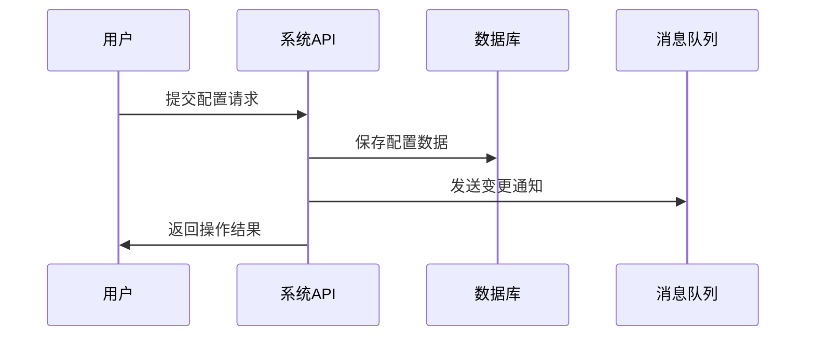

# FMEA分析输出格式定义

基于企业FMEA分析报告标准格式，定义概要设计中4.6.2.3章节的标准输出格式。

## FMEA分析章节结构

### 标准章节格式
```markdown
##### 4.6.2.3. 业务流程可靠（FMEA分析）

**功能要求对齐**：
[描述模块核心功能及其关键特征，要求可量化，如"3秒内返回操作结果"]

**FMEA分析时序图**：
[关键功能的时序图，体现主要参与者和核心流程]

**FMEA分析表格**：
[按照标准表格格式分析失效模式]

**本迭代需要解决的故障**：
[根据RPN优先级明确本迭代解决的故障]
```

## 功能要求对齐格式

### 功能描述要求
- **结果导向**：描述功能的关键特征是结果，不是过程
- **可量化**：必须包含可量化的指标，如时间、数量、成功率等
- **需求编号对应**：明确对应设计任务书中的需求编号

### 标准格式示例
```markdown
**功能要求对齐**：
- **F1-配置管理功能**：3秒内返回配置操作结果，支持1000个区域配置
- **F2-数据富化功能**：保持18K EPS富化性能，富化准确率>99%  
- **F3-配置同步功能**：30秒内完成所有模块配置同步
```

## FMEA分析时序图要求

### 时序图内容要求
- **关键功能覆盖**：每个关键功能至少一个时序图
- **参与者完整**：包含用户、系统、外部依赖等主要参与者
- **流程简洁**：突出核心流程，避免过度细化
- **失效点标识**：在时序图中体现主要的潜在失效点

### 标准格式示例
```markdown
**FMEA分析时序图**：

**关键功能1：配置管理操作**

```

## FMEA分析表格标准格式

### 表格结构要求
```markdown
| 失效模式 | 失效原因(围绕输入/执行/输出) | 失效影响(对产品核心能力) | 严重程度(S) | 发生频度(O) | 可探测度(D) | RPN | 改进措施(重点保证业务成功) |
|----------|----------|----------|-------------|-------------|-------------|-----|----------|
| [失效模式名] | [具体原因] | [对核心能力影响] | [1-10] | [1-10] | [1-10] | [S×O×D] | [具体措施] |
```

### 字段填写规范

**1. 失效模式（四类）**：
- **失效**：功能返回失败（如创建返回失败）
- **超时**：功能响应超时（如创建超时）  
- **慢**：功能成功但性能差（如创建很慢达不到要求）
- **不完整**：功能成功但结果缺失（如创建成功但数据不完整）

**2. 失效原因（围绕三个过程）**：
- **输入类**：外部输入异常，改进措施主要是拦截与报告
- **执行动作**：内部处理异常，核心改进对象，重点分析
- **输出类**：输出环节异常，寻找失败原因进行改进

**3. 失效影响（对产品核心能力）**：
- 关注对产品核心功能的直接影响
- 不进行深层次发散（如断网、客户流失等）
- 用于辅助判断严重程度

**4. 评分标准**：
- **严重程度(S)**：1-10分，对产品影响的严重程度
- **发生频度(O)**：1-10分，失效发生的可能性  
- **可探测度(D)**：1-10分，系统对失效的检测能力
- **RPN**：S×O×D，用于优先级排序

**5. 改进措施（重点保证业务成功）**：
- 围绕如何保证业务流程成功
- 包含限制非法输入的自保机制
- 重试、监控、告警、降级等事后措施
- 不是事前的代码优化措施

## 本迭代故障解决格式

### 优先级分类标准
```markdown
**本迭代需要解决的故障**：

根据RPN优先级排序(RPN=S×O×D)，本迭代重点解决：
1. **最高优先级(RPN≥80)**：[具体失效模式(RPN值)]
2. **高优先级(50≤RPN<80)**：[具体失效模式(RPN值)]  
3. **中等优先级(RPN<50)**：[具体失效模式(RPN值)]
4. **解决措施方向**：[重试机制、监控告警、降级处理等]
```

## FMEA分析原则

### 核心分析原则
1. **产品线上运行导向**：分析产品上线后的故障，不是编码过程故障
2. **外部环境导向**：主要分析外部环境导致的失效，基本功能和性能已满足
3. **业务成功导向**：改进措施重点保证业务流程最终成功
4. **健壮性导向**：考虑模块的健壮性，出问题后如何保证软件正常工作

### 分析深度控制
- **失效模式**：关注外部表现，从用户和系统角度看到的失效
- **失效原因**：关注内部原因，从技术实现角度的具体原因
- **不过度发散**：失效影响不进行过深的业务影响分析
- **实用性优先**：避免理论分析，专注实际可能出现的问题

## FEMA分析经验
### 关于FMEA的指标说明：

1、功能要求：阐述的是功能的关键特征是一个结果，而不是一个功能的过程，例如1s内界面返回结果（有时间可量化）；

2、失效模式：关注四类失效模式，失效（例如创建返回失败）、超时（创建超时）、慢（创建返回成功，但是很慢，达不到要求）、不完整（创建成功，但是结果数据缺失）

3、失效影响：对产品影响的核心能力，主要用于辅助判断严重程度，不需要进行更深层次的发散，例如控制台无法登陆，可能影响到客户的断网这类发散

4、失效原因：围绕输入、执行动作、输出三个核心过程进行。针对输入类，改进措施主要是拦截与报告，核心需要针对执行动作进行改进，针对输出需要寻找对应的失败的原因进行改进

5、FMEA主要是围绕产品线上运行之后出现的故障，而不是针对编码过程中故障

6、解决措施：核心为了业务成功，重点在于如何保证业务流程成功，即使在无法保证成功的情况下，如何通过限制非法的输入，做到自保。

7、严重程度：核心看对产品影响的严重程度，对于发生概率等指标是一个相对的次序，用于排序使用

8、关于可靠性测试设计：常见手段通过前提修改函数，以及动态注入两种，动态注入了解一下测试中心能不能承接搭建

### 补充说明
1、可靠性属于：功能和性能测试之后可能出现的问题分析

2、针对自己的模块分析需要注意是失效模式看的是外部，失效原因看的是内部

3、可靠性需要考虑开发模块的健壮性，出了问题可以保证软件正常工作；如果模块级别实现不了可以上升到系统级别，作为需求去处理

4、针对卡死模块有重启机制，但是要监控模块是否在一直重启，如果在单位时间重启次数过多需要上报告警

5、失效模式不完整 指的是功能中做了多个事，需要原子性完成A和B，但是实际只成功了A

6、输入太长，数量太多，规则复杂这类都属于性能规格，不放在可靠性分析中

7、可靠性问题大部分还是外部生存环境导致，因为FMEA要分析的是基本功能和性能满足的情况下的失效原因