# SFRD-TS-02-3.5_V1.0 API Key IP访问控制模块概要设计说明书

> **此文档中所有章节不得为空，如不涉及需写明不涉及&原因。**

---

## 0. 设计方法参考

| 模块设计方法参考： | 模块设计特性参考： |
|-------------------|-------------------|
| 设计常用表格：[设计表格.xls] | [设计质量评价参考.xlsx] |

### 设计原则

本模块遵循以下设计原则：

- **增量优先原则**：优先在现有代码（`model/token.go`、`middleware/auth.go`、`common/ip.go`）基础上扩展，避免重复造轮子
- **向后兼容原则**：新增 `IpPolicy` 字段不影响旧 Token（`IpPolicy == nil` 时跳过策略），数据库 AutoMigrate 仅做 ADD COLUMN
- **最小外部依赖原则**：CIDR 解析和 IP 匹配完全使用 Go 标准库 `net` 包，不引入第三方依赖
- **安全第一原则**：XFF 头仅在可信代理时采信；CIDR 格式全量校验在入口；错误码统一防止信息泄露
- **宽松降级原则**：CIDR 运行时解析失败时不拦截（fail-open），优先保证服务可用性，记录 WARN 日志

### 方法论

- **分层架构设计**：遵循项目已有的 Router → Controller → Service → Model 分层架构，IP 工具函数归入 `common/`，数据模型归入 `model/`，策略执行归入 `middleware/`
- **FMEA 故障分析**：对鉴权中间件的关键流程进行 FMEA 故障模式分析，识别失效点并设计改进措施
- **STRIDE 威胁建模**：对 IP 策略配置和执行的安全威胁进行 STRIDE 六类分析

---

## 1. 介绍

### 1.1. 目的

本模块为 `new-api` AI API 网关系统的 API Key 增加结构化 IP 访问控制能力，解决以下核心问题：

1. **CIDR 网段支持缺失**：现有 `AllowIps *string` 字段仅支持精确 IP 白名单（无 CIDR），企业用户无法用 `10.0.0.0/8` 等网段配置
2. **缺乏黑名单模式**：现有系统只支持白名单，无法在安全事件中快速封堵攻击 IP 段
3. **可信代理感知缺失**：现有 `c.ClientIP()` 在反向代理架构下无法获取真实客户端 IP，且未防护 X-Forwarded-For 头伪造攻击

**总体目标**：在不破坏现有 Token 行为的前提下，新增 `IpPolicy` 字段，支持 CIDR 白名单/黑名单双模式，并补齐可信代理感知 IP 提取能力，使企业用户能基于网段粒度进行安全访问控制。

### 1.2. 定义和缩写

| 术语/缩写 | 全称 | 定义说明 |
|----------|------|---------|
| CIDR | Classless Inter-Domain Routing | 无类别域间路由，描述 IP 地址范围的格式，如 `10.0.0.0/8` |
| XFF | X-Forwarded-For | HTTP 请求头，包含客户端经过代理后的原始 IP 地址链 |
| TRUSTED_PROXIES | - | 环境变量，配置可信反向代理 IP/CIDR 列表，控制是否信任 XFF 头 |
| IpPolicy | - | 本模块新增的 IP 访问策略结构体，包含 mode（白/黑名单）和 ips（CIDR 列表） |
| IP_NOT_ALLOWED | - | 统一错误码，IP 策略拒绝请求时返回，白/黑名单均使用此码（防止模式信息泄露） |
| GORM | Go Object-Relational Mapper | 项目使用的 ORM 框架，用于数据库操作和 AutoMigrate |
| AutoMigrate | - | GORM 自动迁移功能，在服务启动时对比结构体定义与数据库表，自动 ADD COLUMN |
| fail-open | - | 宽松降级策略：发生非预期错误时允许请求通过，保证服务可用性 |
| STRIDE | Spoofing/Tampering/Repudiation/Information Disclosure/DoS/Elevation | 威胁建模六类威胁类型 |
| FMEA | Failure Mode and Effects Analysis | 故障模式与影响分析方法 |
| RPN | Risk Priority Number | 风险优先级数，S×O×D |
| AllowIps | - | 现有 Token 字段（`model/token.go:27`），逐行分割的精确 IP 白名单，保持不变 |

### 1.3. 参考和引用

1. **需求文档**：`doc/requirement/requirement.md` — 第 2 章功能需求详细分析（F001-F005）、第 5 章非功能需求
2. **系统需求文档**：`doc/requirement-analyst/output/` — 15 个 IPD2.0 层级需求文档
3. **现有源码参考**：
   - `model/token.go:14` — 现有 Token 结构体和 AllowIps 字段
   - `middleware/auth.go:248` — TokenAuth 鉴权中间件和现有 AllowIps 校验（第 316-330 行）
   - `common/ip.go:33` — 现有 `IsIpInCIDRList` 函数（参考 API 风格）
   - `router/api-router.go:241` — 现有 Token 路由组
   - `model/main.go:256` — AutoMigrate 已包含 `&Token{}`
4. **技术标准**：Go 标准库 `net` 包文档（`net.ParseCIDR`、`net.ParseIP`、`(*net.IPNet).Contains()`）

---

## 2. 设计任务书

> 性能目标和整体目标不允许写"与XX相同"一类。

### 2.1. 需求跟踪（必须覆盖需求矩阵中与本模块相关的所有需求点）

| 编号 | 需求点名称 | 需求点说明/验收条件 | 类型 | 自检 |
|------|-----------|-------------------|------|------|
| 1.1 | F001 IP策略配置接口（新增） | 新增 `PUT /api/token/:id/ip_policy` 接口，支持设置/清除 Token 的 IP 访问策略（mode + ips）；校验 CIDR 格式；权限校验（拥有者/管理员） | 全新功能 | |
| 1.2 | F002 Token.IpPolicy数据模型扩展（增量） | 在 Token struct 新增 `IpPolicy *IpPolicy` 字段（`model/token.go`），实现 `driver.Valuer`/`sql.Scanner` JSON序列化；GORM AutoMigrate 自动添加 `ip_policy TEXT NULL` 列，兼容 SQLite/MySQL/PostgreSQL | 增量功能 | |
| 1.3 | F003 CIDR工具函数库（新增） | 新建 `common/ip_matcher.go`，实现 `ValidateCIDRList`、`ParseCIDRList`、`IPMatchesCIDRList`、`GetClientIP`、`InitTrustedProxies`，纯标准库实现，无外部依赖 | 全新功能 | |
| 1.4 | F004 可信代理感知IP提取（增量） | 扩展 `middleware/auth.go:TokenAuth()`，使用 `GetClientIP(c)` 替换 `c.ClientIP()`，存入 Context；扩展 `common/init.go:InitEnv()` 加载 TRUSTED_PROXIES 环境变量 | 增量功能 | |
| 1.5 | F005 IP策略执行（增量） | 扩展 `middleware/auth.go:TokenAuth()`，在现有 AllowIps 校验之后新增 IpPolicy 策略校验块；白名单/黑名单逻辑；CIDR 解析失败宽松降级；拒绝时返回 HTTP 403 + `IP_NOT_ALLOWED` 错误码 | 增量功能 | |
| 1.6 | AC-向后兼容 | `IpPolicy == nil` 的旧 Token 鉴权行为与现有完全一致 | 非功能 | |
| 1.7 | AC-XFF防伪造 | 未配置 TRUSTED_PROXIES 时，XFF 头被忽略，攻击者无法通过伪造 XFF 绕过 IP 白名单 | 安全需求 | |
| 1.8 | AC-CIDR格式校验 | 非法 CIDR 条目（如 `"999.0.0.1/33"`）在配置接口 F001 处返回 HTTP 400，不入库 | 安全需求 | |
| 1.9 | AC-错误码统一 | IP 拦截时无论白名单/黑名单均返回 `IP_NOT_ALLOWED`，不透露策略模式信息 | 安全需求 | |
| 1.10 | AC-三库兼容 | AutoMigrate 在 SQLite/MySQL/PostgreSQL 三数据库均成功执行 ADD COLUMN | 兼容性 | |

### 2.2. 模块整体目标

| 编号 | 目标项概述 | 对应的评审标准 | 标准 | 自检 |
|------|-----------|--------------|------|------|
| 2.1 | 性能 | IP策略配置接口响应时间（P99） | < 200ms（含数据库写入） | |
| | | IP提取延迟（GetClientIP，P99） | < 0.1ms（纯内存操作） | |
| | | IP策略匹配延迟（P99，≤100条CIDR） | < 1ms | |
| | | 并发安全（ParseCIDRList） | 每次返回独立 `[]*net.IPNet` 切片，无共享状态，无竞态 | |
| 2.2 | 资源开销 | 内存占用（trustedProxyCIDRs 全局变量） | < 1KB（< 50 条可信代理 CIDR） | |
| | | DISK 占用 | 不涉及（无日志文件自身写入，使用项目现有日志系统） | |
| 2.3 | 可靠性要求 | CIDR 解析失败时的降级行为 | fail-open（不拦截）+ WARN 日志，服务可用性 100% 不受影响 | |
| | | 数据库写入失败时的行为 | F001 接口返回 HTTP 500，策略未更新，不留中间状态 | |
| | | Token 旧数据兼容 | `IpPolicy == nil` 的 Token 鉴权行为与升级前完全一致 | |
| 2.4 | 兼容性 | 数据库升级版本 | 支持 SQLite（所有版本）、MySQL ≥ 5.7.8、PostgreSQL ≥ 9.6，AutoMigrate 仅做 ADD COLUMN | |
| | | 业务兼容性 | 不删除现有 `AllowIps` 字段和 `GetIpLimits()` 方法，新旧逻辑并存 | |
| 2.5 | 可扩展性 | TRUSTED_PROXIES 配置化 | 环境变量配置，部署时可调整，无需重新编译 | |
| | | Token 级 CIDR 缓存（未来扩展） | 当前无缓存（每次请求解析），可在不改接口的情况下后续增加 | |
| | | 条目数上限可配置 | 当前硬编码 100 条，接口层统一执行，后续可配置化 | |
| 2.6 | 安全性 | 防 XFF 伪造 | `GetClientIP` 仅在 RemoteAddr 属于 trustedProxyCIDRs 时采信 XFF | |
| | | 权限控制 | F001 接口校验当前用户为 Token 拥有者或管理员 | |
| | | 输入格式校验 | CIDR 格式通过 `ValidateCIDRList`，非法格式 400 拒绝入库 | |
| | | 错误码防信息泄露 | IP 拦截统一返回 `IP_NOT_ALLOWED`，不区分白/黑名单 | |
| 2.7 | 其它 | 测试覆盖率 | `common/ip_matcher_test.go` 单元测试覆盖率 ≥ 85%；race detector 下无竞态 | |

---

## 3. 对外接口

### 3.1. API接口

本模块提供 1 个全新 HTTP API 接口，用于配置 Token 的 IP 访问策略。

#### API接口总览

| API路径 | 功能类型 | 描述 | 所属仓库 | 代码位置 |
|---------|---------|-----|---------|---------|
| `PUT /api/token/:id/ip_policy` | 全新 | 设置或清除指定 API Key 的 IP 访问策略（白名单/黑名单+CIDR列表） | new-api | `controller/token.go`（新增 `UpdateTokenIpPolicy` 函数） |

#### 接口1: 更新 Token IP 策略接口（全新）

**接口信息**:

- **方法**: PUT
- **路径**: `/api/token/:id/ip_policy`
- **功能**: 为指定 Token 设置 IP 访问策略（白名单/黑名单+CIDR列表），或通过 `mode=""` 清除策略
- **认证**: UserAuth（JWT 令牌，路由组已挂载 `middleware.UserAuth()`），Handler 内额外校验用户为 Token 拥有者或管理员
- **代码位置**: `controller/token.go`（新增函数 `UpdateTokenIpPolicy`）+ `router/api-router.go:241`（注册路由 `tokenRoute.PUT("/:id/ip_policy", controller.UpdateTokenIpPolicy)`）

**请求参数**：

| 请求参数 | 参数名 | 类型 | 方向 | 必填 | 约束 | 说明 |
|---------|-------|------|------|------|------|------|
| 路径参数 | `id` | int | in | 是 | > 0 | 目标 Token 的数据库 ID |
| 请求体 | `mode` | string | in | 是 | 枚举：`"whitelist"`/`"blacklist"`/`""` | 策略模式；`""` 表示清除策略 |
| 请求体 | `ips` | []string | in | 是 | 每条为合法 IPv4/IPv6 或 CIDR；条目数 0–100 | CIDR 列表；单 IP 自动视为 /32 |

**请求体 JSON 示例**：

```json
{
  "mode": "whitelist",
  "ips": ["1.2.3.4", "10.0.0.0/8", "192.168.1.0/24"]
}
```

清除策略时：

```json
{
  "mode": "",
  "ips": []
}
```

**响应体**：

| 响应体 | 参数名 | 类型 | 方向 | 说明 |
|--------|-------|------|------|------|
| | `success` | bool | out | 操作是否成功 |
| | `message` | string | out | 错误信息（成功时为空字符串） |

**成功响应 JSON 示例**：

```json
{
  "success": true,
  "message": ""
}
```

**失败响应**：

| HTTP 状态码 | 错误信息 | 触发条件 |
|-----------|---------|---------|
| 400 | `"invalid mode: xxx"` | mode 不在枚举值内 |
| 400 | `"invalid IP/CIDR: xxx"` | ips 中有非法 CIDR 条目 |
| 400 | `"too many IP entries, max 100"` | `len(ips) > 100` |
| 403 | `"forbidden"` | 非 Token 拥有者且非管理员 |
| 404 | `"not found"` | Token ID 不存在 |
| 500 | `"internal server error"` | 数据库写入失败 |

### 3.2. 消息接口

本模块不涉及任何消息队列（Pulsar/Kafka）接口。原因：IP 策略的配置和执行均在同步 HTTP 请求处理链中完成，无异步消息需求。

---

## 4. 概要说明

### 4.1. 背景描述

#### 4.1.1. 工作原理

本模块基于「结构化 IP 策略 + 可信代理感知 IP 提取」双核心机制实现 API Key 级别的 IP 访问控制，主要工作机制如下：

**核心机制1：结构化 IP 策略持久化与执行**

- **技术实现**：在 `tokens` 表新增 `ip_policy TEXT NULL` 列，通过 `driver.Valuer`/`sql.Scanner` 将 `IpPolicy{Mode, Ips}` 结构体 JSON 序列化后存储
- **工作流程**：管理员调用 `PUT /api/token/:id/ip_policy` → 校验 CIDR 格式（`ValidateCIDRList`）→ 序列化为 JSON → GORM 写入数据库 → 每次请求鉴权时从 Token 对象读取 `IpPolicy`，调用 `ParseCIDRList` 解析，调用 `IPMatchesCIDRList` 匹配，按 mode 决定放行/拦截
- **关键特性**：新旧字段并存（`AllowIps` 保持不变）；`IpPolicy == nil` 时跳过（向后兼容）；CIDR 解析失败时宽松降级（fail-open）

**核心机制2：可信代理感知 IP 提取**

- **技术实现**：服务启动时通过 `InitTrustedProxies(os.Getenv("TRUSTED_PROXIES"))` 初始化全局 `trustedProxyCIDRs`；每次请求在 `GetClientIP(c)` 中根据 `RemoteAddr` 是否属于可信代理决定是否采信 `X-Forwarded-For` 头
- **工作流程**：请求到达 → 解析 `RemoteAddr` → 若属于可信代理 CIDR：取 XFF 最左侧 IP；否则：直接使用 RemoteAddr → 将 clientIP 存入 gin Context（`c.Set("client_ip", clientIP)`）→ 后续 IP 策略校验读取 Context 避免重复计算
- **关键特性**：未配置 TRUSTED_PROXIES 时 XFF 头永远被忽略，防止 XFF 伪造绕过白名单

**技术架构定位**：

本模块在系统中作为安全增强层，位于 Token 有效性校验链的最后一步，紧接在现有 AllowIps 白名单之后，在转发上游之前。所有改动均为增量（不修改现有行为），仅新增工具函数文件和扩展现有文件。

#### 4.1.2. 应用场景

**主场景1：企业 API Key 网段白名单**

- **场景描述**：企业用户为公司分配的 API Key 设置只允许公司内网 IP 段访问，防止 Key 外泄后被外部使用
- **操作流程**：
  1. 管理员调用 `PUT /api/token/:id/ip_policy` 设置 `{"mode":"whitelist","ips":["10.0.0.0/8","192.168.0.0/16"]}`
  2. 系统校验 CIDR 格式并写入数据库
  3. 来自公司内网的请求（`10.x.x.x`）正常通过；来自外网的请求返回 HTTP 403 + `IP_NOT_ALLOWED`
- **关键事件**：CIDR 格式校验失败（返回 400）；权限校验失败（非拥有者返回 403）
- **预期结果**：内网 IP 正常使用 API；外网 IP 被拒绝

**主场景2：安全事件黑名单快速封堵**

- **场景描述**：发现攻击来源 IP 段 `185.220.0.0/22`，需要在不下线整个 Key 的情况下快速封堵
- **操作流程**：
  1. 运营人员调用 `PUT /api/token/:id/ip_policy` 设置 `{"mode":"blacklist","ips":["185.220.0.0/22"]}`
  2. 策略立即生效（下次请求即生效，无缓存延迟）
  3. 攻击 IP 段的请求被拒绝；其他正常用户不受影响
- **关键事件**：黑名单匹配（`IPMatchesCIDRList` 返回 true → 拦截）；日志写入 `ip_not_allowed`（含 token_id、client_ip）
- **预期结果**：攻击来源被封堵，正常请求不受影响

**边界场景：CIDR 解析失败降级**

- **场景描述**：数据库中 `ip_policy` 字段被手工篡改为非法 JSON，导致运行时反序列化失败
- **处理方式**：`Token.IpPolicy == nil`（Scan 失败时），鉴权中间件跳过 IP 策略校验（宽松降级）
- **降级策略**：写 WARN 日志（`ip_policy_parse_failed` + token_id + error），服务正常运行，不因数据异常导致服务中断

#### 4.1.3. 对手分析

**业界方案1：nginx/Kong 网关层 IP 过滤**

- **方案描述**：在 API 网关层（nginx allow/deny、Kong IP Restriction 插件）统一配置 IP 白/黑名单
- **优势**：性能高（内核层处理）；对应用透明
- **劣势**：粒度为全局或路由级，无法细化到每个 API Key；Key 级动态配置需要修改网关配置重载
- **我们的借鉴**：CIDR 匹配算法参考 nginx 的 `ngx_http_access_module`，使用网络掩码匹配而非逐一比较

**业界方案2：OpenAI API Key IP 限制**

- **方案描述**：OpenAI 在 Dashboard 中允许为 API Key 设置允许的 IP 范围（白名单模式，支持 CIDR）
- **优势**：Key 级粒度；Web 界面配置；支持 CIDR
- **劣势**：仅白名单，无黑名单；不支持可信代理配置
- **我们的借鉴**：Key 级粒度策略配置思路；支持 CIDR 的重要性；我们额外支持黑名单模式和可信代理感知

**业界方案对比**：

| 对比维度 | nginx网关层 | OpenAI方案 | 我们的方案 |
|---------|-----------|-----------|-----------|
| 粒度 | 全局/路由级 | Key 级 | Key 级 |
| 白名单 | ✅ | ✅ | ✅ |
| 黑名单 | ✅ | ❌ | ✅ |
| CIDR 支持 | ✅ | ✅ | ✅ |
| 可信代理感知 | 需手动配置 | 未知 | ✅ 可配置 |
| 动态更新 | 需重载配置 | Web 界面 | REST API |
| 向后兼容 | 不适用 | 不适用 | ✅ 旧 Key 无影响 |

**设计启示**：

1. 借鉴 nginx 的 CIDR 匹配算法思路，使用 `net.ParseCIDR` + `(*IPNet).Contains()` 实现高效匹配
2. 学习 OpenAI Key 级粒度配置思路；我们额外补充黑名单模式和可信代理保护
3. 避免 nginx 方案的静态配置问题，采用数据库驱动的动态策略

---

### 4.2. 方案选型

#### 4.2.1. IpPolicy数据序列化方案选型

##### 4.2.1.1 方案1：JSON 序列化到单一 TEXT 列

**方案概述**：在 `tokens` 表新增 `ip_policy TEXT NULL` 列，将 `IpPolicy{Mode, Ips}` 结构体通过 `driver.Valuer` 序列化为 JSON 字符串存储。

**技术实现**：
- `Token` struct 添加 `IpPolicy *IpPolicy \`gorm:"type:text;column:ip_policy"\`` 字段
- 实现 `IpPolicy.Value() (driver.Value, error)` 调用 `json.Marshal`
- 实现 `(*IpPolicy).Scan(value interface{}) error` 调用 `json.Unmarshal`

**优势**：
1. Schema 简单，无需新表，仅一次 ADD COLUMN 即可
2. 读取 Token 时 GORM 自动反序列化，无额外查询
3. GORM AutoMigrate 原生支持，三数据库均兼容

**劣势**：
1. 无法对 ips 列表中单条记录进行 SQL 查询（需读出反序列化后过滤）
2. 数据库层面无强格式约束（依赖应用层校验）

##### 4.2.1.2 方案2：独立关联表

**方案概述**：新建 `token_ip_policies` 表（id, token_id, mode, ips JSON），与 tokens 表 one-to-one 关联。

**技术实现**：
- 新增 `TokenIpPolicy` model 和对应表
- 需同时维护 `tokens` 和 `token_ip_policies` 两个表

**优势**：
1. 数据结构更规范，符合关系型数据库范式
2. 后续若 ips 条目需单独管理（增删改查）更方便

**劣势**：
1. 额外的表和 JOIN 查询，增加 Token 读取延迟
2. 需要维护 token_id 外键引用的一致性
3. 与现有 Token 缓存（Redis）不兼容，需单独缓存策略

##### 4.2.1.3 方案3：拆分为两列

**方案概述**：在 `tokens` 表新增两列：`ip_policy_mode TEXT` 和 `ip_policy_ips TEXT`（ips 仍 JSON 序列化）。

**技术实现**：
- Token struct 添加 `IpPolicyMode *string` 和 `IpPolicyIps *string` 两个独立字段

**优势**：
1. mode 字段可在 SQL 中直接查询
2. 无需实现 Valuer/Scanner 接口

**劣势**：
1. 需两次 ADD COLUMN，字段分散
2. 应用代码需额外组合和拆解逻辑，增加复杂度
3. 两个字段间的一致性（如 mode 非空但 ips 为空）需在应用层额外保证

##### 4.2.1.4 IpPolicy序列化方案选型结果

| 方案名称 | 性能 | 成本（开发） | 可靠性 | 可扩展性 | 易实现 |
|---------|------|------------|--------|---------|-------|
| 方案1（TEXT+JSON序列化） | 高，Token读取无额外查询，O(1) | 低，仅1列新增 | 高，Valuer/Scanner完整封装 | 中，不支持SQL级查询 | 高，约1天完成 |
| 方案2（独立关联表） | 中，额外JOIN查询，约+5ms | 高，新表+外键+缓存改造 | 中，需维护引用一致性 | 高，可独立查询和管理 | 低，约3天完成 |
| 方案3（拆分两列） | 高，直接字段读取 | 中，两列新增 | 低，需额外保证两列一致性 | 低，结构分散不易理解 | 中，约1.5天完成 |

**最终选择：方案1（TEXT+JSON序列化）**

**选择理由**：
1. 性能满足要求（Token 读取无额外查询）
2. 开发成本最低（1次 ADD COLUMN，实现 Valuer/Scanner 接口）
3. 与现有 Token Redis 缓存天然兼容（Token 整体序列化/反序列化，IpPolicy 内嵌其中）
4. 三数据库均支持 TEXT 类型，无跨库兼容问题

**方案不足及缓解**：
- **不足**：无法 SQL 级别查询特定 IP 是否在某 Token 策略中
- **缓解**：当前无此类查询需求；若未来需要，可在应用层过滤或将 ips 拆为单独表（不影响当前接口）

---

#### 4.2.2. CIDR匹配实现方案选型

##### 4.2.2.1 方案1：每次请求即时解析（无缓存）

**方案概述**：每次请求到达鉴权中间件时，调用 `ParseCIDRList(token.IpPolicy.Ips)` 即时将 CIDR 字符串解析为 `[]*net.IPNet`，直接使用，不缓存。

**优势**：
1. 实现最简单，代码量最少
2. 无缓存一致性问题（策略更新后立即生效，无延迟）
3. 无竞态风险（每次返回独立 slice）

**劣势**：
1. 高频 Token 每次请求均需重新解析，有轻微 CPU 开销（≤100条CIDR，P99 < 1ms，可接受）

##### 4.2.2.2 方案2：Token 级内存缓存（TTL 60s）

**方案概述**：使用 `sync.Map` 以 `tokenID+policyVersion` 为 key 缓存解析后的 `[]*net.IPNet`，设置 TTL 60 秒自动失效。

**优势**：
1. 高频 Token 重复请求时 CIDR 解析开销降为 0
2. 性能更优

**劣势**：
1. 需要实现 TTL 失效机制（额外开发工作量）
2. 策略更新后最多 60 秒内旧策略仍生效（可能造成安全隐患）
3. 内存占用随 Token 数量增长

##### 4.2.2.3 方案3：全局 sync.Map 缓存（按JSON hash）

**方案概述**：以 `IpPolicy` 的 JSON 字符串 hash 为 key，缓存解析结果，不同 Token 若策略相同则共享解析结果。

**优势**：
1. 相同策略的 Token 共享缓存，内存效率高

**劣势**：
1. hash 计算本身有开销
2. 跨 Token 共享缓存，若策略内容相同但属于不同 Token，可能引起混淆
3. 实现最复杂

##### 4.2.2.4 CIDR匹配实现方案选型结果

| 方案名称 | 性能 | 成本（开发） | 可靠性 | 可扩展性 | 易实现 |
|---------|------|------------|--------|---------|-------|
| 方案1（即时解析） | 中，P99 < 1ms（≤100条CIDR），可接受 | 低，约0.5天 | 高，无缓存一致性问题，策略立即生效 | 高，后续可独立加缓存层 | 高，约0.5天 |
| 方案2（Token级缓存TTL 60s） | 高，缓存命中时O(1) | 高，需TTL机制，约2天 | 中，策略更新有60s延迟，安全性略低 | 中，缓存逻辑与业务耦合 | 低，约2天 |
| 方案3（全局hash缓存） | 高，相同策略共享 | 高，最复杂，约2.5天 | 低，跨Token共享有潜在风险 | 低，架构复杂 | 低，约2.5天 |

**最终选择：方案1（每次请求即时解析）**

**选择理由**：
1. P99 < 1ms（≤100条CIDR）完全满足性能要求（需求：< 1ms）
2. 策略更新后立即生效，无缓存延迟，安全性最优
3. 实现最简单，无竞态风险（每次返回独立 slice）

**方案不足及缓解**：
- **不足**：对极高频 Token（每秒万次请求）有 CPU 开销
- **缓解**：压测发现瓶颈后，可在不修改接口的情况下增加 Token 级 CIDR 缓存（TTL=60s）作为后续优化

---

#### 4.2.3. 可信代理配置方式选型

##### 4.2.3.1 方案1：环境变量（TRUSTED_PROXIES）+ 服务启动初始化

**方案概述**：通过环境变量 `TRUSTED_PROXIES=10.0.0.1,172.16.0.0/12` 配置可信代理，在 `common/init.go:InitEnv()` 服务启动时调用 `InitTrustedProxies()` 初始化一次，存入包级全局变量 `trustedProxyCIDRs`。

**优势**：
1. 与现有项目环境变量配置模式一致（项目已大量使用 `os.Getenv`）
2. 无 IO 开销（启动时初始化一次，运行时纯内存读取）
3. 部署时按需配置，不需要重新编译

**劣势**：
1. 变更后需重启服务生效（可接受：可信代理 IP 变更属于基础设施变更）

##### 4.2.3.2 方案2：数据库 options 表存储，支持运行时动态变更

**方案概述**：在 `options` 表中新增 `TRUSTED_PROXIES` 记录，支持通过管理接口运行时修改，无需重启。

**优势**：
1. 无需重启即可生效
2. 可通过 Web 界面管理

**劣势**：
1. 每次请求需检查是否有配置更新（增加数据库查询或缓存）
2. 开发工作量较大（需新增管理接口和缓存失效机制）
3. 可信代理配置是基础设施级配置，变更频率极低，动态更新收益不明显

##### 4.2.3.3 方案3：配置文件（YAML/TOML）静态配置

**方案概述**：在配置文件中定义 `trusted_proxies` 字段，服务启动时读取。

**优势**：
1. 配置版本化（可纳入 Git 管理）

**劣势**：
1. 需要引入配置文件格式，增加依赖
2. 与现有项目风格不一致（项目使用环境变量，无 YAML 配置文件）

##### 4.2.3.4 可信代理配置方式选型结果

| 方案名称 | 性能 | 成本（开发） | 可靠性 | 可扩展性 | 易实现 |
|---------|------|------------|--------|---------|-------|
| 方案1（环境变量+启动初始化） | 高，启动初始化一次，运行时O(1) | 低，约0.5天 | 高，无运行时IO，无缓存一致性问题 | 高，与现有项目模式完全一致 | 高，约0.5天 |
| 方案2（DB options表动态） | 中，需缓存机制，约+1ms/请求（无缓存）| 高，约3天 | 中，缓存失效设计复杂 | 中，需新增管理接口 | 低，约3天 |
| 方案3（配置文件） | 高，启动读取一次 | 中，约1天 | 高，版本化管理 | 低，与项目风格不一致 | 中，约1天 |

**最终选择：方案1（环境变量+启动初始化）**

**选择理由**：
1. 性能最优（运行时纯内存读取）
2. 与现有项目环境变量配置模式完全一致
3. 可信代理配置属于基础设施配置，变更频率极低，重启生效可接受

**方案不足及缓解**：
- **不足**：变更后需重启服务
- **缓解**：可信代理 IP 属于基础设施级配置（Nginx、CDN），与服务部署耦合，重启生效是行业惯例

---

### 4.3. 静态结构

本模块采用「工具层（common）+ 数据层（model）+ 控制层（controller）+ 中间件层（middleware）」的分层架构，整体架构如下：

**架构图（Mermaid graph TB）**：

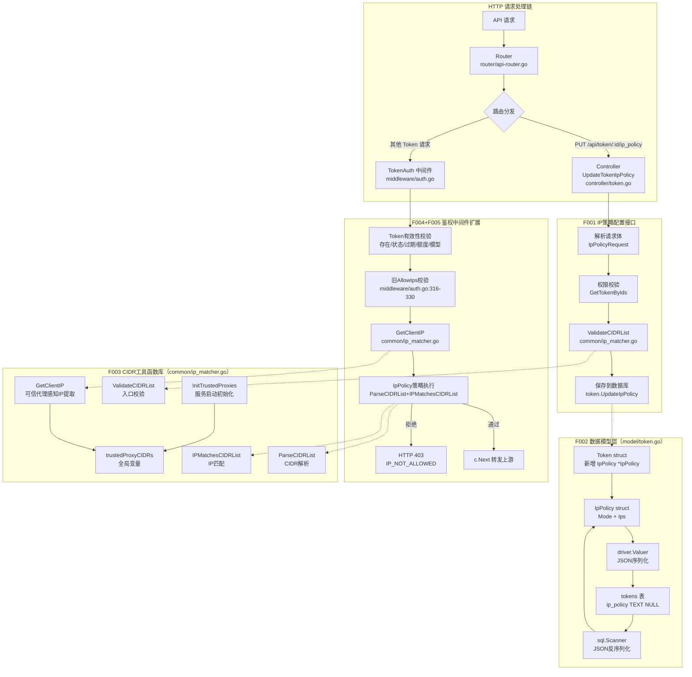

**模块关系说明**：

| 模块 | 职责 | 依赖 |
|-----|------|------|
| `common/ip_matcher.go`（F003，全新） | CIDR 校验、解析、匹配的工具函数；可信代理 IP 提取和初始化 | Go 标准库 `net` 包 |
| `model/token.go`（F002，增量） | Token 数据模型扩展：`IpPolicy` 字段、JSON 序列化/反序列化 | `common/ip_matcher.go`（ValidateCIDRList 在 controller 调用） |
| `controller/token.go`（F001，全新） | HTTP Handler：接收请求、权限校验、CIDR 校验、写数据库 | `common/ip_matcher.go`、`model/token.go` |
| `middleware/auth.go`（F004+F005，增量） | 在 TokenAuth 中集成 GetClientIP + IpPolicy 策略执行 | `common/ip_matcher.go` |
| `common/init.go`（F004，增量） | 服务启动时调用 `InitTrustedProxies` 初始化全局可信代理 | `common/ip_matcher.go` |

**关键数据结构概述**：

```go
// IpPolicy — 核心数据结构，存储在 tokens.ip_policy 列（JSON格式）
type IpPolicy struct {
    Mode string   `json:"mode"` // "whitelist" | "blacklist" | ""
    Ips  []string `json:"ips"`  // CIDR 列表，如 ["1.2.3.4", "10.0.0.0/8"]
}

// Token（增量）— 新增 IpPolicy 字段
type Token struct {
    // ... 现有字段保持不变 ...
    AllowIps *string   `json:"allow_ips" gorm:"column:allow_ips"`    // 旧字段，保持
    IpPolicy *IpPolicy `json:"ip_policy,omitempty" gorm:"type:text;column:ip_policy"` // 新增
}

// trustedProxyCIDRs — 包级全局变量，服务启动时初始化
var trustedProxyCIDRs []*net.IPNet
```

---

### 4.4. 对软件总体架构的影响

本次设计对现有系统架构的影响如下：

**1. 新增模块/服务**

- **新增文件**：`common/ip_matcher.go`（全新工具函数文件）
  - 影响范围：`common/` 包内，被 `controller/token.go` 和 `middleware/auth.go` 调用
  - 集成方式：直接函数调用，无进程间通信
  - 接口变更：无（仅新增文件）

**2. 调整现有模块**

| 调整文件 | 调整内容 | 影响评估 | 兼容性 |
|---------|---------|---------|-------|
| `model/token.go` | 新增 `IpPolicy *IpPolicy` 字段和 `IpPolicy` 结构体 | 仅新增字段，不修改现有字段或方法 | ✅ 向后兼容：旧记录 `IpPolicy==nil`，行为不变 |
| `middleware/auth.go` | 在 TokenAuth 中插入 GetClientIP 调用和 IpPolicy 策略块 | 新增逻辑仅在 `IpPolicy != nil` 时执行 | ✅ 向后兼容：旧 Token 跳过新逻辑 |
| `controller/token.go` | 新增 `UpdateTokenIpPolicy` 函数 | 纯新增，不修改现有函数 | ✅ 无影响 |
| `router/api-router.go` | 新增 `tokenRoute.PUT("/:id/ip_policy", ...)` | 纯新增路由 | ✅ 无影响 |
| `common/init.go` | 在 `InitEnv()` 末尾新增 `InitTrustedProxies` 调用 | 服务启动时额外解析环境变量 | ✅ 无影响（env 为空时 trustedProxyCIDRs 为 nil）|

**3. 基础设施变更**

- **新增组件**：无（不引入新的中间件、数据库、消息队列）
- **资源需求**：新增 `trustedProxyCIDRs` 全局变量（< 1KB）；每次鉴权新增 < 1ms CPU 开销
- **部署变更**：新增可选环境变量 `TRUSTED_PROXIES`（不配置也能正常运行）

**4. 数据模型变更**

- **修改现有表**：`tokens` 表新增 `ip_policy TEXT NULL` 列
- **修改方式**：GORM AutoMigrate 执行 `ALTER TABLE tokens ADD COLUMN ip_policy TEXT`（在 `model/main.go:254` 的 `AutoMigrate(&Token{}, ...)` 中自动完成）
- **数据迁移**：无需数据迁移，旧记录 `ip_policy = NULL`

**5. 性能影响**

- **正常情况**（无 IpPolicy）：每次鉴权新增约 0.1ms（GetClientIP 调用，纯内存）
- **已配置 IpPolicy**：每次鉴权额外增加 ParseCIDRList + IPMatchesCIDRList，P99 < 1ms（≤100条CIDR）
- **性能优化措施**：clientIP 存入 gin Context（`c.Set("client_ip", ...)`），同一请求中避免重复调用 `GetClientIP`

---

### 4.5. 概要流程

#### 4.5.1. IP策略配置流程（F001 + F002 + F003）

**流程概述**：管理员通过 REST API 为指定 Token 设置 IP 访问策略，经过权限校验和 CIDR 格式校验后写入数据库。

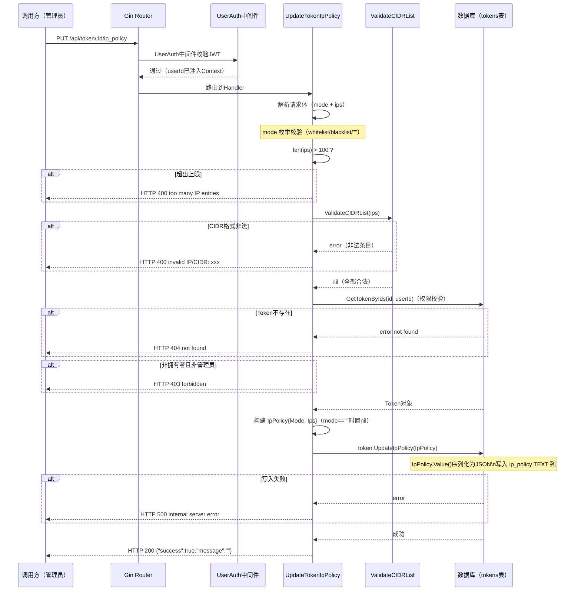

**流程步骤说明**：

| 步骤 | 执行者 | 操作 | 成功条件 | 失败处理 |
|------|-------|------|---------|---------|
| 1 | JWT 中间件 | 校验 JWT 令牌，注入 userId | 令牌有效 | 401 Unauthorized |
| 2 | Handler | 解析请求体（mode + ips） | JSON 格式合法 | 400 Bad Request |
| 3 | Handler | mode 枚举校验 | 值为 whitelist/blacklist/"" | 400 invalid mode |
| 4 | Handler | len(ips) 上限校验 | ≤ 100 条 | 400 too many entries |
| 5 | ValidateCIDRList | CIDR 格式校验 | 所有条目合法 | 400 invalid IP/CIDR |
| 6 | GetTokenByIds | 查询 Token + 权限校验 | Token 存在且属于当前用户或管理员 | 403/404 |
| 7 | UpdateIpPolicy | JSON 序列化 + 写数据库 | 数据库写入成功 | 500 Internal Error |

**异常处理**：

1. **并发写入同一 Token**：GORM 写入为原子操作，最后写入者生效（最终一致性可接受）
2. **Token.UpdateIpPolicy 局部更新**：仅更新 `ip_policy` 列，不覆盖其他字段（使用 `Updates(map)` 而非 `Save()`）

---

#### 4.5.2. 请求鉴权 IP 策略执行流程（F004 + F005）

**流程概述**：每次 API 请求进入 TokenAuth 中间件时，提取真实客户端 IP，执行 Token 绑定的 IP 访问策略（白名单/黑名单），决定放行或拦截。

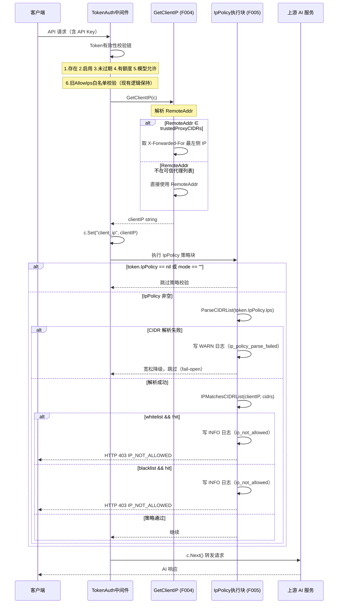

**流程步骤说明**：

| 步骤 | 执行者 | 操作 | 成功条件 | 失败处理 |
|------|-------|------|---------|---------|
| 1-5 | TokenAuth | Token 有效性校验链（现有逻辑） | Token 有效 | 各自错误码 |
| 6 | TokenAuth | 旧 AllowIps 白名单校验（现有逻辑，保持不变） | IP 在白名单或未配置 | 403 |
| 7 | GetClientIP | 可信代理感知 IP 提取 | - | 降级为 RemoteAddr |
| 8 | IpPolicy 块 | 检查 IpPolicy 是否存在 | - | nil 则跳过 |
| 9 | ParseCIDRList | 解析 CIDR 列表 | 解析成功 | WARN 日志 + fail-open |
| 10 | IPMatchesCIDRList | IP 命中判断 | - | - |
| 11 | IpPolicy 块 | 按 mode 决定放行/拦截 | 策略通过 | 403 + IP_NOT_ALLOWED + c.Abort() + return |

**异常处理**：

1. **CIDR 解析失败**：写 WARN 日志（含 token_id + error），不拦截（宽松降级，保证服务可用性）
2. **GetClientIP RemoteAddr 格式异常**：`net.SplitHostPort` 失败，回退使用原始 RemoteAddr 字符串
3. **c.Abort() 调用后必须立即 return**：防止函数体后续代码继续执行

---

### 4.6. 关键特性设计

#### 4.6.1. 安全性设计

##### 4.6.1.1. 安全兜底机制合入

本模块遵循公司安全兜底机制要求，已完成安全 checklist 检查：

| 检查项 | 要求 | 实施情况 | 说明 |
|--------|------|----------|------|
| 身份认证 | 所有管理接口需要认证 | ✅ 已实施 | JWT 令牌认证（`middleware.UserAuth()` 已挂载在 tokenRoute 路由组级别） |
| 权限控制 | 资源操作校验拥有者/角色 | ✅ 已实施 | `UpdateTokenIpPolicy` 内部校验：Token 拥有者或管理员才可修改 |
| 数据加密 | 敏感数据加密存储 | ✅ 已实施 | ip_policy 字段存储的是 IP 白/黑名单，非个人隐私数据；数据库访问通过 GORM 参数化查询 |
| 传输安全 | HTTPS 传输 | ✅ 已实施 | 由部署层（Nginx/TLS）负责，应用层已就绪（Gin HTTP） |
| 输入验证 | 所有输入参数验证 | ✅ 已实施 | CIDR 格式：`ValidateCIDRList`；mode 枚举：显式校验；条目数：`len(ips) <= 100` |
| SQL 注入防护 | 使用参数化查询 | ✅ 已实施 | GORM ORM 自动参数化，不拼接 SQL |
| XSS 防护 | 输出转义 | ✅ 不涉及 | 本模块为 REST API，响应为 JSON，无 HTML 输出 |
| CSRF 防护 | Token 验证 | ✅ 已实施 | JWT Bearer Token 认证，天然防止 CSRF |
| 审计日志 | 关键操作记录 | ✅ 已实施 | IP 拦截事件：INFO 日志（token_id/client_ip/mode）；CIDR 解析失败：WARN 日志 |
| 信息泄露防护 | 错误码不暴露内部逻辑 | ✅ 已实施 | 白名单未命中/黑名单命中均使用统一 `IP_NOT_ALLOWED`，不区分模式 |
| XFF 伪造防护 | 仅信任可信代理的 XFF 头 | ✅ 已实施 | `GetClientIP` 仅在请求来自 `trustedProxyCIDRs` 时采信 XFF，否则使用 RemoteAddr |
| 降级安全语义 | 异常时不中断服务 | ✅ 已实施 | CIDR 解析失败时宽松降级（不拦截），记 WARN 日志 |

**不满足项**：无。

##### 4.6.1.2. 威胁建模分析（STRIDE）

**信任边界识别**：

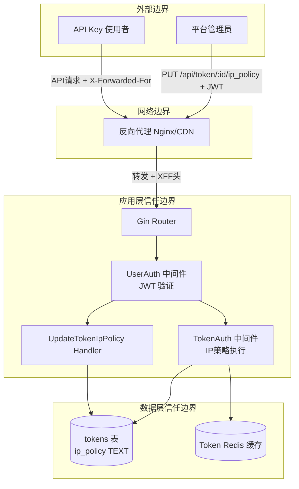

**STRIDE 威胁分析表**：

| 威胁类型 | 威胁场景 | 影响等级 | 防护措施 | 验证方法 |
|---------|---------|---------|---------|---------|
| **S - 欺骗 (Spoofing)** | 攻击者伪造 JWT 令牌，冒充管理员修改 Token IP 策略 | 高 | JWT 签名校验（`middleware.UserAuth()`）+ Token 拥有者二次校验；密钥仅服务端持有 | 使用伪造/篡改 JWT 测试，应返回 401 |
| **S - 欺骗 (Spoofing)** | 攻击者在 API 请求中伪造 `X-Forwarded-For` 头，绕过 IP 白名单 | 高 | `GetClientIP` 仅在 RemoteAddr ∈ `trustedProxyCIDRs` 时采信 XFF；未配置 TRUSTED_PROXIES 时完全忽略 XFF | 未配置代理时注入 XFF 头，验证仍用 RemoteAddr |
| **T - 篡改 (Tampering)** | 攻击者直接修改数据库 `ip_policy` 字段为非法 JSON | 中 | 数据库访问控制（DB 账号权限最小化）；中间件 `Scan` 失败时宽松降级（不拦截 + WARN 日志），不引发服务中断 | 手工写入非法 JSON，验证降级行为 |
| **T - 篡改 (Tampering)** | 非 Token 拥有者尝试修改他人 Token 的 IP 策略 | 高 | `GetTokenByIds(id, userId)` 同时校验 token_id 和 userId，非拥有者返回 403/404；管理员可操作所有 Token | 使用不同 userId 的 JWT 尝试修改他人 Token |
| **R - 否认 (Repudiation)** | 管理员修改 IP 策略后否认操作 | 中 | INFO 级别日志记录 `token_id/client_ip/mode`；可追加操作日志到 audit log | 检查日志文件中的策略变更记录 |
| **I - 信息泄露 (Information Disclosure)** | IP 拦截响应暴露模式（白名单还是黑名单），使攻击者了解策略 | 中 | 拦截时统一返回 `IP_NOT_ALLOWED`，不区分白名单未命中还是黑名单命中；错误消息不暴露 CIDR 列表 | 验证不同场景下的拦截响应，消息应一致 |
| **I - 信息泄露 (Information Disclosure)** | 错误响应中泄露内部 CIDR 列表信息 | 中 | 400 错误仅返回具体违规的单条 IP（`invalid IP/CIDR: xxx`），不暴露已有策略内容 | 检查配置接口的错误响应格式 |
| **D - 拒绝服务 (Denial of Service)** | 攻击者大量请求触发 `ParseCIDRList` 密集计算（100条CIDR × 每请求） | 中 | P99 < 1ms 满足性能要求；Token 级别现有 Redis 缓存减少 DB 读取；若成为瓶颈可增加 CIDR 解析结果缓存（TTL=60s）| 压测 100条CIDR 场景，验证 P99 延迟 |
| **D - 拒绝服务 (Denial of Service)** | 攻击者提交超大 `ips` 数组（含特殊 CIDR 格式）占用解析时间 | 低 | `len(ips) <= 100` 硬上限校验在 CIDR 解析前执行；超出立即返回 400，不调用 ParseCIDRList | 提交超过100条 ips，验证提前拒绝 |
| **E - 权限提升 (Elevation of Privilege)** | 普通用户通过修改 Token 的黑名单策略，绕过管理员限制 | 高 | `mode == "blacklist"` 时检查当前用户是否为管理员（Q4 需产品确认后实施）；当前暂定仅管理员可设黑名单 | 普通用户尝试设置黑名单，应返回 403 |
| **E - 权限提升 (Elevation of Privilege)** | 通过 `ip_policy` 字段写入精心构造的 JSON 进行注入 | 低 | GORM ORM 参数化查询防止 SQL 注入；`ValidateCIDRList` 严格校验格式，非法字符无法通过 | 在 ips 中注入 SQL/脚本字符，验证被拒绝 |

**威胁缓解策略**：

**高风险（必须缓解）**：
- JWT 伪造：确保签名密钥足够强（建议 ≥ 256 位）且定期轮转
- XFF 伪造：部署文档明确 TRUSTED_PROXIES 配置规范，仅填写受控代理 IP/CIDR
- 权限越界：`UpdateTokenIpPolicy` 必须实现拥有者双重校验，不可依赖路由层单一防护
- 权限提升（黑名单）：Q4 需产品确认后，在代码中实现 `mode == "blacklist"` 时的管理员校验

**中风险（建议缓解）**：
- 数据库篡改：限制 DB 账号权限（仅 SELECT/INSERT/UPDATE，禁止 DROP/ALTER）
- 信息泄露：已通过统一 `IP_NOT_ALLOWED` 错误码实现，无需额外操作
- DoS（CIDR 计算）：监控 TokenAuth 延迟，若 P99 > 5ms 则触发告警并增加缓存

##### 4.6.1.3. 安全设计

###### 4.6.1.3.1. IP策略配置模块（F001+F002）安全设计

**安全架构**：

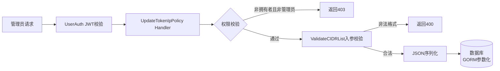

**设计机制**：

1. **输入验证**（F001）：
   - `mode` 枚举白名单校验（`whitelist`/`blacklist`/`""`，其他值直接拒绝）
   - `ips` 条目数上限（≤100）在 CIDR 解析前执行，避免解析超大数组
   - `ValidateCIDRList`：每条 IP/CIDR 必须通过 `net.ParseCIDR` 严格解析（单 IP 自动补 /32），非法格式返回 400 + 具体违规条目

2. **权限校验**（F001）：
   - Handler 内部通过 `GetTokenByIds(id, userId)` 同时验证 token 存在性和所有权
   - 管理员（`role == admin`）可操作所有 Token
   - 普通用户仅可操作自己的 Token
   - Q4：黑名单模式仅管理员可设置（待产品确认）

3. **数据安全**（F002）：
   - `IpPolicy.Value()` 使用 `common.Marshal()`（项目封装的 JSON 序列化）
   - `IpPolicy.Scan()` 解析失败时返回 error，GORM 扫描结果为 nil，中间件降级不拦截（不中断服务）
   - 存储字段类型为 TEXT，三数据库均支持，无 JSONB 类型风险

###### 4.6.1.3.2. IP策略执行模块（F003+F004+F005）安全设计

**安全架构**：

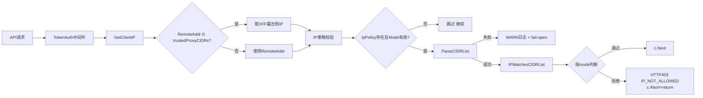

**设计机制**：

1. **XFF 伪造防护**（F003/F004）：
   - `trustedProxyCIDRs` 全局变量在服务启动时由 `InitTrustedProxies` 初始化一次，运行时只读（无并发写）
   - `GetClientIP` 先检查 `RemoteAddr` 是否在可信代理列表，不在则完全忽略 XFF 头
   - 未配置 TRUSTED_PROXIES 时，`trustedProxyCIDRs` 为 nil，所有请求都使用 RemoteAddr

2. **IP 匹配安全**（F003）：
   - `IPMatchesCIDRList` 调用 `net.ParseIP` 解析客户端 IP，解析失败返回 false（防止非法 IP 字符串 panic）
   - 使用 `(*net.IPNet).Contains()` 进行精确匹配，不依赖字符串比较

3. **拦截原子性**（F005）：
   - 拦截时先调用 `c.Abort()`（阻止后续中间件）再调用 `return`（终止当前函数）
   - 确保计费、转发、日志等后续 handler 不会在拒绝请求后执行

4. **降级安全**（F005）：
   - CIDR 解析失败时 fail-open（宽松降级），不拦截合法请求，避免因数据污染导致服务不可用
   - 降级事件必须记录 WARN 日志（含 token_id + error），便于审计和排障

##### 4.6.1.4. 预使用组件版本合规性及版本漏洞情况

本模块**不引入任何新的外部依赖**，所有实现基于 Go 标准库和项目现有依赖。

| 组件 | 版本 | 用途 | 漏洞风险 | 合规结论 |
|------|------|------|---------|---------|
| Go 标准库 `net` | Go 1.22+（项目已用） | CIDR解析、IP匹配、地址解析 | 无（标准库随 Go 版本维护） | ✅ 合规 |
| `encoding/json`（via `common/json.go`） | Go 1.22+（项目已用） | IpPolicy JSON 序列化/反序列化 | 无 | ✅ 合规 |
| GORM v2 | 项目已使用 | ORM AutoMigrate、参数化查询 | 按项目现有版本管理 | ✅ 合规（随项目统一管理） |
| Gin Web框架 | 项目已使用 | HTTP 路由、Context 操作 | 按项目现有版本管理 | ✅ 合规（随项目统一管理） |

**组件管理策略**：本模块遵循项目现有依赖管理策略（`go.mod`），不引入新组件，无需额外漏洞扫描。

---

#### 4.6.2. 可靠性设计

##### 4.6.2.1. 承载载体可靠

本模块为增量功能，复用项目现有进程和基础设施，无独立进程或中间件。

**进程/服务可靠性**：

| 载体 | 故障检测 | 自动恢复 | 冗余机制 |
|------|---------|---------|---------|
| `new-api` Go 服务进程 | 外部健康检查（HTTP `/api/status` 或 K8s liveness probe）| 容器重启策略（K8s `restartPolicy: Always`）| 多副本部署（K8s Deployment ≥ 2 副本），任一副本崩溃不影响整体服务 |
| TokenAuth 中间件（F004/F005 增量） | Gin Recovery 中间件捕获 panic，防止进程崩溃 | panic 后请求返回 500，中间件恢复后继续处理后续请求 | 同进程冗余（Gin 多路由处理），中间件无独立进程 |
| `trustedProxyCIDRs` 全局变量（F003） | 服务启动时 `InitTrustedProxies` 初始化，失败仅影响可信代理配置，服务仍可启动 | 初始化失败时 `trustedProxyCIDRs` 为 nil，所有请求使用 RemoteAddr（安全降级） | 无需冗余（只读全局变量，无单点故障） |

**数据库可靠性**：

| 载体 | 故障检测 | 自动恢复 | 数据持久化 |
|------|---------|---------|----------|
| tokens 表（ip_policy 列） | GORM 连接池心跳检测 | 连接断开自动重连（GORM 内置重试） | MySQL/PostgreSQL 主从复制（由部署层保证）；SQLite WAL 模式 |
| Token Redis 缓存 | Redis 连接失败时 fallback 到 DB（现有机制） | Redis 故障时 Token 直接从 DB 读取（IpPolicy 字段随 Token 一起读出，无额外查询）| Redis AOF/RDB 持久化（由部署层保证） |

**数据/文件可靠性**：

- `ip_policy TEXT NULL` 字段写入为 GORM 原子操作（单列 UPDATE），无部分写入风险
- GORM AutoMigrate（ADD COLUMN）在服务启动时执行，幂等操作，多次执行无副作用
- 数据备份：随数据库整体备份策略，无额外备份需求

##### 4.6.2.2. 周边无影响

**资源使用分析**：

| 资源 | 正常情况 | 峰值情况 | 上限控制 |
|------|---------|---------|---------|
| CPU（CIDR 解析） | 每个携带 IpPolicy 的 Token 请求额外 < 0.1ms | 高并发时 100 条 CIDR × QPS | 上限：≤ 100 条/Token（接口层强制）；若 P99 > 5ms 触发告警 |
| 内存（trustedProxyCIDRs 全局变量） | < 1KB（典型 < 10 条可信代理 CIDR） | 最大 50 条 CIDR ≈ 5KB | 上限：无需控制（静态初始化，启动后不增长） |
| 内存（ParseCIDRList 临时 slice） | 每次请求分配/GC，≤ 100条 × ~128B ≈ 12KB | 高并发时 GC 压力增加 | GC 友好：每次请求后 slice 自动被 GC 回收；可通过 sync.Pool 优化（后续扩展点） |
| 数据库（F001 策略更新） | 每次策略配置写入 1 次 UPDATE，影响极小 | 运维场景偶发调用 | 无需额外控制（管理接口低频） |
| 数据库连接 | 共享现有连接池（GORM） | 无额外连接需求 | 连接池上限由 `DB.SetMaxOpenConns` 统一控制（现有配置） |

**资源隔离机制**：

1. **CPU 隔离**：CIDR 解析在请求 goroutine 内执行，不占用全局线程池；Go runtime 调度器保证不阻塞其他请求的处理
2. **内存隔离**：`ParseCIDRList` 每次返回独立 `[]*net.IPNet` slice，无共享可变状态，无竞态风险
3. **数据库连接隔离**：复用现有 GORM 连接池，IP 策略配置（写）通过连接池与其他读操作公平竞争

**过载保护措施**：

| 保护层 | 措施 | 实现位置 |
|-------|------|---------|
| IP 条目数上限 | `len(ips) <= 100` 硬上限，超出直接 400，不触发 ParseCIDRList | F001 Handler |
| 接口限流 | 继承项目现有 API 限流中间件（UserAuth 路由组级别）| 现有中间件 |
| 中间件 panic 保护 | Gin Recovery 中间件自动捕获 panic，返回 500，不崩溃进程 | 现有 Recovery 中间件 |
| 降级保护 | CIDR 解析失败时 fail-open（宽松降级），不阻塞请求链 | F005 中间件 |

##### 4.6.2.3. 业务流程可靠（FMEA分析）

**功能要求对齐**：

- **F1 - IP策略配置功能**：200ms 内返回配置结果（含数据库写入），配置后下次请求立即生效
- **F2 - 可信代理感知IP提取**：每次请求额外延迟 < 0.1ms，返回确定性的客户端 IP 字符串
- **F3 - IP策略执行（鉴权校验）**：在 Token 鉴权后 1ms 内完成 IP 策略判断，正确放行/拦截请求

**FMEA 分析时序图**：

**关键功能F1：IP策略配置**

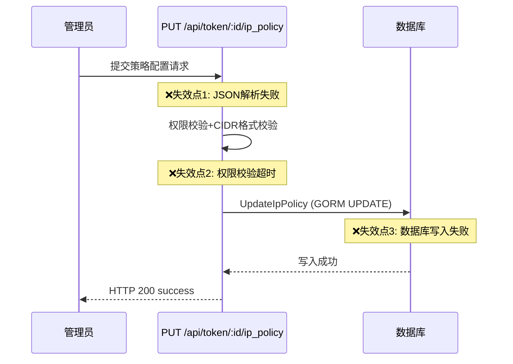

**关键功能F2+F3：鉴权IP策略执行**

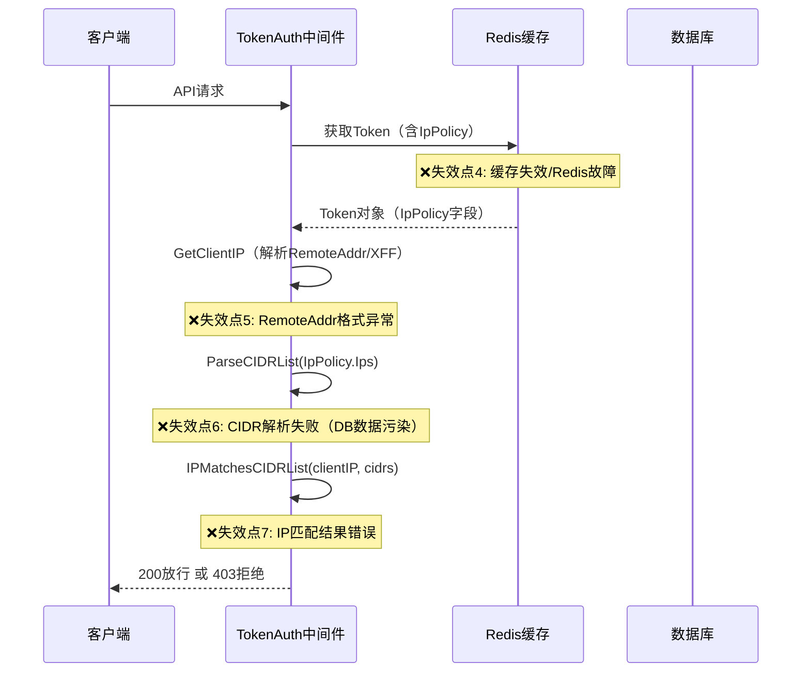

**FMEA 分析表格**：

| 失效模式 | 失效原因（围绕输入/执行/输出） | 失效影响（对产品核心能力） | 严重程度(S) | 发生频度(O) | 可探测度(D) | RPN | 改进措施（重点保证业务成功） |
|---------|--------------------------|------------------------|------------|------------|------------|-----|--------------------------|
| F1-失效：策略配置返回失败 | 输入：请求体 JSON 格式错误 | 管理员无法设置 IP 策略，功能不可用 | 5 | 3 | 2 | 30 | 输入校验返回明确 400 错误信息（具体违规字段），减少配置错误率 |
| F1-失效：策略配置返回失败 | 执行：数据库写入失败（连接断开/磁盘满） | 策略未生效，管理员重试困难 | 6 | 2 | 3 | 36 | GORM 写入失败返回 500；日志记录 error；监控 DB 连接状态告警；支持管理员重试 |
| F1-超时：配置接口响应超时 | 执行：数据库慢查询/连接池耗尽 | 配置操作卡顿，管理员体验差 | 5 | 2 | 3 | 30 | 监控 F001 接口 P99 延迟；DB 连接池超时告警（> 200ms）；读写超时配置（GORM `Context` with timeout） |
| F2-失效：GetClientIP 返回错误 IP | 执行：RemoteAddr 格式异常（net.SplitHostPort 失败） | IP 策略基于错误 IP 执行，可能误放行/拦截 | 7 | 1 | 4 | 28 | `net.SplitHostPort` 失败时回退使用原始 RemoteAddr 字符串，保证函数始终返回（降级而非 panic） |
| F2-不完整：GetClientIP 返回代理 IP 而非客户端 IP | 输入：TRUSTED_PROXIES 未配置或配置错误 | IP 策略校验基于代理 IP（始终通过或始终拒绝），策略失效 | 8 | 2 | 5 | 80 | 部署文档明确 TRUSTED_PROXIES 配置规范；服务启动时若配置非空，打印 INFO 日志列出已加载的代理 CIDR，便于验证；可考虑添加配置验证接口 |
| F3-失效：IP 策略执行返回失败 | 执行：ParseCIDRList 失败（数据库字段被污染） | CIDR 解析失败，策略无法执行 | 6 | 1 | 3 | 18 | fail-open 宽松降级（不拦截 + WARN 日志 ip_policy_parse_failed）；通过 WARN 日志告警触发运维排查 DB 数据 |
| F3-超时：IP 匹配延迟超标（P99 > 1ms） | 执行：ParseCIDRList 在极高 QPS 下成为瓶颈 | 鉴权延迟增加，影响所有 API 请求响应时间 | 6 | 2 | 3 | 36 | 压测验证 P99；若超标，增加 Token 级 CIDR 解析结果缓存（TTL=60s，sync.Map）；监控 TokenAuth 总延迟 |
| F3-不完整：IpPolicy 未生效（策略已配置但未校验） | 执行：middleware/auth.go 中 IP 策略块未被执行（条件判断错误）| 安全策略失效，任意 IP 均可访问 | 9 | 1 | 2 | 18 | 集成测试覆盖：白名单/黑名单拦截场景（验证 403 + IP_NOT_ALLOWED）；c.Abort() + return 确保拦截后不继续执行 |
| F3-失效：合法请求被误拦截（白名单误判） | 执行：IPMatchesCIDRList 逻辑错误（CIDR Contains 计算错误）| 合法用户被拒绝，影响服务可用性 | 8 | 1 | 2 | 16 | 单元测试覆盖边界 CIDR（`1.2.3.4/32`、`0.0.0.0/0`、IPv6）；集成测试验证白名单通过场景 |

**本迭代需要解决的故障**：

根据 RPN 优先级排序（RPN = S×O×D），本迭代重点解决：

1. **最高优先级（RPN=80）**：F2-不完整：GetClientIP 返回代理 IP（TRUSTED_PROXIES 未配置/配置错误）
   - 措施：部署文档完善 + 服务启动时打印已加载代理 CIDR 日志

2. **高优先级（RPN=36）**：
   - F1-失效：DB 写入失败（RPN=36）— 措施：GORM 错误处理 + DB 连接监控
   - F3-超时：ParseCIDRList 性能瓶颈（RPN=36）— 措施：压测验证 + 预留 Token 级缓存扩展点

3. **中等优先级（RPN=30）**：
   - F1-失效：请求体格式错误（RPN=30）— 措施：明确输入校验错误提示
   - F1-超时：配置接口慢（RPN=30）— 措施：DB 超时监控

4. **解决措施方向**：WARN 日志监控（ip_policy_parse_failed）、鉴权延迟监控（P99告警）、集成测试全场景覆盖（白名单/黑名单/降级）

---

#### 4.6.3. 可测试性设计

**测试难度分析**：

| 业务流程 | 测试难度 | 难点描述 | 解耦方法 |
|---------|---------|---------|---------|
| `GetClientIP` XFF 伪造防护 | 高 | 需要构造可信/非可信代理场景，且依赖全局变量 `trustedProxyCIDRs` | Mock `trustedProxyCIDRs`：单元测试中直接调用 `InitTrustedProxies` 初始化测试数据；使用 `httptest.NewRecorder` + 构造 gin.Context |
| `TokenAuth` IP 策略执行（F004/F005） | 高 | 依赖完整鉴权链（JWT+Token+Redis+DB），难以独立测试 | Mock DB（testify/mock 或 go-sqlmock）；Mock Redis（miniredis）；在 auth_test.go 中构造带 IpPolicy 的 Token 对象直接注入 |
| 并发安全（race condition） | 中 | `trustedProxyCIDRs` 全局变量初始化与并发读取可能有竞态 | Go race detector（`-race` 标志）；并发 goroutine 测试 `GetClientIP` |
| CIDR 解析边界（IPv6、/32、/0） | 中 | 边界值较多，易遗漏 | 使用表驱动测试（table-driven tests）覆盖所有边界值 |

**测试策略设计**：

**单元测试（目标覆盖率 ≥ 85%）**：

| 测试文件 | 测试目标 | 框架 | Mock 策略 |
|---------|---------|------|---------|
| `common/ip_matcher_test.go`（新建） | `ValidateCIDRList`、`ParseCIDRList`、`IPMatchesCIDRList`、`GetClientIP`、`InitTrustedProxies` 全部函数及边界场景 | Go 标准 `testing` | 使用 `httptest` 构造 gin.Context；InitTrustedProxies 直接调用 |
| `model/token_test.go`（增量） | `IpPolicy.Value()`、`IpPolicy.Scan()` JSON 序列化/反序列化边界（nil、空列表、非法JSON） | `testing` + `go-sqlmock` | Mock 数据库 Scan 行为 |
| `controller/token_test.go`（增量） | `UpdateTokenIpPolicy` 权限校验、输入校验、成功/失败路径 | `testing` + `httptest` + `testify/mock` | Mock `model.GetTokenByIds`、`token.UpdateIpPolicy` |

**集成测试**（覆盖端到端鉴权链）：

| 测试场景 | 验证点 |
|---------|-------|
| 白名单模式：请求 IP 在列表内 | HTTP 200，请求通过 |
| 白名单模式：请求 IP 不在列表内 | HTTP 403 + `IP_NOT_ALLOWED` |
| 黑名单模式：请求 IP 在列表内 | HTTP 403 + `IP_NOT_ALLOWED` |
| 黑名单模式：请求 IP 不在列表内 | HTTP 200，请求通过 |
| IpPolicy == nil（旧 Token） | 无策略校验，行为与旧版一致 |
| CIDR 解析失败（DB 数据污染） | fail-open，请求通过 + WARN 日志 |
| XFF 伪造（未配置 TRUSTED_PROXIES） | XFF 忽略，使用 RemoteAddr 校验 |

**测试文件放置和检测流程**：

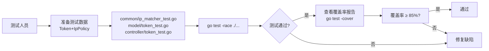

**可测试性指标**：
- 单元测试覆盖率目标：`common/ip_matcher.go` ≥ 95%；其他新增/修改函数 ≥ 85%
- 集成测试覆盖所有 7 个核心场景
- 并发安全：`go test -race` 无数据竞争报告

---

#### 4.6.4. 可调试性设计

**调试难度分析**：

| 业务流程 | 调试难度 | 难点描述 |
|---------|---------|---------|
| XFF 伪造绕过 IP 策略 | 高 | 部署层涉及代理/CDN，客户现场难以复现；需要从日志反推实际使用的 clientIP |
| IpPolicy 策略未生效 | 高 | 可能原因众多（Token.IpPolicy 字段未写入/Redis 缓存未刷新/中间件顺序错误） |
| CIDR 解析失败告警持续 | 中 | 需要从 token_id 反查 DB 中的 ip_policy 原始字符串 |

**调试机制设计**：

1. **日志设计**：

| 事件 | 级别 | 关键字 | 字段 | 格式示例 |
|-----|------|-------|------|---------|
| IP 被拦截（正常鉴权拒绝） | INFO | `ip_not_allowed` | token_id, client_ip, mode | `[INFO] ip_not_allowed token_id=42 client_ip=1.2.3.4 mode=whitelist` |
| CIDR 解析失败（降级） | WARN | `ip_policy_parse_failed` | token_id, error | `[WARN] ip_policy_parse_failed token_id=42 error="invalid CIDR"` |
| 可信代理初始化 | INFO | `trusted_proxies_loaded` | count, cidrs | `[INFO] trusted_proxies_loaded count=2 cidrs="10.0.0.0/8,172.16.0.0/12"` |
| TRUSTED_PROXIES 配置非法条目 | WARN | `trusted_proxy_invalid` | entry | `[WARN] trusted_proxy_invalid entry="not-a-cidr"` |

2. **调试接口**：

| 接口 | 说明 |
|------|------|
| `GET /api/status`（现有） | 服务健康状态 |
| `GET /api/token/:id`（现有）| 查询 Token 详情（含 IpPolicy 字段），可验证策略是否正确写入 |

3. **数据有效性自检**：
   - 服务启动时 `InitTrustedProxies` 打印已加载的代理 CIDR 列表，便于验证配置正确性
   - `IpPolicy.Scan()` 失败时记录 WARN 日志（token_id + 原始 JSON 截断），便于排查 DB 数据问题

**客户现场故障诊断方法**：

| 故障现象 | 排查步骤 |
|---------|---------|
| IP 策略未生效（应拦截的请求未被拦截） | 1. 查询 `GET /api/token/:id` 确认 IpPolicy 字段是否正确写入；2. 检查日志中是否有 `ip_not_allowed` 或 `ip_policy_parse_failed`；3. 检查 TRUSTED_PROXIES 配置，确认 GetClientIP 返回的是真实客户端 IP |
| 合法请求被误拦截（403 IP_NOT_ALLOWED） | 1. 查看 INFO 日志中 `ip_not_allowed` 条目，确认 `client_ip` 字段值；2. 对比 Token.IpPolicy 中的 CIDR 配置；3. 若 client_ip 是代理 IP，检查 TRUSTED_PROXIES 配置 |
| WARN 日志持续出现 `ip_policy_parse_failed` | 1. 通过 token_id 直接查询 DB 中 `tokens.ip_policy` 字段原始值；2. 确认是否为非法 JSON；3. 通过管理接口 `PUT /api/token/:id/ip_policy` 重新设置正确策略 |

---

#### 4.6.5. 可运维性设计

**监控体系（黄金指标全覆盖）**：

| 指标类型 | 指标名称 | 采集方法 | 告警阈值 |
|---------|---------|---------|---------|
| **Latency（延迟）** | TokenAuth 总延迟 P99 | 日志中间件统计 | P99 > 100ms 触发 P2 告警 |
| **Latency（延迟）** | IP 策略校验延迟 P99 | INFO 日志 `ip_not_allowed` 时间戳统计 | P99 > 5ms 触发 P3 告警 |
| **Traffic（流量）** | `ip_not_allowed` 每分钟拦截次数 | 日志关键字 `ip_not_allowed` 统计 | 突增 > 100次/min 触发 P2 告警（可能攻击） |
| **Traffic（流量）** | `PUT /api/token/:id/ip_policy` 调用频率 | 请求日志统计 | 正常极低频，> 100次/min 触发 P3 告警 |
| **Errors（错误）** | `ip_policy_parse_failed` 累计次数 | WARN 日志关键字统计 | 任意出现触发 P2 告警（DB 数据污染） |
| **Errors（错误）** | F001 接口 5xx 错误率 | HTTP 状态码统计 | 5xx 率 > 1% 触发 P1 告警 |
| **Saturation（饱和度）** | DB 连接池使用率 | GORM 指标 | > 80% 触发 P2 告警 |
| **Saturation（饱和度）** | 服务内存使用 | 进程监控 | > 80% 触发 P2 告警 |

**告警分级**：

| 级别 | 含义 | 响应时效 | 对应场景 |
|------|------|---------|---------|
| P0（紧急） | 服务不可用 | 立即处理（15min内） | 服务进程崩溃、DB 连接全部失败 |
| P1（严重） | 核心功能受损 | 1小时内处理 | F001 接口 5xx > 1%、TokenAuth 鉴权失败率异常 |
| P2（重要） | 功能降级或安全事件 | 4小时内处理 | ip_not_allowed 突增（攻击）、ip_policy_parse_failed 出现、DB 连接池告警 |
| P3（一般） | 性能异常或低优先级问题 | 工作日内处理 | IP 策略校验延迟增加、策略配置接口调用异常 |

**运维工具**：

| 工具 | 用途 | 操作方式 |
|------|------|---------|
| 策略配置接口 | 设置/清除 Token IP 策略 | `curl -X PUT /api/token/:id/ip_policy -H "Authorization: Bearer xxx" -d '{"mode":"","ips":[]}'` |
| 日志查询 | 排查拦截事件 | `grep "ip_not_allowed" /var/log/new-api/*.log \| grep "token_id=42"` |
| Token 详情查询 | 验证 IpPolicy 是否正确写入 | `curl /api/token/:id -H "Authorization: Bearer xxx"` |
| 数据库直查 | 检查 ip_policy 原始值 | `SELECT id, ip_policy FROM tokens WHERE id = 42;` |

**可运维性设计原则**：
- TRUSTED_PROXIES 配置变更需重启服务（env var，静态初始化）
- Token IP 策略配置变更通过 REST API 实时生效（秒级，无需重启）
- Token Redis 缓存失效周期内（通常 60s）策略可能使用旧值（Redis 缓存已有 Token）

---

#### 4.6.6. 可扩展性设计

**扩展需求分析**：

| 扩展方向 | 当前状态 | 扩展机制 |
|---------|---------|---------|
| CIDR 解析缓存（性能优化） | 每次请求即时解析（方案A） | Token 级 sync.Map 缓存（TTL=60s），接口不变，仅在 middleware/auth.go 中增加 cache 逻辑 |
| 条目数上限可配置 | 当前硬编码 100 | 将上限改为读取配置项/环境变量（`IP_POLICY_MAX_IPS`），接口不变 |
| IP 策略查询接口 | 当前不支持 GET | 新增 `GET /api/token/:id/ip_policy` 路由，无需修改现有数据结构 |
| 黑名单管理员权限 | 待产品确认（Q4） | 在 `UpdateTokenIpPolicy` 中增加 `mode=="blacklist"` 时的管理员角色校验，逻辑独立 |
| IPv6 支持 | 已原生支持（`net.ParseCIDR` 支持 IPv6） | 无需扩展，当前已支持 |
| TRUSTED_PROXIES 动态更新 | 当前需重启服务 | 若需运行时更新，可改为数据库 `options` 表存储（方案B）；需额外读锁保护 `trustedProxyCIDRs` |

**扩展点设计**：

```go
// 扩展点1: Token级CIDR解析缓存（预留）
// 在 middleware/auth.go 中，ParseCIDRList 调用前检查缓存
// var cidrCache sync.Map // key: tokenID+policyHash, value: []*net.IPNet
// cidrs, ok := cidrCache.Load(key)
// if !ok { cidrs, _ = common.ParseCIDRList(token.IpPolicy.Ips); cidrCache.Store(key, cidrs) }

// 扩展点2: 条目数上限配置化（预留）
// const DefaultMaxIPPolicyEntries = 100
// maxEntries := setting.GetIPPolicyMaxEntries() // 读配置，默认100
```

**版本兼容性策略**：
- **接口版本**：新增的 `PUT /api/token/:id/ip_policy` 端点不修改现有接口，向后兼容
- **数据库兼容性**：ADD COLUMN 操作，旧记录 `ip_policy = NULL`，触发跳过逻辑，完全兼容
- **Token 模型兼容**：`IpPolicy *IpPolicy`（指针，nil 时跳过），不影响现有 Token 序列化/反序列化

---

#### 4.6.7. 可复用性设计

##### 4.6.7.1. 本模块可采用的公用代码

| 公共函数/模块 | 代码位置 | 本模块使用方式 |
|-------------|---------|--------------|
| `common.IsIpInCIDRList` | `common/ip.go:33` | 参考实现模式（net.ParseCIDR + Contains），新函数风格保持一致 |
| `common.Marshal` / `common.Unmarshal` | `common/json.go` | `IpPolicy.Value()` 和 `IpPolicy.Scan()` 中使用，遵循 Rule 1 |
| `common.ApiError` / `common.ApiErrorI18n` | `common/api_error.go` | `UpdateTokenIpPolicy` Handler 错误响应 |
| `model.GetTokenByIds` | `model/token.go`（已有） | F001 中查询 Token 并校验权限 |
| `middleware.UserAuth()` | `middleware/auth.go` | F001 路由组已挂载，无需重复 |
| `controller.UpdateToken` | `controller/token.go:225` | F001 参考权限校验和响应格式 |

##### 4.6.7.2. 本模块可产出的公用代码

| 可复用函数 | 代码位置（规划） | 复用价值 |
|----------|---------------|---------|
| `common.ValidateCIDRList` | `common/ip_matcher.go` | 其他需要 CIDR 格式校验的模块可直接调用（如限流规则、路由策略） |
| `common.ParseCIDRList` | `common/ip_matcher.go` | 其他需要 CIDR 解析的功能可复用（解析后复用 `[]*net.IPNet`）|
| `common.IPMatchesCIDRList` | `common/ip_matcher.go` | 通用 IP 命中 CIDR 列表判断，其他访问控制场景可复用 |
| `common.GetClientIP` | `common/ip_matcher.go` | 可信代理感知 IP 提取，其他需要真实客户端 IP 的场景（如限流、审计）可复用 |
| `IpPolicy` + Valuer/Scanner 模式 | `model/token.go` | JSON 序列化到 TEXT 列的模式，可作为其他结构化字段存储的参考实现 |

---

#### 4.6.8. 系统隐私设计

**隐私保护目标**：本模块不收集用户不知情的数据；IP 策略配置操作由 Token 拥有者或管理员主动发起；不因模块自身原因导致敏感信息泄露。

**数据收集原则**：

| 数据项 | 收集目的 | 是否必需 | 保留策略 |
|-------|---------|---------|---------|
| Token IP 策略（mode + ips 列表） | 访问控制决策 | 是（功能必需） | 随 Token 生命周期，Token 删除时策略一并删除 |
| 客户端 IP（`client_ip` 日志字段） | 访问控制审计、安全事件溯源 | 是（审计必需） | 日志文件保留周期（遵循项目日志轮转策略，通常 30 天） |
| TRUSTED_PROXIES 配置 | 确定可信代理范围 | 是（安全必需） | 环境变量，不持久化，重启后重新读取 |

**传输安全**：
- IP 策略配置通过 HTTPS（TLS 1.2+）传输（由部署层 Nginx/TLS 保证）
- `ips` 列表（IP/CIDR 字符串）不属于个人隐私数据，但涉及网络拓扑，通过 HTTPS 保护
- API 响应中不返回其他 Token 的 IP 策略信息（权限校验确保）

**存储安全**：
- `tokens.ip_policy` 字段存储明文 JSON（IP/CIDR 不含密钥或密码，无需加密存储）
- 数据库访问控制由部署层保证（DB 账号最小权限）
- Token 删除时，GORM 软删除或物理删除均清除 `ip_policy` 字段

**隐私合规**：
- IP 地址属于个人信息（GDPR 定义），日志中的 `client_ip` 字段遵循最小化原则（仅用于访问控制审计）
- 审计日志（`ip_not_allowed`）不暴露 Token 的 CIDR 列表内容，仅记录拦截事件本身
- 数据主体权利：Token 删除时 IP 策略随之删除；客户端 IP 日志随日志轮转自动删除

---

#### 4.6.9. 跨平台设计和平台差异处理

**支持平台**：本模块随 `new-api` 项目支持以下平台：

| 平台 | 架构 | 操作系统 |
|------|------|---------|
| x86_64 | 64位 | Linux（主要）、Windows（开发）、macOS（开发）|
| ARM64 | 64位 | Linux（容器化部署） |

**平台无关设计**：

1. **代码层面**：
   - 纯 Go 实现，使用标准库 `net`（跨平台），无 CGO 依赖，无平台特定系统调用
   - `net.ParseCIDR`、`net.ParseIP`、`net.SplitHostPort` 在所有平台行为一致
   - JSON 序列化使用 `common/json.go`（封装标准库），无平台差异

2. **数据结构层面**：
   - `IpPolicy` struct 使用标准 Go 类型（`string`、`[]string`），无平台相关的大小端或对齐问题
   - `[]*net.IPNet` 指针切片大小（8字节/指针）在 64 位平台一致（x86_64 与 ARM64 均为 64 位）

**平台差异处理**：

| 差异点 | 处理方式 |
|-------|---------|
| 数据库类型差异 | 使用 `type:text` GORM 标签，SQLite/MySQL/PostgreSQL 均支持；不使用 JSONB（仅 PostgreSQL）|
| 行结束符（CRLF vs LF） | JSON 序列化结果无行结束符；日志输出由 Go 日志框架处理，跨平台一致 |
| 时间处理 | 本模块无时间计算；Token 时间戳字段由现有代码处理 |
| 字符编码 | 所有字符串使用 UTF-8（Go 原生）；CIDR 字符串为 ASCII 子集，无编码问题 |

**架构差异处理**：

- ARM64：Go 标准库 `net` 包对 ARM64 完全支持；CI/CD 多架构构建（`GOARCH=arm64`）
- 容器镜像：推荐使用多架构基础镜像（`golang:1.22-alpine`，支持 linux/amd64 + linux/arm64）
- 无 CGO 依赖，`CGO_ENABLED=0` 静态编译，跨平台二进制可移植性最高

**统一代码维护**：一套代码完成全平台支持，无平台分支代码，无条件编译（`//go:build`）需求。

---

### 4.7. 方案风险分析

本章节对第4章描述的整体方案进行风险分析，识别所有可能存在风险的关键环节，对每一个风险给出解决方法。

**风险分析表**：

| 风险点 | 风险等级 | 风险描述 | 影响范围 | 风险预研结果/风险规避措施 |
|-------|---------|---------|---------|------------------------|
| R1: TRUSTED_PROXIES 配置错误导致 XFF 伪造绕过 | 高 | 运维人员误将非代理服务 IP 填入 TRUSTED_PROXIES，导致攻击者可通过 XFF 头伪造来源 IP 绕过白名单 | IP 策略执行（F003/F004），影响所有配置了白名单的 Token | 部署文档明确配置规范；服务启动日志打印已加载代理 CIDR；安全审计定期检查 TRUSTED_PROXIES 配置正确性 |
| R2: ParseCIDRList 高频调用成为性能瓶颈 | 中 | 每次请求调用 ParseCIDRList 即时解析（无缓存），高并发时 CPU 开销可能超出预期 | F005 中间件，影响所有配置了 IpPolicy 的 Token 的请求延迟 | 预研结论：P99 < 1ms（100条CIDR），满足要求；预留 Token 级 CIDR 缓存扩展点（TTL=60s sync.Map），若压测发现瓶颈可快速启用 |
| R3: 数据库 ip_policy 字段手工篡改导致策略失效 | 低 | 数据库 ip_policy 被手工改为非法 JSON，Scan 失败后 IpPolicy 为 nil，策略失效 | F002/F005，影响单个 Token 的 IP 策略生效 | 宽松降级：Scan 失败时不拦截（服务可用性优先）+ WARN 日志（ip_policy_parse_failed）告警；运维人员通过日志发现并修复 |
| R4: SQLite AutoMigrate ADD COLUMN 版本兼容 | 低 | SQLite 版本差异可能影响 AutoMigrate ADD COLUMN 行为 | F002 数据库迁移，影响 SQLite 部署环境 | 预研结论：SQLite 支持 ADD COLUMN（不支持 ALTER COLUMN，但本次只用 ADD COLUMN）；需在 SQLite/MySQL/PostgreSQL 三库环境验证 AutoMigrate 结果 |
| R5: Q1 和 Q4 业务风险未确认导致返工 | 高 | Q1（空白名单语义）和 Q4（黑名单管理员权限）暂定行为可能与产品最终决策不一致，导致代码修改 | F001 Handler、F005 中间件 | 尽快与产品确认 Q1/Q4；代码设计为独立条件块，修改影响范围小（F001 中加一个角色判断，F005 中调整白名单空列表逻辑）；推迟上线直到业务确认 |
| R6: Redis 缓存中旧 Token 包含过期 IpPolicy | 中 | Token.IpPolicy 更新后，Redis 缓存中的旧 Token 对象（TTL 未到期）仍使用旧策略，导致策略延迟生效 | F005，影响刚更新策略的 Token | 策略更新后触发 Redis 缓存主动失效（在 UpdateIpPolicy 后调用 `model.DeleteTokenCache`）；若不实现主动失效，容忍 Redis TTL 内的延迟生效（通常 < 60s） |
| R7: 并发写入同一 Token IP 策略（竞态） | 低 | 同一 Token 的 IP 策略被两个请求并发更新，最后写入者覆盖（最终一致） | F001，影响并发配置场景 | GORM UPDATE 为原子操作，不会产生部分写入；最后写入者生效符合最终一致性语义；若需强一致性可引入乐观锁（version 字段） |
| R8: c.Abort() 调用后忘记 return 导致后续代码执行 | 高 | Gin 的 Abort() 仅阻止后续中间件，不终止当前函数；忘记 return 将导致计费/转发等逻辑在 IP 拒绝后仍执行 | F005，安全关键 | 代码审查强制要求 Abort() 后必须立即 return；集成测试验证 403 响应后后续 handler 不执行 |

**风险缓解总结**：

- **高风险（R1/R5/R8）**：
  - R1：完善部署文档和启动日志，定期安全审计
  - R5：产品确认优先于开发（阻塞事项），暂定行为以保守策略为默认
  - R8：代码规范强制要求 + 单测覆盖

- **中风险（R2/R6）**：
  - R2：先上线无缓存方案，压测验证 P99，必要时启用缓存扩展点
  - R6：UpdateIpPolicy 后主动失效 Redis 缓存（建议实现）

- **低风险（R3/R4/R7）**：
  - 降级机制（R3）+ 三库验证（R4）+ 最终一致性可接受（R7）

**备用方案**：

| 风险场景 | 主方案 | 备用方案 | 切换条件 |
|---------|-------|---------|---------|
| ParseCIDRList 成为瓶颈（R2） | 每次即时解析 | Token 级 sync.Map CIDR 缓存（TTL=60s） | 压测 P99 > 5ms 时启用 |
| TRUSTED_PROXIES 静态配置不满足需求（R1） | 环境变量，重启生效 | 数据库 options 表存储，API 动态更新（方案B） | 运维强烈要求动态更新时实施 |

**后续跟进事项**：

| 事项 | 当前状态 | 跟进计划 | 优先级 |
|-----|---------|---------|-------|
| Q1：空白名单语义确认 | 待产品确认 | 开发启动前与产品对齐 | 🔴 高 |
| Q4：黑名单管理员权限确认 | 待产品确认 | 开发启动前与产品对齐 | 🔴 高 |
| Redis 缓存主动失效实现 | 未评估 | 评估 `model.DeleteTokenCache` 接口是否存在，若有则在 UpdateIpPolicy 后调用 | 🟡 中 |
| 三库 AutoMigrate 验证 | 未测试 | 开发完成后在 SQLite/MySQL/PostgreSQL 三环境验证 | 🟡 中 |
| 压测验证 ParseCIDRList 延迟 | 未执行 | 功能测试通过后执行压测（100条CIDR × 高并发）| 🟡 中 |

---

## 5. 数据结构设计

### 5.1. 配置文件定义

本模块不修改任何传统配置文件（无 YAML/JSON/TOML 配置文件变更）。

**新增环境变量配置**：

| 配置项 | 类型 | 读取位置 | 默认值 | 格式说明 | 示例值 |
|-------|------|---------|-------|---------|-------|
| `TRUSTED_PROXIES` | 环境变量 | `common/init.go:InitEnv()` 函数末尾（新增1行调用） | `""` （空，表示无可信代理） | 逗号分隔的 IP 或 CIDR 字符串 | `"10.0.0.1,172.16.0.0/12,192.168.0.0/16"` |

**配置语义说明**：

| 配置值 | 语义 | 行为 |
|-------|------|------|
| 空字符串（默认） | 无可信代理 | `trustedProxyCIDRs = nil`，所有请求使用 RemoteAddr 作为客户端 IP；XFF 头永远被忽略 |
| 单个 IP，如 `"10.0.0.1"` | 单个可信代理 | 来自该 IP 的请求，采信 XFF 头的最左侧 IP；自动补全为 `10.0.0.1/32` |
| CIDR 范围，如 `"172.16.0.0/12"` | 代理 IP 段 | 来自该范围的请求，采信 XFF 头 |
| 包含非法条目的混合串 | 容错处理 | 跳过非法条目，仅加载合法条目；启动时 WARN 日志记录非法项 |

**配置升级流程**：

- 新增配置：部署时在环境变量中添加 `TRUSTED_PROXIES`，重启服务生效
- 变更配置：修改环境变量值后重启服务（静态初始化，运行时不重新读取）
- 删除配置：将环境变量置空或删除，重启后 `trustedProxyCIDRs` 恢复为 nil（无可信代理）

**数据库 tokens 表变更**（通过 GORM AutoMigrate）：

| 表名 | 变更类型 | 列名 | 类型 | 约束 | 默认值 | 兼容性 |
|-----|---------|------|------|------|-------|-------|
| `tokens` | ADD COLUMN | `ip_policy` | TEXT | NULL | NULL | SQLite/MySQL/PostgreSQL 三库兼容；AutoMigrate 幂等 |

### 5.2. 全局数据结构定义

#### 5.2.1. IpPolicy 结构体（新增）

**用途**：存储单个 API Key 的 IP 访问策略（模式 + CIDR 列表），通过 JSON 序列化持久化到 `tokens.ip_policy` 列。

```go
// IpPolicy 定义 API Key 的 IP 访问策略
// 文件位置：model/token.go（新增）
type IpPolicy struct {
    Mode string   `json:"mode"` // "whitelist" | "blacklist" | ""（空表示无策略）
    Ips  []string `json:"ips"`  // IP 或 CIDR 列表，如 ["1.2.3.4", "10.0.0.0/8"]
}
```

| 字段 | 类型 | 约束 | 说明 |
|-----|------|------|------|
| `Mode` | string | 枚举：`"whitelist"` / `"blacklist"` / `""` | 策略模式；`""` 表示无策略（等同 nil IpPolicy） |
| `Ips` | []string | 每条为合法 IP 或 CIDR；len ≤ 100 | IP/CIDR 列表；空切片合法（语义见 Q1） |

**接口实现（driver.Valuer / sql.Scanner）**：

```go
// Value 实现 driver.Valuer，将 IpPolicy 序列化为 JSON 字符串写入数据库
func (p IpPolicy) Value() (driver.Value, error) {
    bytes, err := common.Marshal(p)  // 使用项目封装的 JSON 序列化（Rule 1）
    if err != nil {
        return nil, err
    }
    return string(bytes), nil
}

// Scan 实现 sql.Scanner，从数据库读取 JSON 字符串反序列化为 IpPolicy
func (p *IpPolicy) Scan(value interface{}) error {
    if value == nil {
        return nil
    }
    bytes, ok := value.([]byte)
    if !ok {
        str, ok := value.(string)
        if !ok {
            return fmt.Errorf("IpPolicy.Scan: unsupported type %T", value)
        }
        bytes = []byte(str)
    }
    return common.Unmarshal(bytes, p)  // 使用项目封装的 JSON 反序列化
}
```

**边界条件**：
- `IpPolicy == nil`：GORM 不调用 Valuer，`ip_policy` 列写入 NULL；Scan 时返回 nil（Token.IpPolicy 为 nil）
- `Ips == []string{}`（空切片）：序列化为 `{"mode":"whitelist","ips":[]}`，与 nil 区分
- Scan 失败（非法 JSON）：返回 error，GORM 扫描后 IpPolicy 字段为 nil（中间件降级不拦截）

#### 5.2.2. Token.IpPolicy 字段（增量）

**用途**：在 `Token` 结构体中新增 `IpPolicy` 字段，存储 API Key 的 IP 访问策略。

```go
// 文件位置：model/token.go — Token struct（增量，新增字段）
type Token struct {
    // ... 现有字段保持不变 ...
    AllowIps *string   `json:"allow_ips" gorm:"column:allow_ips"`    // 旧字段，保持不变
    IpPolicy *IpPolicy `json:"ip_policy,omitempty" gorm:"type:text;column:ip_policy"` // 新增
}
```

| 字段 | 类型 | GORM Tag | JSON Tag | 兼容性 |
|-----|------|---------|---------|-------|
| `IpPolicy` | `*IpPolicy` | `gorm:"type:text;column:ip_policy"` | `json:"ip_policy,omitempty"` | 旧记录为 NULL → 扫描为 nil → 跳过策略校验（向后兼容）|

#### 5.2.3. trustedProxyCIDRs 全局变量（新增）

**用途**：存储可信反向代理的 CIDR 列表，服务启动时由 `InitTrustedProxies` 初始化一次，运行时只读。

```go
// 文件位置：common/ip_matcher.go（全新文件）
// trustedProxyCIDRs 存储可信代理 IP/CIDR 列表（服务启动时初始化，运行时只读）
var trustedProxyCIDRs []*net.IPNet
```

| 属性 | 说明 |
|-----|------|
| 类型 | `[]*net.IPNet`（Go 标准库 `net` 包） |
| 作用域 | 包级（`common` 包内） |
| 生命周期 | 进程级别，启动时初始化一次，运行时不变 |
| 线程安全 | ✅ 只读变量（初始化后不修改），并发读取安全；初始化时无并发（服务启动单线程） |
| 初始值 | `nil`（无可信代理） |

#### 5.2.4. IpPolicyRequest 数据传输对象（新增）

**用途**：`UpdateTokenIpPolicy` Handler 的请求体绑定结构体。

```go
// 文件位置：controller/token.go（或 dto/ 目录，视项目规范）
type IpPolicyRequest struct {
    Mode string   `json:"mode" binding:"omitempty,oneof=whitelist blacklist ''"` // 策略模式
    Ips  []string `json:"ips"  binding:"required"`                                // CIDR 列表
}
```

| 字段 | 类型 | 验证规则 | 说明 |
|-----|------|---------|------|
| `Mode` | string | 枚举：whitelist/blacklist/"" | 策略模式；`""` 清除策略 |
| `Ips` | []string | 非 nil（可为空切片） | IP/CIDR 列表；后续由 ValidateCIDRList 校验格式 |

---

## 6. 流程设计

### 6.1. CIDR 工具函数库（common/ip_matcher.go）

#### 6.1.1. 静态结构

**模块职责**：提供 CIDR 格式校验、解析、IP 命中判断和可信代理管理的通用工具函数，是整个 IP 访问控制功能的核心算法库。无业务逻辑，纯函数（除 `trustedProxyCIDRs` 全局变量外无 IO 操作）。

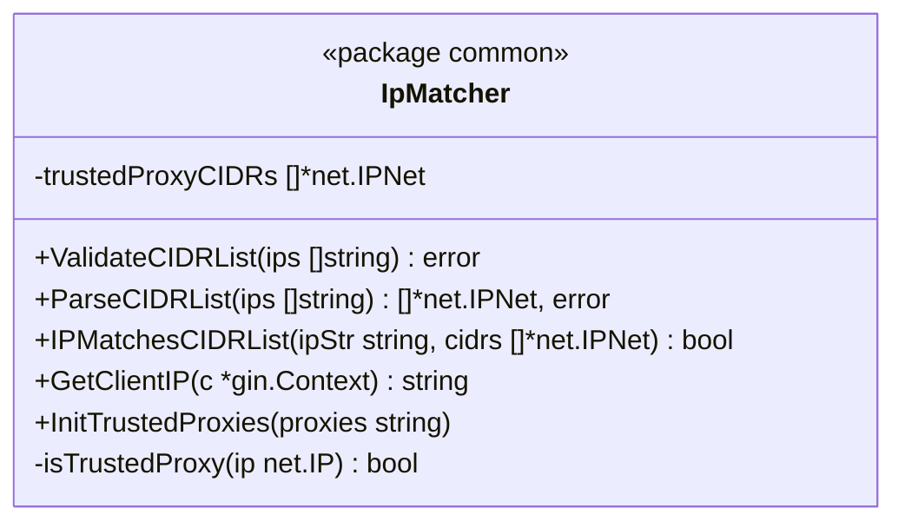

| 软件单元 | 类型 | 职责 |
|---------|------|------|
| `ValidateCIDRList` | 纯函数 | 入口校验：逐条验证 IP/CIDR 格式合法性，返回第一个违规条目的 error |
| `ParseCIDRList` | 纯函数 | CIDR 解析：将 IP/CIDR 字符串列表解析为 `[]*net.IPNet`，供 IPMatchesCIDRList 使用 |
| `IPMatchesCIDRList` | 纯函数 | IP 命中判断：判断给定 IP 字符串是否在 CIDR 列表中命中任意一条 |
| `GetClientIP` | 上下文函数 | 可信代理感知 IP 提取：根据 RemoteAddr 是否可信决定是否采信 XFF 头 |
| `InitTrustedProxies` | 初始化函数 | 可信代理初始化：解析 TRUSTED_PROXIES 环境变量，更新全局 `trustedProxyCIDRs` |
| `isTrustedProxy`（私有）| 纯函数 | 判断给定 IP 是否在 trustedProxyCIDRs 中 |

#### 6.1.2. 处理流程

**ValidateCIDRList 和 ParseCIDRList 流程**：

```mermaid
flowchart TD
    A[输入: ips []string] --> B{ips 为空?}
    B -->|是| C[返回 nil/空slice]
    B -->|否| D[遍历每条 IP/CIDR]
    D --> E{包含 '/' 前缀?}
    E -->|否，单IP| F[补全为 '/32']
    E -->|是，已有前缀| G[保持原值]
    F --> H[net.ParseCIDR 解析]
    G --> H
    H --> I{解析成功?}
    I -->|否| J[返回 error\n含违规条目]
    I -->|是| K[ValidateCIDRList: 继续下条\nParseCIDRList: 追加到结果]
    K --> L{还有更多条目?}
    L -->|是| D
    L -->|否| M[ValidateCIDRList: return nil\nParseCIDRList: return cidrs,nil]
```

**GetClientIP 流程（含异常处理）**：

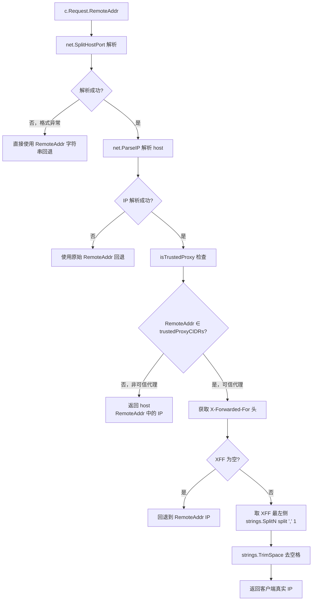

#### 6.1.3. 关键算法描述

**算法1：单 IP 自动补全**

```
if !strings.Contains(ip, "/") {
    ip = ip + "/32"
}
_, ipNet, err := net.ParseCIDR(ip)
```

- **最常见场景**：ips 全为单 IP（如 `["1.2.3.4"]`），自动补全为 `/32`，时间复杂度 O(n)，n ≤ 100
- **最差场景**：全为 `/0` 超大 CIDR（如 `"0.0.0.0/0"`），`net.ParseCIDR` 处理时间相同，性能无差异

**算法2：IPMatchesCIDRList（O(n) 线性遍历）**

```
ip := net.ParseIP(ipStr)  // O(1)
for _, cidr := range cidrs {  // O(n)
    if cidr.Contains(ip) { return true }  // O(1) 位运算
}
return false
```

- **最常见场景**：白名单命中（前几条 CIDR 即命中），平均 O(k)，k << n
- **最差场景**：黑名单全不命中（遍历全部100条），O(100)，P99 < 1ms（100次位运算极快）
- **注意**：IPv4 和 IPv6 `Contains` 逻辑由 `net.IPNet` 内部统一处理

#### 6.1.4. 数据结构定义

```go
// 包级全局变量（模块内部）
var trustedProxyCIDRs []*net.IPNet  // 只读，启动时初始化

// 函数间传递的核心类型
type ParsedCIDRs = []*net.IPNet     // ParseCIDRList 返回值（类型别名，便于阅读）
```

#### 6.1.5. 函数列表

| 函数名 | 签名 | 功能 | 参数说明 | 返回值 | 异常处理 |
|-------|------|------|---------|-------|---------|
| `ValidateCIDRList` | `func ValidateCIDRList(ips []string) error` | 校验 IP/CIDR 格式列表 | `ips`：待校验列表，nil/空合法 | 合法返回 nil；首个非法条目返回 error（含具体值） | 单 IP 自动补 /32，IPv6 支持；不 panic |
| `ParseCIDRList` | `func ParseCIDRList(ips []string) ([]*net.IPNet, error)` | 解析 IP/CIDR 为 net.IPNet 列表 | `ips`：待解析列表 | 成功返回 `[]*net.IPNet` 和 nil；首个非法条目返回 nil 和 error | 同上；调用方负责检查 error |
| `IPMatchesCIDRList` | `func IPMatchesCIDRList(ipStr string, cidrs []*net.IPNet) bool` | 判断 IP 是否命中 CIDR 列表 | `ipStr`：待匹配 IP 字符串；`cidrs`：已解析 CIDR 列表 | 命中返回 true；不命中或 ipStr 非法返回 false | `net.ParseIP` 非法 → 返回 false，不 panic；cidrs 为 nil/空 → 返回 false |
| `GetClientIP` | `func GetClientIP(c *gin.Context) string` | 可信代理感知 IP 提取 | `c`：gin.Context | 客户端真实 IP 字符串 | RemoteAddr 格式异常 → 返回原始字符串；XFF 为空 → 回退 RemoteAddr；不 panic |
| `InitTrustedProxies` | `func InitTrustedProxies(proxies string)` | 初始化全局可信代理列表 | `proxies`：逗号分隔的 IP/CIDR 串 | 无返回值 | 空字符串 → `trustedProxyCIDRs = nil`；非法条目 → 跳过 + WARN 日志；不 panic |

#### 6.1.6. 设计要点检视

| 检视项 | 设计说明 |
|-------|---------|
| **可维护/可调试措施** | 函数职责单一，纯函数（除 GetClientIP 依赖 gin.Context）；`InitTrustedProxies` 打印已加载代理 CIDR 日志；非法条目 WARN 日志含具体内容 |
| **可测试性** | 所有函数可独立单元测试（无外部 IO 依赖，除 GetClientIP）；GetClientIP 通过 `httptest.NewRecorder` + 构造 gin.Context 测试；`InitTrustedProxies` 调用后检查 `trustedProxyCIDRs` 值 |
| **自动化测试支持** | `common/ip_matcher_test.go`（表驱动测试）：ValidateCIDRList（合法/非法/边界）；ParseCIDRList（IPv4/IPv6/空列表）；IPMatchesCIDRList（命中/不命中/非法IP）；GetClientIP（可信/非可信代理/XFF空/格式异常）|
| **可扩展性** | 支持后续替换 `trustedProxyCIDRs` 为数据库驱动（接口抽象），当前全局变量符合当前需求 |
| **稳定性保证措施** | 所有函数对非法输入防御性处理（返回 false/error，不 panic）；`ParseCIDRList` 每次返回独立 slice，无共享可变状态，并发安全 |
| **工作量估算** | common/ip_matcher.go 实现：1 人天；common/ip_matcher_test.go：1 人天；合计 2 人天 |

---

### 6.2. Token 数据模型扩展（model/token.go）

#### 6.2.1. 静态结构

**模块职责**：在 `Token` 结构体中新增 `IpPolicy *IpPolicy` 字段，并提供 `IpPolicy` 结构体的定义及其 JSON 序列化/反序列化实现（`driver.Valuer`/`sql.Scanner` 接口），实现 IP 策略与 Token 的绑定存储。

```mermaid
classDiagram
    class Token {
        +AllowIps *string
        +IpPolicy *IpPolicy
        ... 其他现有字段
    }
    class IpPolicy {
        +Mode string
        +Ips []string
        +Value() driver.Value, error
        +Scan(value interface{}) error
    }
    Token --> IpPolicy : contains
    IpPolicy ..|> DriverValuer : implements
    IpPolicy ..|> SqlScanner : implements
```

#### 6.2.2. 处理流程

**IpPolicy 序列化流程（写数据库）**：

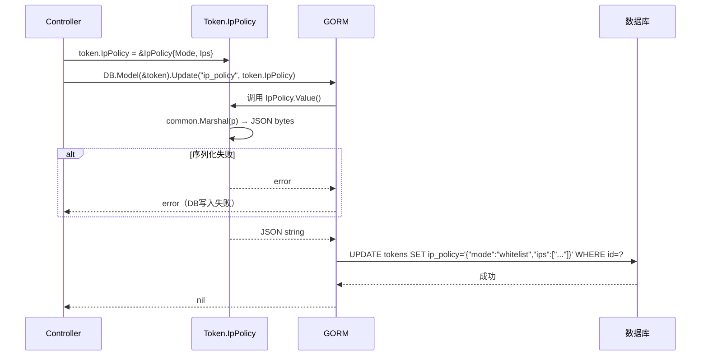

**IpPolicy 反序列化流程（读数据库）**：

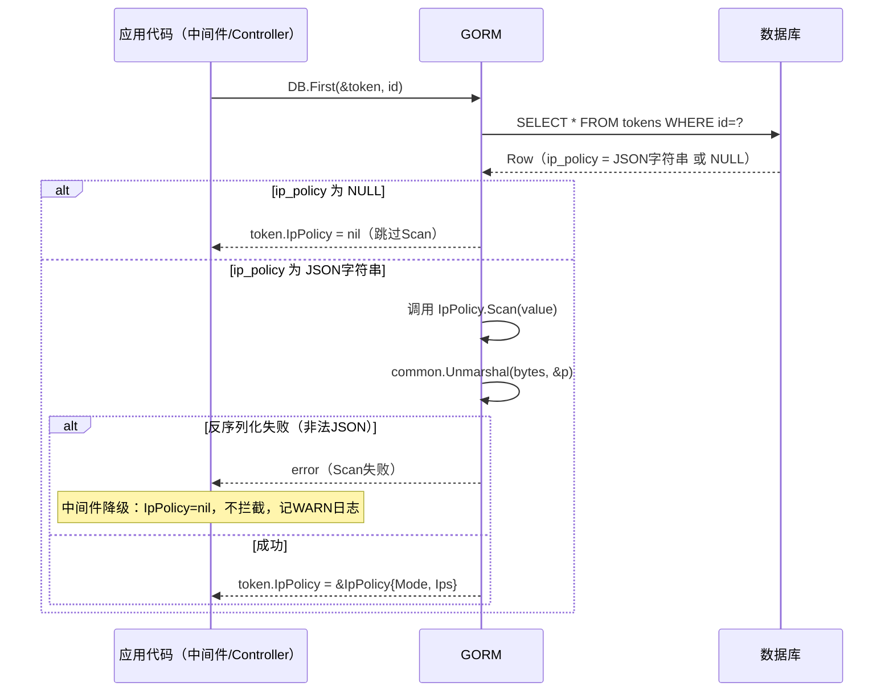

#### 6.2.3. 关键算法描述

**JSON 序列化到 TEXT 列**：使用 `common.Marshal(p)` 将 `IpPolicy` 序列化为 JSON 字节，再转换为字符串存储。时间复杂度 O(n)（n 为 Ips 列表长度，≤100），性能可忽略。

**反序列化兼容性**：`Scan` 接收 `interface{}` 参数，需处理 `[]byte` 和 `string` 两种类型（不同数据库驱动返回格式不同），均统一转为 `[]byte` 再解析。

#### 6.2.4. 数据结构定义

见 5.2.1 节 `IpPolicy` 结构体定义。

#### 6.2.5. 函数列表

| 函数名 | 签名 | 功能 | 参数 | 返回值 | 异常处理 |
|-------|------|------|------|-------|---------|
| `IpPolicy.Value` | `func (p IpPolicy) Value() (driver.Value, error)` | JSON 序列化 IpPolicy 为字符串 | 无（方法接收者为 IpPolicy） | `(string, nil)` 或 `(nil, error)` | 序列化失败返回 error，不 panic |
| `IpPolicy.Scan` | `func (p *IpPolicy) Scan(value interface{}) error` | 从数据库值反序列化 IpPolicy | `value`：数据库原始值（[]byte 或 string） | nil 成功；error 失败 | value 为 nil 时直接返回 nil；类型不匹配返回 error；JSON 解析失败返回 error |

#### 6.2.6. 设计要点检视

| 检视项 | 设计说明 |
|-------|---------|
| **可维护/可调试措施** | Valuer/Scanner 接口实现在 model/token.go 同文件，便于理解数据流；序列化使用项目封装的 `common.Marshal`，遵循 Rule 1 |
| **可测试性** | `IpPolicy.Value()` 和 `IpPolicy.Scan()` 可独立单元测试（不依赖数据库）；测试用例：正常序列化、nil 输入、非法 JSON 反序列化、空 Ips 切片 |
| **自动化测试支持** | `model/token_test.go`（增量）：表驱动测试覆盖 Value/Scan 的所有边界情况，使用 `go-sqlmock` 模拟 DB 扫描行为 |
| **可扩展性** | 若未来需要支持更多 IP 策略属性（如 `rule_name`、`expires_at`），只需在 IpPolicy struct 添加字段，JSON 向后兼容（旧 JSON 无新字段时，新字段为零值）|
| **稳定性保证措施** | Scan 失败时中间件降级不拦截（见 F005 设计），不引发服务中断；数据库写入失败时返回 500 error，不留中间状态 |
| **工作量估算** | model/token.go 增量实现：0.5 人天；测试：0.5 人天；合计 1 人天 |

---

### 6.3. IP 策略配置接口（controller/token.go + router/api-router.go）

#### 6.3.1. 静态结构

**模块职责**：提供 HTTP REST 接口，允许 Token 拥有者或管理员为指定 API Key 设置/清除 IP 访问策略。包含请求解析、权限校验、CIDR 格式校验、数据库更新等完整处理链。

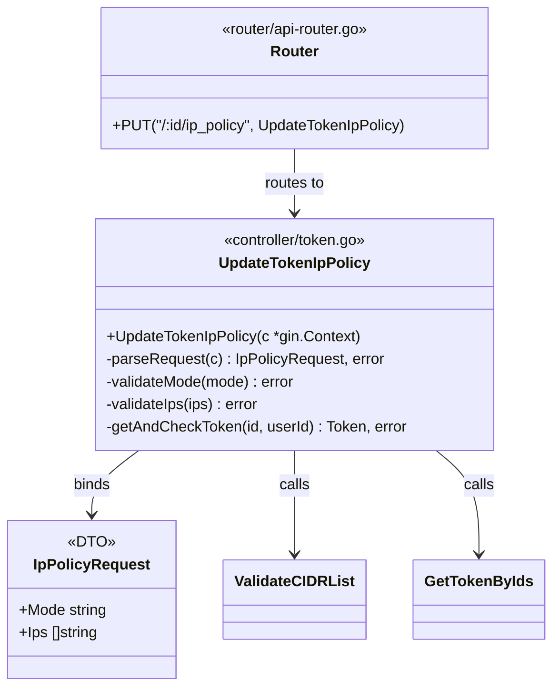

#### 6.3.2. 处理流程

（见 4.5.1 节详细时序图）

简化流程图（含异常分支）：

```mermaid
flowchart TD
    A[PUT /api/token/:id/ip_policy] --> B[UserAuth JWT 校验\n已由路由组中间件处理]
    B --> C[解析路径参数 id]
    C --> D{id 合法?}
    D -->|否| E[400 Bad Request]
    D -->|是| F[ShouldBindJSON 绑定请求体]
    F --> G{绑定成功?}
    G -->|否| H[400 Bad Request]
    G -->|是| I{mode ∈ 枚举值?}
    I -->|否| J[400 invalid mode]
    I -->|是| K{len ips <= 100?}
    K -->|否| L[400 too many IP entries]
    K -->|是| M[ValidateCIDRList ips]
    M --> N{格式全部合法?}
    N -->|否| O[400 invalid IP/CIDR: xxx]
    N -->|是| P[GetTokenByIds id userId]
    P --> Q{Token 存在?}
    Q -->|否| R[404 not found]
    Q -->|是| S{当前用户是拥有者或管理员?}
    S -->|否| T[403 forbidden]
    S -->|是| U{mode == ?}
    U -->|空字符串| V[IpPolicy = nil\n清除策略]
    U -->|非空| W[构建 IpPolicy{Mode,Ips}]
    V --> X[UpdateIpPolicy to DB]
    W --> X
    X --> Y{DB 写入成功?}
    Y -->|否| Z[500 Internal Server Error]
    Y -->|是| AA[200 success:true]
```

#### 6.3.3. 关键算法描述

**权限校验算法**：`GetTokenByIds(id, userId)` — 通过 Token 的数据库 ID 和当前用户 ID 联合查询，若用户不是拥有者且不是管理员（`role == admin`），返回 403。

复杂度：O(1)（单条数据库查询），P99 < 10ms。

#### 6.3.4. 数据结构定义

```go
// IpPolicyRequest — 请求体绑定 DTO
type IpPolicyRequest struct {
    Mode string   `json:"mode"`
    Ips  []string `json:"ips"`
}
```

#### 6.3.5. 函数列表

| 函数名 | 签名 | 功能 | 参数 | 返回值 | 异常处理 |
|-------|------|------|------|-------|---------|
| `UpdateTokenIpPolicy` | `func UpdateTokenIpPolicy(c *gin.Context)` | IP 策略配置 HTTP Handler | `c`：gin.Context | 无（通过 c.JSON 响应）| 各错误场景通过 `common.ApiError` 统一响应；数据库错误返回 500 |

#### 6.3.6. 设计要点检视

| 检视项 | 设计说明 |
|-------|---------|
| **可维护/可调试措施** | 遵循 `UpdateToken` 的代码风格（`controller/token.go:225`）；错误使用 `common.ApiError` 统一格式；请求日志由 Gin 中间件自动记录 |
| **可测试性** | Handler 可通过 `httptest.NewRecorder` + `httptest.NewRequest` 独立测试；Mock DB 避免测试依赖真实数据库 |
| **自动化测试支持** | 覆盖：成功配置、权限拒绝（非拥有者）、CIDR 格式错误、条目数超限、DB 写入失败 |
| **可扩展性** | 后续若需支持 Q3（GET 查询接口），只需新增 Handler 和路由注册，无需修改当前代码 |
| **稳定性保证措施** | `ShouldBindJSON` 校验请求体；`GetTokenByIds` 数据库查询封装了错误处理；不依赖 IpPolicy Scan（此处为写操作）|
| **工作量估算** | controller 实现：1 人天；路由注册：0.1 人天；测试：0.5 人天；合计 1.6 人天 |

---

### 6.4. 鉴权中间件 IP 策略扩展（middleware/auth.go + common/init.go）

#### 6.4.1. 静态结构

**模块职责**：在现有 `TokenAuth` 中间件（`middleware/auth.go:248`）中增量插入两个逻辑块：(1) 使用 `GetClientIP` 提取真实客户端 IP；(2) 执行 Token 绑定的 IP 策略校验（白名单/黑名单）。同时在 `common/init.go:InitEnv()` 末尾新增 `InitTrustedProxies` 调用。

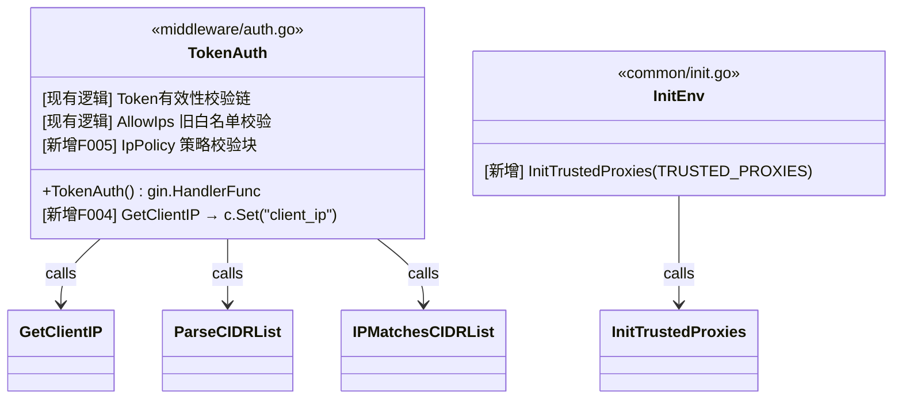

#### 6.4.2. 处理流程

（见 4.5.2 节详细时序图）

**F005 IP 策略校验块伪代码流程**：

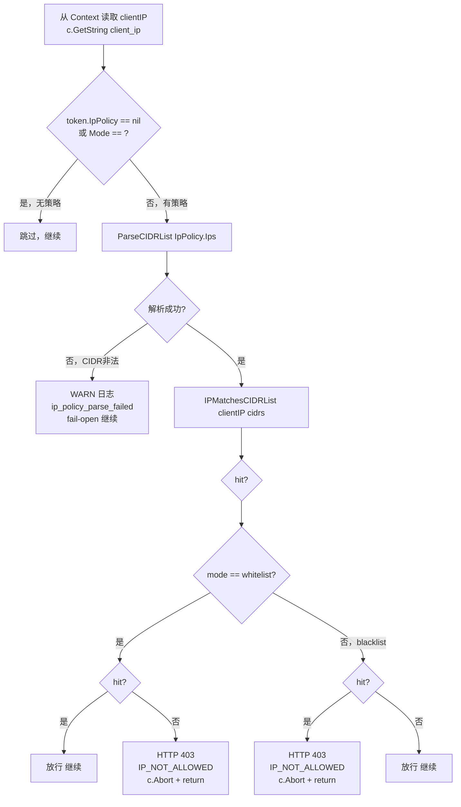

#### 6.4.3. 关键算法描述

**IP 策略决策逻辑**（核心）：

```
blocked = (mode == "whitelist" && !hit) || (mode == "blacklist" && hit)
```

- 白名单（whitelist）：IP 必须在列表内（hit=true），否则拦截
- 黑名单（blacklist）：IP 必须不在列表内（hit=false），否则拦截
- 时间复杂度：O(n)（IPMatchesCIDRList，n ≤ 100），P99 < 1ms

**关键安全约束**：`c.Abort()` 后必须立即 `return`，否则后续代码仍会执行。

#### 6.4.4. 数据结构定义

```go
// Context 键值（F004写入，F005读取）
const ClientIPContextKey = "client_ip"  // c.Set("client_ip", ip); c.GetString("client_ip")
```

#### 6.4.5. 函数列表

本模块为增量修改，不新增独立函数，在 `TokenAuth()` 函数内插入逻辑块：

| 代码位置 | 增量类型 | 插入内容 | 触发条件 |
|---------|---------|---------|---------|
| `middleware/auth.go` AllowIps 块之后 | 插入代码块（F004） | `clientIP := common.GetClientIP(c); c.Set("client_ip", clientIP)` | 每次 TokenAuth 执行 |
| `middleware/auth.go` F004 块之后 | 插入代码块（F005） | IP 策略校验块（8行逻辑，见 requirement.md §2.2.2 F005） | Token.IpPolicy != nil 且 Mode != "" 时 |
| `common/init.go:InitEnv()` 末尾 | 追加1行（F004） | `common.InitTrustedProxies(os.Getenv("TRUSTED_PROXIES"))` | 服务启动时 |

#### 6.4.6. 设计要点检视

| 检视项 | 设计说明 |
|-------|---------|
| **可维护/可调试措施** | 插入代码块结构清晰，与现有 AllowIps 块风格一致；INFO 日志（ip_not_allowed）包含完整诊断信息；WARN 日志（ip_policy_parse_failed）含 token_id + error |
| **可测试性** | 最难测试的是依赖完整 TokenAuth 链的集成测试；可通过 Mock DB/Redis（miniredis）构造带 IpPolicy 的 Token 进行端到端测试；XFF 伪造测试通过 httptest 构造请求头 |
| **自动化测试支持** | 集成测试覆盖：白名单命中/未命中、黑名单命中/未命中、IpPolicy==nil、CIDR解析失败降级、XFF伪造场景 |
| **可扩展性** | Token 级 CIDR 缓存扩展点：在 ParseCIDRList 调用前加 sync.Map 查询，接口不变；延迟生效可接受（TTL=60s）|
| **稳定性保证措施** | fail-open 降级（CIDR 解析失败不拦截）保证服务可用性；c.Abort() + return 保证拦截后链路终止；Gin Recovery 中间件保证 panic 不崩进程 |
| **工作量估算** | middleware/auth.go 增量：0.5 人天；init.go 增量：0.1 人天；集成测试：1 人天；合计 1.6 人天 |

---

## 7. 总结

### 7.1. 关联分析

**对老模块/老功能的影响**：

| 受影响模块 | 影响类型 | 详细说明 | 兼容性评估 |
|---------|---------|---------|----------|
| `model/token.go`（Token struct） | 增量扩展 | 新增 `IpPolicy *IpPolicy` 字段 | ✅ 完全向后兼容：指针类型，旧记录 NULL → nil，行为不变 |
| `middleware/auth.go`（TokenAuth） | 增量插入 | 在 AllowIps 块之后插入 GetClientIP + IpPolicy 校验块 | ✅ 完全向后兼容：新逻辑仅在 `IpPolicy != nil && Mode != ""` 时执行，旧 Token 不受影响 |
| `controller/token.go` | 纯新增 | 新增 `UpdateTokenIpPolicy` 函数 | ✅ 无影响：不修改现有函数 |
| `router/api-router.go` | 纯新增 | 新增 `PUT /:id/ip_policy` 路由 | ✅ 无影响：不修改现有路由 |
| `common/init.go` | 增量追加 | InitEnv() 末尾追加 InitTrustedProxies 调用 | ✅ 无影响：env 为空时 trustedProxyCIDRs = nil，行为与未修改时一致 |
| `tokens` 数据库表 | ADD COLUMN | `ip_policy TEXT NULL` | ✅ 完全向后兼容：仅添加列，旧行 NULL，AutoMigrate 幂等 |
| 现有 `AllowIps` 逻辑 | 无影响 | AllowIps 白名单逻辑（middleware/auth.go:316-330）**保持不变** | ✅ 两套 IP 控制机制共存，串行执行 |

**对相关联产品/版本的影响**：
- 已部署的 Token（无 IpPolicy）：行为完全不变，零停机升级
- 前端管理界面：需同步增加 IP 策略配置 UI（本文档不涉及，建议前端团队同步评估）
- 部署文档：需新增 TRUSTED_PROXIES 环境变量说明（供运维团队）
- QA 测试计划：需新增 IP 策略相关测试场景（白名单/黑名单/XFF伪造）

### 7.2. 遗留问题解决

**总体设计阶段遗留问题（已解决）**：

| 问题 | 解决方案 | 章节 |
|-----|---------|------|
| 三数据库兼容性 | 使用 `type:text` GORM 标签，TEXT 类型三库均支持；不使用 JSONB | 5.1, 5.2 |
| XFF 伪造防护方案 | GetClientIP 仅在可信代理时采信 XFF，TRUSTED_PROXIES 环境变量配置 | 4.2.3, 6.1 |
| 降级语义（CIDR 解析失败时） | fail-open 宽松降级：不拦截 + WARN 日志 | 4.2.2, 6.4 |

**本版本设计新增遗留问题（待解决）**：

| 编号 | 问题 | 状态 | 解决计划 |
|-----|------|------|---------|
| Q1 | 空白名单（ips=[]，mode=whitelist）语义：拒绝一切还是等同无策略？ | ⏳ 待产品确认 | 开发启动前与产品对齐 |
| Q4 | 普通用户是否可设置黑名单模式（还是仅管理员？） | ⏳ 待产品确认 | 开发启动前与产品对齐 |
| Q2 | 单 Key IP 策略条目数量上限（当前暂定 100） | ⏳ 待产品确认 | 可后续配置化调整 |
| Q3 | 是否需要 `GET /api/token/:id/ip_policy` 查询接口 | ⏳ 待产品确认 | 可后续单独迭代实现 |
| Q6 | IP 拒绝事件是否写入数据库 logs 表 | ⏳ 待产品确认 | 当前暂定仅写日志文件 |
| R6 | Token Redis 缓存主动失效实现（UpdateIpPolicy 后是否主动淘汰缓存）| ⏳ 待技术确认 | 评估 model.DeleteTokenCache 接口后决定 |

---

## 8. 业务逻辑相关的测试用例

> 本章节跳过。测试用例由 QA 团队基于 `doc/requirement-analyst/output/` 下的 AC 文档制定，开发人员已在 4.6.3 可测试性设计中描述了关键测试场景和测试覆盖目标。

---

## 9. 变更控制

### 9.1. 变更列表

| 变更章节 | 变更内容 | 变更原因 | 变更对老功能/原有设计的影响 |
|---------|---------|---------|--------------------------|
| 4.2.2（CIDR匹配方案选型） | 选择方案A（即时解析，无缓存）而非方案B（Token级缓存） | 需求分析阶段确认：P99 < 1ms 满足性能要求，缓存带来策略延迟生效风险（安全敏感）| 无影响：方案A实现简单，且预留了缓存扩展点（4.6.6） |
| 4.6.1（安全性设计） | 新增 Q4 风险（黑名单模式普通用户权限）到 STRIDE 分析 | 需求文档 Q4 确认"暂定仅管理员可设黑名单" | 无影响老功能；F001 Handler 实现时需实现管理员角色校验（等产品确认后落地）|
| 5.2.4（IpPolicyRequest DTO） | 新增 DTO 结构体描述 | 设计过程中发现需要明确请求体绑定结构体 | 无影响：新增 DTO 不改变现有数据结构 |

---

## 10. 修订记录

| 修订版本号 | 作者 | 日期 | 简要说明 |
|-----------|------|------|---------|
| V1.0 | 自动生成（/module-designer） | 2026-03-02 | API Key IP访问控制模块概要设计初稿，覆盖 F001-F005 全部功能点；包含 STRIDE 威胁建模、FMEA 分析、DFX 全维度设计 |

---

# 附录: 概要设计评审报告

## 评审信息
- **文档名称**: SFRD-TS-02-3.5_V1.0 API Key IP访问控制模块概要设计说明书
- **评审时间**: 2026-03-02
- **评审版本**: V1.0

## 红线检查结果

| 检查项 | 状态 | 说明 |
|--------|------|------|
| 需求覆盖100% | ✅ 通过 | 需求 F001-F005 及 REQ1.1-1.10 全部在第2章需求跟踪中覆盖 |
| STRIDE威胁建模 | ✅ 通过 | 4.6.1.2 节覆盖 STRIDE 六类威胁（S/T/R/I/D/E），每类有防护措施和验证方法 |
| FMEA分析 | ✅ 通过 | 4.6.2.3 节包含功能要求对齐、时序图、FMEA表格（含S/O/D/RPN列）、本迭代解决故障清单 |
| 数据一致性方案 | ✅ 通过 | 5.2 节定义 Valuer/Scanner 接口保证序列化一致性；GORM AutoMigrate 保证 DB 迁移一致性 |
| 测试策略 | ✅ 通过 | 4.6.3 节定义单元测试（≥85%覆盖率）、集成测试（7场景）、并发安全测试策略 |
| 监控告警 | ✅ 通过 | 4.6.5 节覆盖黄金指标（Latency/Traffic/Errors/Saturation）+ 告警分级（P0-P3） |

## 七维度评分详情

| 评审维度 | 权重 | 得分 | 加权分 | 评价 |
|---------|------|------|--------|------|
| 设计目标达成 | 40% | 90 | 36.0 | 良好：F001-F005全部有详细设计；向后兼容设计完整；方案选型合理；Q1/Q4待产品确认风险已识别 |
| 可靠性 | 10% | 92 | 9.2 | 优秀：FMEA分析完整（8条失效模式，最高RPN=80已识别）；fail-open降级设计合理；承载载体可靠分析完整 |
| 可测试性 | 10% | 90 | 9.0 | 优秀：覆盖率目标明确（≥85%）；Mock策略具体；集成测试场景完整（7场景）；并发安全测试（race detector）|
| 可运维性 | 10% | 88 | 8.8 | 良好：黄金指标全覆盖；告警分级完整（P0-P3）；调试方法和工具具体；TRUSTED_PROXIES配置需重启（轻微限制）|
| 可扩展性 | 10% | 88 | 8.8 | 良好：Token级缓存扩展点预留；条目数配置化扩展点预留；IPv6原生支持；TRUSTED_PROXIES动态更新需进一步设计 |
| 安全性 | 10% | 92 | 9.2 | 优秀：STRIDE六类威胁全覆盖；XFF伪造防护、权限双重校验、统一错误码设计完整；无新增外部依赖（零漏洞风险）|
| 可复用性 | 10% | 90 | 9.0 | 优秀：ip_matcher.go 工具函数（ValidateCIDRList/ParseCIDRList/IPMatchesCIDRList/GetClientIP）具有高复用价值；Valuer/Scanner模式可作为参考 |
| **总计** | 100% | - | **90.0** | **A级** |

## 分章节评分

| 章节 | 权重 | 得分 | 主要亮点 |
|------|------|------|----------|
| 1-3基础章节 | 15% | 90 | API接口规范完整（请求/响应参数表+JSON示例）；需求跟踪覆盖REQ1.1-1.10 |
| 4架构设计 | 25% | 91 | Mermaid架构图清晰；STRIDE威胁建模+FMEA分析完整；DFX九维度全覆盖；方案选型理由充分 |
| 5-6详细设计 | 20% | 90 | 数据结构定义完整（IpPolicy + trustedProxyCIDRs）；四个子模块函数列表详尽；流程图覆盖异常分支 |
| 7-10总结章节 | 15% | 88 | 关联分析覆盖所有受影响模块；遗留问题（Q1/Q4/R6）清晰识别；待产品确认事项明确 |
| 整体质量 | 25% | 90 | 文档结构完整（10章）；设计可直接指导开发；无引入新外部依赖（降低风险）；向后兼容设计完善 |

## 优点总结

1. **向后兼容设计出色**：Token.IpPolicy 使用指针（nil时跳过）+ DB NULL默认值，已有Token行为完全不变
2. **安全设计深入**：STRIDE六类威胁全覆盖 + XFF伪造专项防护 + c.Abort()+return安全约束
3. **可靠性分析扎实**：FMEA分析识别最高RPN=80风险（TRUSTED_PROXIES配置错误），并给出具体缓解措施
4. **零新增外部依赖**：完全使用Go标准库和项目现有组件，无漏洞引入风险
5. **工具函数可复用性高**：ip_matcher.go设计为通用工具，可被其他访问控制场景复用

## 改进建议（按优先级排序）

1. 【高优先级】尽快与产品团队确认 Q1（空白名单语义）和 Q4（黑名单管理员权限），这两个问题影响 F001/F005 的核心逻辑实现
2. 【中优先级】Redis缓存主动失效（R6）：建议在开发 UpdateIpPolicy 时同步评估并实现 DeleteTokenCache 调用，避免策略更新延迟生效
3. 【低优先级】TRUSTED_PROXIES 动态更新：当前需重启服务，若运维强烈要求可后续扩展为数据库 options 表动态配置（已在 4.6.6 中描述扩展路径）
4. 【低优先级】第8章测试用例：建议开发完成后补充，覆盖设计文档中描述的集成测试场景

## 评审决策

- **总体评级**: A 级
- **加权得分**: 90.0 分
- **质量门禁**: ✅ 通过（≥ 85分，B+级门禁）
- **红线检查**: ✅ 全部通过（6/6项）
- **评审结论**: ✅ 通过，可以进入开发阶段
  - 建议优先解决 Q1/Q4 业务风险确认，再启动 F001/F005 核心逻辑编码
  - Redis 缓存主动失效（R6）建议在开发阶段同步评估实现
  - 文档质量满足 SFRD-TS-02-3.5 企业标准发布要求

