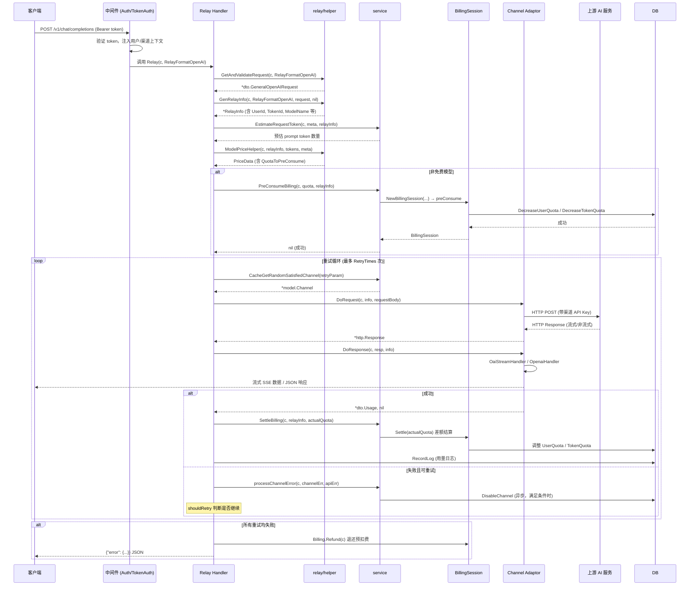
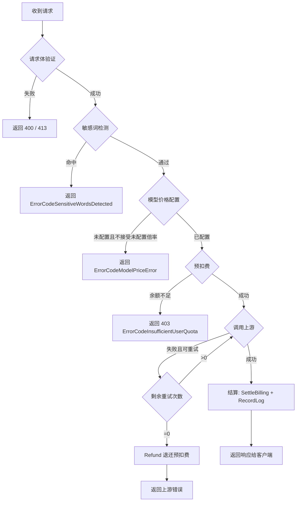
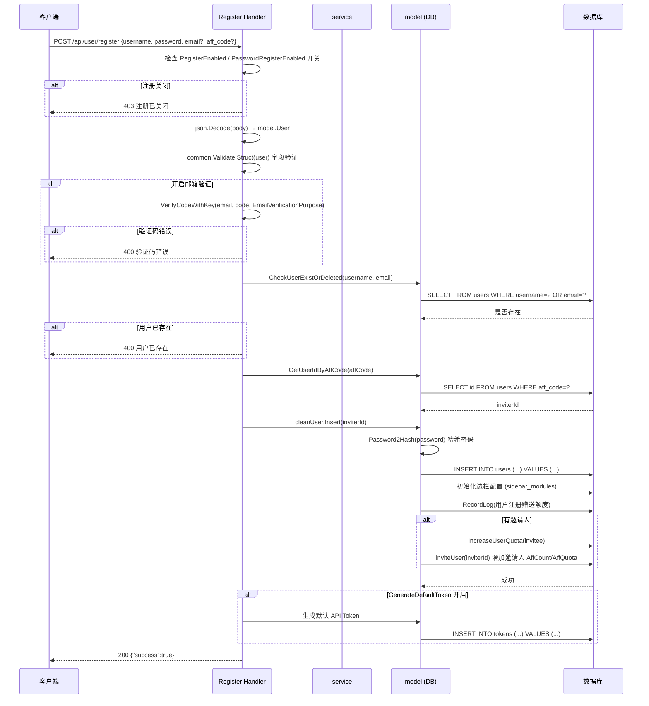
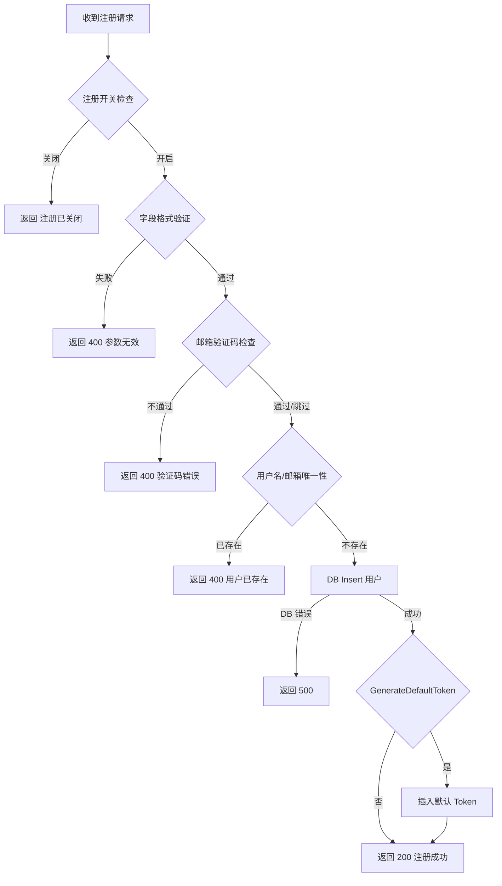
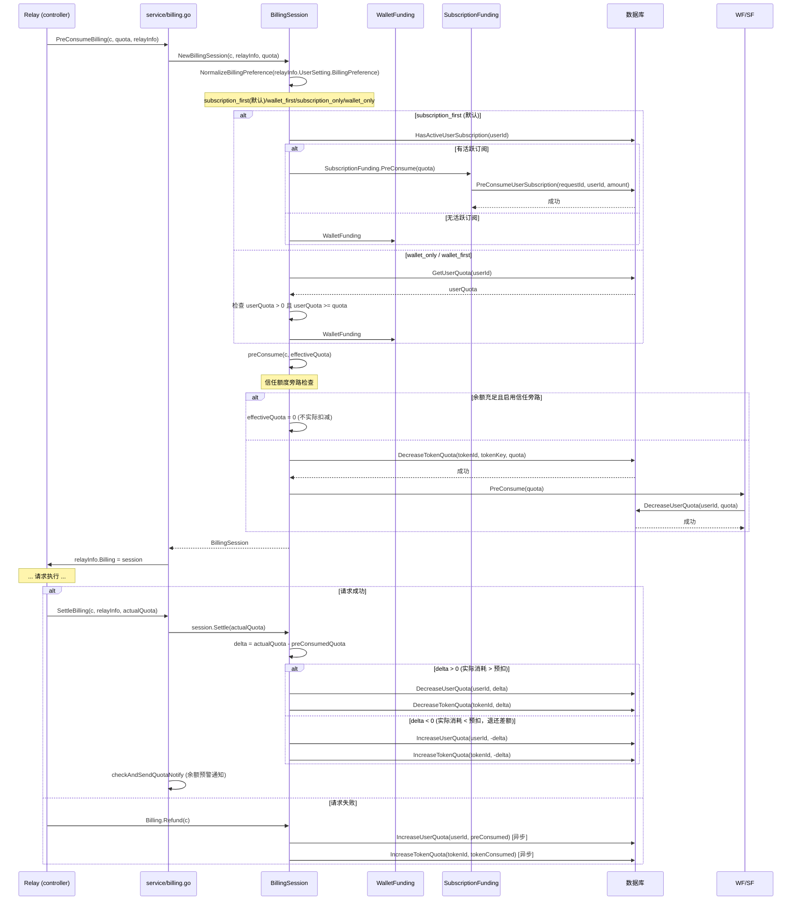
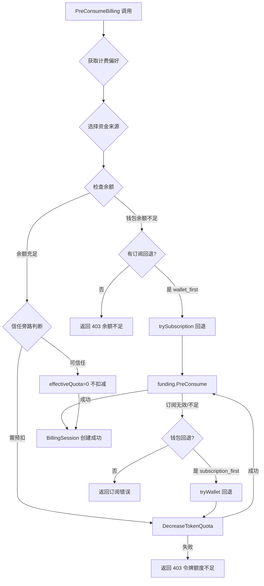
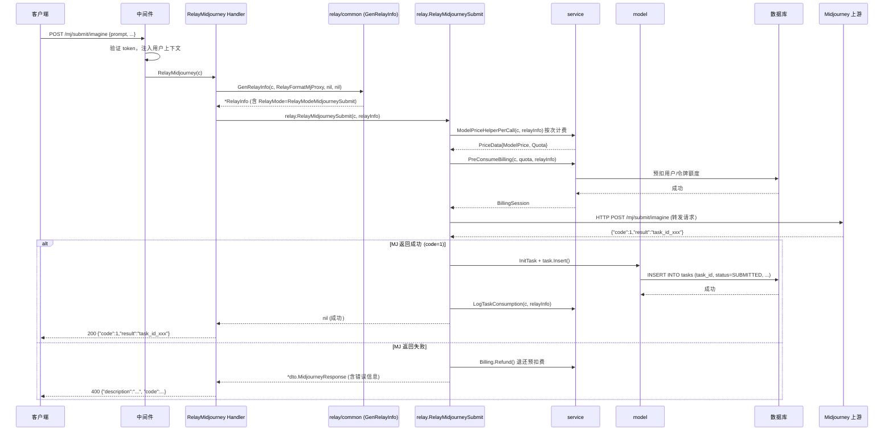
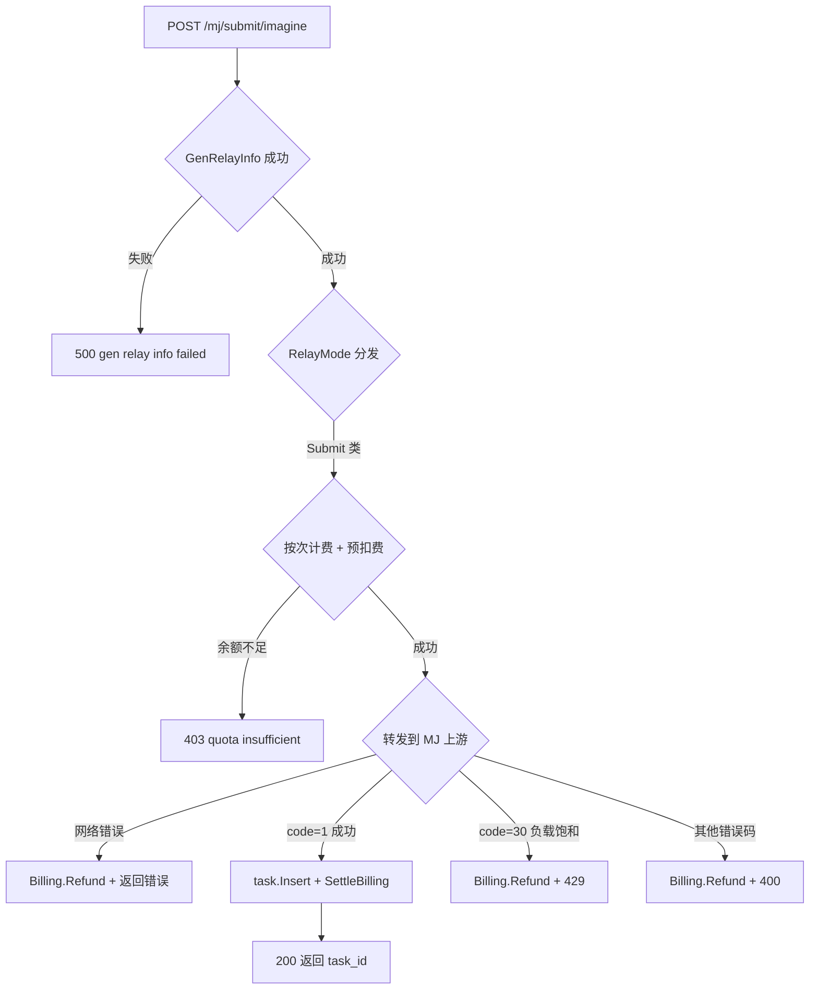
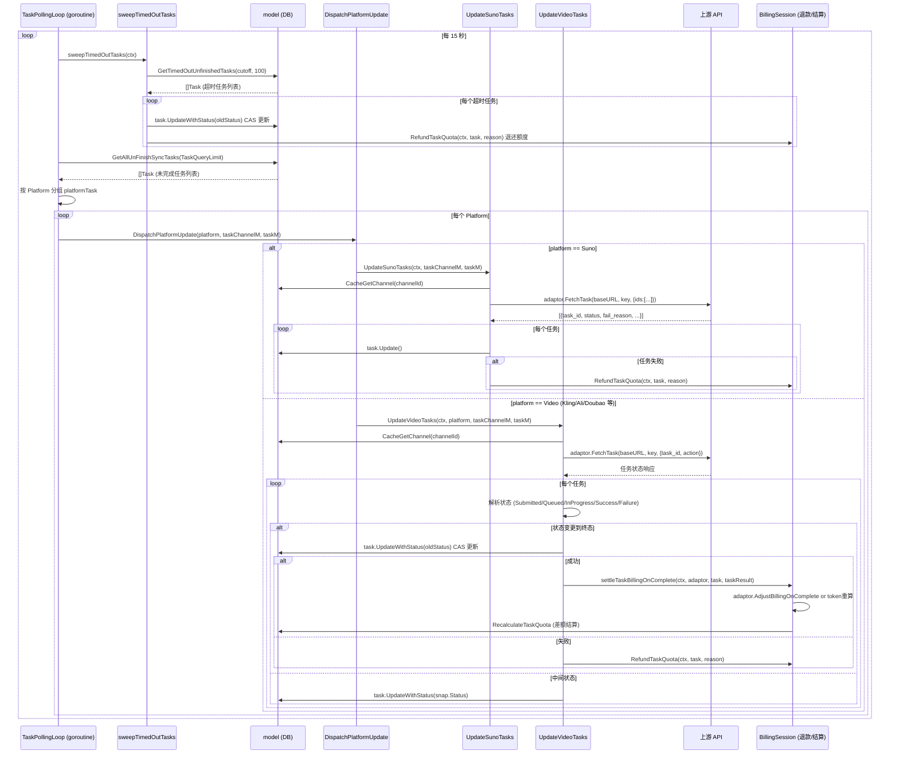
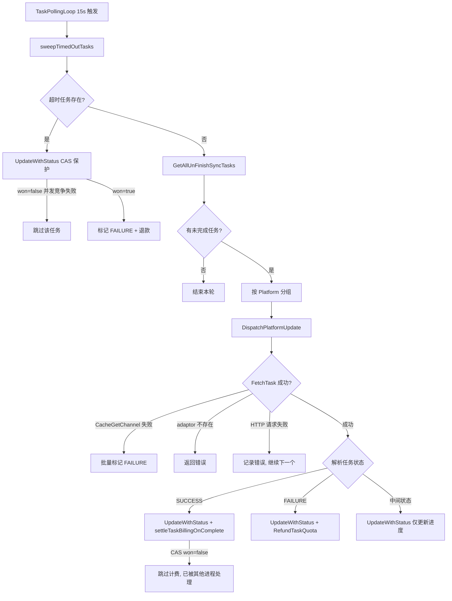

# 业务流程详解

> 本文档深度分析 **5 个核心业务流程**，提供完整的时序图、代码追踪和数据流转分析。
>
> 查看所有业务流程概述，请参考 [业务流程索引](./业务流程索引.md)

---

## 1. OpenAI 聊天补全中继

**入口**：`POST /v1/chat/completions` → `new-api/controller/relay.go:Relay`

### 1.1 流程时序图



### 1.2 代码执行路径

**Step 1: 请求接收与格式验证** (`new-api/controller/relay.go:66`)

```go
func Relay(c *gin.Context, relayFormat types.RelayFormat) {
    // 读取并验证请求体
    request, err := helper.GetAndValidateRequest(c, relayFormat)
    // ...
}
```

`GetAndValidateRequest` 根据 `relayFormat` 分发到对应的验证函数：

```go
// new-api/relay/helper/valid_request.go:19
func GetAndValidateRequest(c *gin.Context, format types.RelayFormat) (request dto.Request, err error) {
    switch format {
    case types.RelayFormatOpenAI:
        request, err = GetAndValidateTextRequest(c, relayMode)
    // ...
    }
}

// GetAndValidateTextRequest 校验关键字段
func GetAndValidateTextRequest(c *gin.Context, relayMode int) (*dto.GeneralOpenAIRequest, error) {
    textRequest := &dto.GeneralOpenAIRequest{}
    err := common.UnmarshalBodyReusable(c, textRequest)
    // 验证 messages 非空, model 非空, max_tokens 合法范围
    if len(textRequest.Messages) == 0 && textRequest.Prefix == nil && textRequest.Suffix == nil {
        return nil, errors.New("field messages is required")
    }
    // ...
    return textRequest, nil
}
```

**Step 2: 构建 RelayInfo 上下文** (`new-api/relay/common/relay_info.go:523`)

```go
func GenRelayInfo(c *gin.Context, relayFormat types.RelayFormat, request dto.Request, ws *websocket.Conn) (*RelayInfo, error) {
    // 根据格式选择工厂函数
    info = GenRelayInfoOpenAI(c, request)
    // 初始化 RequestConversionChain
    info.InitRequestConversionChain()
    return info, nil
}

func genBaseRelayInfo(c *gin.Context, request dto.Request) *RelayInfo {
    return &RelayInfo{
        UserId:          common.GetContextKeyInt(c, constant.ContextKeyUserId),
        TokenId:         common.GetContextKeyInt(c, constant.ContextKeyTokenId),
        OriginModelName: common.GetContextKeyString(c, constant.ContextKeyOriginalModel),
        // ... 更多字段从 gin context 中提取
    }
}
```

**Step 3: Token 估算与价格计算** (`new-api/relay/helper/price.go:48`)

```go
func ModelPriceHelper(c *gin.Context, info *relaycommon.RelayInfo, promptTokens int, meta *types.TokenCountMeta) (types.PriceData, error) {
    modelPrice, usePrice := ratio_setting.GetModelPrice(info.OriginModelName, false)
    groupRatioInfo := HandleGroupRatio(c, info)

    if !usePrice {
        // 基于倍率模式：预估 token * 模型倍率 * 分组倍率
        preConsumedTokens := common.Max(promptTokens, common.PreConsumedQuota)
        preConsumedTokens += meta.MaxTokens // 加上 max_tokens 预留
        ratio := modelRatio * groupRatioInfo.GroupRatio
        preConsumedQuota = int(float64(preConsumedTokens) * ratio)
    } else {
        // 按价格模式：模型单价 * QuotaPerUnit * 分组倍率
        preConsumedQuota = int(modelPrice * common.QuotaPerUnit * groupRatioInfo.GroupRatio)
    }
    // ...
}
```

**Step 4: 预扣费** (`new-api/service/billing.go:19`)

```go
func PreConsumeBilling(c *gin.Context, preConsumedQuota int, relayInfo *relaycommon.RelayInfo) *types.NewAPIError {
    session, apiErr := NewBillingSession(c, relayInfo, preConsumedQuota)
    if apiErr != nil {
        return apiErr
    }
    relayInfo.Billing = session  // 会话存入 RelayInfo，供后续结算/退款使用
    return nil
}
```

**Step 5: 渠道选择与请求发送** (`new-api/controller/relay.go:188`)

```go
for ; retryParam.GetRetry() <= common.RetryTimes; retryParam.IncreaseRetry() {
    // 从缓存中随机选取满足条件的渠道
    channel, channelErr := getChannel(c, relayInfo, retryParam)
    // 重置 request body（支持重试复用）
    c.Request.Body = io.NopCloser(bodyStorage)
    // 调用对应格式的处理器
    newAPIError = relayHandler(c, relayInfo)
    if newAPIError == nil { return } // 成功则退出
    // 判断是否应继续重试
    if !shouldRetry(c, newAPIError, common.RetryTimes-retryParam.GetRetry()) { break }
}
```

**Step 6: 响应处理与结算** (`new-api/relay/channel/openai/adaptor.go:608`)

```go
func (a *Adaptor) DoResponse(c *gin.Context, resp *http.Response, info *relaycommon.RelayInfo) (usage any, err *types.NewAPIError) {
    if info.IsStream {
        usage, err = OaiStreamHandler(c, info, resp)  // 流式：逐块转发 SSE
    } else {
        usage, err = OpenaiHandler(c, info, resp)      // 非流式：一次性返回
    }
    return
}
```

结算由上层 `relay/common_handler` 在 DoResponse 成功后调用 `service.SettleBilling`。

### 1.3 关键决策点

| 决策点 | 条件 | 结果 | 代码位置 |
|--------|------|------|----------|
| 敏感词检测 | `setting.ShouldCheckPromptSensitive()` 为 true | 命中则返回 `ErrorCodeSensitiveWordsDetected` | `new-api/controller/relay.go:134` |
| 免费模型跳过预扣费 | `priceData.FreeModel == true` | 跳过 `PreConsumeBilling` | `new-api/controller/relay.go:159` |
| 信任额度旁路 | 用户余额 > `TrustQuota` 且 token 余额充足 | `effectiveQuota=0`，不实际扣减 | `new-api/service/billing_session.go:153` |
| 订阅 vs 钱包优先级 | 用户 `BillingPreference` 设置 | `subscription_first`（默认）/ `wallet_first` / 仅一种 | `new-api/service/billing_session.go:314` |
| 重试判断 | 错误码是否可重试 + 剩余次数 > 0 + 非固定渠道 | 继续重试下一渠道 | `new-api/controller/relay.go:315` |
| 渠道自动禁用 | `ShouldDisableChannel` 返回 true + `AutoBan` 开启 | 异步调用 `DisableChannel` | `new-api/controller/relay.go:348` |

### 1.4 异常处理流程



### 1.5 数据流转

```
客户端输入: POST /v1/chat/completions {"model":"gpt-4o","messages":[...]}
  ↓ 中间件：提取 Authorization 头，从 DB/Cache 加载 Token 记录
用户信息: UserId=123, TokenId=456, Group="default", TokenQuota=500000
  ↓ GetAndValidateTextRequest：反序列化为 *dto.GeneralOpenAIRequest
请求对象: GeneralOpenAIRequest{Model:"gpt-4o", Messages:[...], Stream:true}
  ↓ GenRelayInfo：绑定用户/令牌/模型信息
RelayInfo: {UserId:123, OriginModelName:"gpt-4o", IsStream:true, ...}
  ↓ ModelPriceHelper：计算预扣额度
PriceData: {ModelRatio:2.5, GroupRatio:1.0, QuotaToPreConsume:3500}
  ↓ PreConsumeBilling → BillingSession.preConsume
DB 操作: users.quota -= 3500; tokens.remain_quota -= 3500
  ↓ CacheGetRandomSatisfiedChannel → DoApiRequest
HTTP 请求: POST https://api.openai.com/v1/chat/completions (含上游 API Key)
  ↓ OaiStreamHandler：逐块解析 SSE，转发给客户端
SSE 流: data: {"choices":[{"delta":{"content":"..."}}]} × N 条
  ↓ 请求结束后 SettleBilling：实际消耗 3200，预扣 3500
DB 操作: users.quota += 300; tokens.remain_quota += 300 (退还多扣)
  ↓ RecordLog
日志记录: logs{user_id:123, model:"gpt-4o", quota:3200, prompt_tokens:800, ...}
响应: 已实时流式推送给客户端
```

---

## 2. 用户密码注册流程

**入口**：`POST /api/user/register` → `new-api/controller/user.go:Register`

### 2.1 流程时序图



### 2.2 代码执行路径

**Step 1: 开关检查** (`new-api/controller/user.go:131`)

```go
func Register(c *gin.Context) {
    if !common.RegisterEnabled {
        common.ApiErrorI18n(c, i18n.MsgUserRegisterDisabled)
        return
    }
    if !common.PasswordRegisterEnabled {
        common.ApiErrorI18n(c, i18n.MsgUserPasswordRegisterDisabled)
        return
    }
    // ...
}
```

**Step 2: 字段验证** (`new-api/controller/user.go:140`)

```go
var user model.User
err := json.NewDecoder(c.Request.Body).Decode(&user)
// 使用 go-validator 验证结构体约束（如 username max=20, password min=8,max=20）
if err := common.Validate.Struct(&user); err != nil {
    common.ApiErrorI18n(c, i18n.MsgUserInputInvalid, ...)
    return
}
```

**Step 3: 邮箱验证码校验（可选）** (`new-api/controller/user.go:150`)

```go
if common.EmailVerificationEnabled {
    if user.Email == "" || user.VerificationCode == "" {
        // 返回错误
    }
    // 对比 Redis 中存储的验证码
    if !common.VerifyCodeWithKey(user.Email, user.VerificationCode, common.EmailVerificationPurpose) {
        common.ApiErrorI18n(c, i18n.MsgUserVerificationCodeError)
        return
    }
}
```

**Step 4: 用户唯一性检查** (`new-api/controller/user.go:160`)

```go
exist, err := model.CheckUserExistOrDeleted(user.Username, user.Email)
// DB 查询（含软删除记录）
if exist {
    common.ApiErrorI18n(c, i18n.MsgUserExists)
    return
}
```

**Step 5: 创建用户** (`new-api/model/user.go:379`)

```go
func (user *User) Insert(inviterId int) error {
    // 1. 哈希密码
    user.Password, err = common.Password2Hash(user.Password)
    // 2. 设置新用户初始额度
    user.Quota = common.QuotaForNewUser
    // 3. 生成邀请码
    user.AffCode = common.GetRandomString(4)
    // 4. 初始化用户设置（空的 UserSetting JSON）
    user.SetSetting(dto.UserSetting{})
    // 5. 写入数据库
    result := DB.Create(user)
    // 6. 根据角色生成默认边栏配置（写回 setting 字段）
    defaultSidebarConfig := generateDefaultSidebarConfigForRole(createdUser.Role)
    // 7. 记录赠送日志
    RecordLog(user.Id, LogTypeSystem, fmt.Sprintf("新用户注册赠送 %s", ...))
    // 8. 处理邀请奖励
    if inviterId != 0 {
        IncreaseUserQuota(user.Id, common.QuotaForInvitee, true)
        inviteUser(inviterId) // 增加邀请人 AffCount 和 AffQuota
    }
}
```

**Step 6: 生成默认 API Token（可选）** (`new-api/controller/user.go:194`)

```go
if constant.GenerateDefaultToken {
    key, err := common.GenerateKey()
    token := model.Token{
        UserId:         insertedUser.Id,
        Name:           cleanUser.Username + "的初始令牌",
        Key:            key,
        ExpiredTime:    -1,         // 永不过期
        RemainQuota:    500000,     // 示例额度
        UnlimitedQuota: true,
    }
    token.Insert()
}
```

### 2.3 关键决策点

| 决策点 | 条件 | 结果 | 代码位置 |
|--------|------|------|----------|
| 注册开关 | `common.RegisterEnabled == false` | 直接返回 403 | `new-api/controller/user.go:132` |
| 密码注册开关 | `common.PasswordRegisterEnabled == false` | 返回 403 | `new-api/controller/user.go:136` |
| 邮箱验证 | `common.EmailVerificationEnabled == true` | 必须提供验证码且通过 | `new-api/controller/user.go:150` |
| 邀请码处理 | `user.AffCode != ""` | 查找邀请人并给双方赠送额度 | `new-api/controller/user.go:170` |
| 默认 Token 生成 | `constant.GenerateDefaultToken == true` | 自动创建初始 API 令牌 | `new-api/controller/user.go:194` |

### 2.4 异常处理流程



### 2.5 数据流转

```
客户端输入: POST /api/user/register
  {"username":"alice","password":"mypassword","email":"a@b.com","verification_code":"123456","aff_code":"xyz1"}
  ↓ 字段验证: username 长度, password 强度, email 格式
解析后: model.User{Username:"alice", Password:"mypassword", Email:"a@b.com", ...}
  ↓ VerifyCodeWithKey: Redis GET email:verify:a@b.com → 对比 "123456"
验证通过
  ↓ CheckUserExistOrDeleted: SELECT FROM users WHERE username='alice' OR email='a@b.com'
结果: 不存在，可注册
  ↓ GetUserIdByAffCode("xyz1"): SELECT id FROM users WHERE aff_code='xyz1'
inviterId: 42
  ↓ cleanUser.Insert(42)
    Password2Hash("mypassword") → "$2a$10$..."
    Quota = QuotaForNewUser (如 10000)
    DB.Create(user) → user.Id = 789
    generateDefaultSidebarConfigForRole(RoleCommonUser) → JSON
    DB UPDATE users SET setting=... WHERE id=789
    DB INSERT logs (赠送额度日志)
    IncreaseUserQuota(789, QuotaForInvitee)
    inviteUser(42): UPDATE users SET aff_count+=1, aff_quota+=QuotaForInviter WHERE id=42
  ↓ Token 插入
    GenerateKey() → "sk-abc123..."
    DB INSERT tokens {user_id:789, key:"sk-abc123...", unlimited_quota:true}
响应: 200 {"success":true,"message":""}
```

---

## 3. AI 请求费用预扣与结算

**入口**：内部调用 → `new-api/service/billing.go:PreConsumeBilling`

### 3.1 流程时序图



### 3.2 代码执行路径

**Step 1: 创建 BillingSession** (`new-api/service/billing_session.go:255`)

```go
func NewBillingSession(c *gin.Context, relayInfo *relaycommon.RelayInfo, preConsumedQuota int) (*BillingSession, *types.NewAPIError) {
    pref := common.NormalizeBillingPreference(relayInfo.UserSetting.BillingPreference)

    switch pref {
    case "subscription_only":
        return trySubscription()
    case "wallet_only":
        return tryWallet()
    case "wallet_first":
        session, err := tryWallet()
        if err != nil && err.GetErrorCode() == types.ErrorCodeInsufficientUserQuota {
            return trySubscription()  // 钱包不足时回退订阅
        }
        return session, err
    default: // subscription_first
        hasSub, _ := model.HasActiveUserSubscription(relayInfo.UserId)
        if !hasSub { return tryWallet() }
        session, apiErr := trySubscription()
        if apiErr != nil && apiErr.GetErrorCode() == types.ErrorCodeInsufficientUserQuota {
            return tryWallet()  // 订阅不足时回退钱包
        }
        return session, apiErr
    }
}
```

**Step 2: 信任额度旁路** (`new-api/service/billing_session.go:195`)

```go
func (s *BillingSession) shouldTrust(c *gin.Context) bool {
    if s.relayInfo.ForcePreConsume { return false }  // 异步任务必须预扣全额
    trustQuota := common.GetTrustQuota()
    tokenTrusted := s.relayInfo.TokenUnlimited || tokenQuota > trustQuota
    switch s.funding.Source() {
    case BillingSourceWallet:
        return s.relayInfo.UserQuota > trustQuota  // 用户余额充足则信任
    case BillingSourceSubscription:
        return false  // 订阅不支持信任旁路
    }
    return false
}
```

**Step 3: 实际预扣** (`new-api/service/billing_session.go:149`)

```go
func (s *BillingSession) preConsume(c *gin.Context, quota int) *types.NewAPIError {
    effectiveQuota := quota
    if s.shouldTrust(c) {
        effectiveQuota = 0  // 信任旁路：不实际扣减
    }
    // 1. 预扣令牌额度
    if effectiveQuota > 0 {
        PreConsumeTokenQuota(s.relayInfo, effectiveQuota)
        s.tokenConsumed = effectiveQuota
    }
    // 2. 预扣资金来源（钱包/订阅）
    s.funding.PreConsume(effectiveQuota)
    s.preConsumedQuota = effectiveQuota
    s.syncRelayInfo()  // 同步到 RelayInfo 的兼容字段
    return nil
}
```

**Step 4: 结算** (`new-api/service/billing_session.go:39`)

```go
func (s *BillingSession) Settle(actualQuota int) error {
    s.mu.Lock()
    defer s.mu.Unlock()
    delta := actualQuota - s.preConsumedQuota
    if delta == 0 { s.settled = true; return nil }
    // 1. 调整资金来源（差额结算）
    s.funding.Settle(delta)  // delta>0 补扣，delta<0 退还
    s.fundingSettled = true
    // 2. 调整令牌额度
    if delta > 0 {
        model.DecreaseTokenQuota(s.relayInfo.TokenId, s.relayInfo.TokenKey, delta)
    } else {
        model.IncreaseTokenQuota(s.relayInfo.TokenId, s.relayInfo.TokenKey, -delta)
    }
    s.settled = true
    return nil
}
```

**Step 5: 退款（请求失败时）** (`new-api/service/billing_session.go:80`)

```go
func (s *BillingSession) Refund(c *gin.Context) {
    // 幂等保护：已结算/已退款/无需退款则跳过
    if s.settled || s.refunded || !s.needsRefundLocked() { return }
    s.refunded = true
    gopool.Go(func() {  // 异步退款，不阻塞请求响应
        s.funding.Refund()                                    // 退还资金来源
        model.IncreaseTokenQuota(tokenId, tokenKey, tokenConsumed)  // 退还令牌
    })
}
```

### 3.3 关键决策点

| 决策点 | 条件 | 结果 | 代码位置 |
|--------|------|------|----------|
| 计费来源选择 | `BillingPreference` + 是否有活跃订阅 | 订阅/钱包/回退逻辑 | `new-api/service/billing_session.go:314` |
| 信任旁路 | 用户/令牌余额 > `TrustQuota` | 不实际扣减，仅记录 | `new-api/service/billing_session.go:195` |
| 强制预扣 | `ForcePreConsume=true`（异步任务） | 禁用信任旁路，必须全额预扣 | `new-api/service/billing_session.go:197` |
| 差额结算方向 | `actualQuota` 与 `preConsumedQuota` 大小关系 | delta>0 补扣；delta<0 退还 | `new-api/service/billing_session.go:45` |
| 退款条件 | `settled=false` 且 `refunded=false` 且 `fundingSettled=false` | 执行异步退款 | `new-api/service/billing_session.go:123` |

### 3.4 异常处理流程



### 3.5 数据流转

```
调用: PreConsumeBilling(c, preConsumedQuota=3500, relayInfo)
  ↓ NewBillingSession: pref="subscription_first"
检查订阅: HasActiveUserSubscription(123) → true
  ↓ trySubscription(): SubscriptionFunding{amount=3500}
    PreConsumeUserSubscription(requestId, 123, 3500) → subscription_id=7
    amount_used += 3500，创建预扣记录
  ↓ preConsume(c, 3500):
    shouldTrust → false (ForcePreConsume 或余额不足)
    PreConsumeTokenQuota(tokenId=456, 3500) → tokens.remain_quota -= 3500
    SubscriptionFunding.PreConsume(3500) → subscription_items.amount_used += 3500
  ↓ relayInfo.Billing = BillingSession{preConsumedQuota:3500, funding:SubscriptionFunding}

... 请求执行，实际消耗 3200 tokens ...

  ↓ SettleBilling(c, relayInfo, actualQuota=3200)
    session.Settle(3200): delta = 3200 - 3500 = -300
    SubscriptionFunding.Settle(-300) → amount_used -= 300
    IncreaseTokenQuota(tokenId=456, 300) → tokens.remain_quota += 300
    checkAndSendSubscriptionQuotaNotify(relayInfo) → 检查是否需要发预警通知
```

---

## 4. Midjourney 任务提交

**入口**：`POST /mj/submit/imagine` → `new-api/controller/relay.go:RelayMidjourney`

### 4.1 流程时序图



### 4.2 代码执行路径

**Step 1: RelayMidjourney 入口** (`new-api/controller/relay.go:391`)

```go
func RelayMidjourney(c *gin.Context) {
    relayInfo, err := relaycommon.GenRelayInfo(c, types.RelayFormatMjProxy, nil, nil)
    if err != nil {
        c.JSON(http.StatusInternalServerError, gin.H{...})
        return
    }

    var mjErr *dto.MidjourneyResponse
    switch relayInfo.RelayMode {
    case relayconstant.RelayModeMidjourneyNotify:
        mjErr = relay.RelayMidjourneyNotify(c)
    case relayconstant.RelayModeMidjourneyTaskFetch, ...:
        mjErr = relay.RelayMidjourneyTask(c, relayInfo.RelayMode)
    default:
        mjErr = relay.RelayMidjourneySubmit(c, relayInfo)  // imagine/variation 等提交类
    }

    if mjErr != nil {
        // 区分 code=30（负载饱和）→ 429，其余 → 400
        statusCode := http.StatusBadRequest
        if mjErr.Code == 30 {
            statusCode = http.StatusTooManyRequests
        }
        c.JSON(statusCode, gin.H{...})
    }
}
```

**Step 2: RelayMidjourneySubmit** (`new-api/relay/channel/task` 下的 MJ adaptor，通过 `relay.RelayTaskSubmit` 调用)

在 `new-api/controller/relay.go:537` 的 `RelayTask` 函数中可见完整的任务提交逻辑：

```go
// 任务提交与计费结算
result, taskErr = relay.RelayTaskSubmit(c, relayInfo)
if taskErr == nil {
    // 结算计费
    service.SettleBilling(c, relayInfo, result.Quota)
    service.LogTaskConsumption(c, relayInfo)
    // 插入任务记录（含 BillingContext）
    task := model.InitTask(result.Platform, relayInfo)
    task.PrivateData.UpstreamTaskID = result.UpstreamTaskID
    task.PrivateData.BillingContext = &model.TaskBillingContext{
        ModelPrice:     relayInfo.PriceData.ModelPrice,
        GroupRatio:     relayInfo.PriceData.GroupRatioInfo.GroupRatio,
        PerCallBilling: common.StringsContains(constant.TaskPricePatches, relayInfo.OriginModelName),
    }
    task.Insert()
}
```

**Step 3: 按次计费价格计算** (`new-api/relay/helper/price.go:143`)

```go
func ModelPriceHelperPerCall(c *gin.Context, info *relaycommon.RelayInfo) types.PriceData {
    groupRatioInfo := HandleGroupRatio(c, info)
    modelPrice, success := ratio_setting.GetModelPrice(info.OriginModelName, true)
    if !success {
        // 使用默认价格表
        defaultPrice, ok := ratio_setting.GetDefaultModelPriceMap()[info.OriginModelName]
        if !ok { modelPrice = 0.1 }
    }
    quota := int(modelPrice * common.QuotaPerUnit * groupRatioInfo.GroupRatio)
    return types.PriceData{Quota: quota, ModelPrice: modelPrice, ...}
}
```

### 4.3 关键决策点

| 决策点 | 条件 | 结果 | 代码位置 |
|--------|------|------|----------|
| 路由分发 | `relayInfo.RelayMode` 值 | Notify/TaskFetch/Submit 等不同处理路径 | `new-api/controller/relay.go:404` |
| 负载饱和判断 | `mjErr.Code == 30` | 返回 429 Too Many Requests | `new-api/controller/relay.go:420` |
| 按次计费 | 任务类模型使用 `ModelPriceHelperPerCall` | 以模型单价一次性计费 | `new-api/relay/helper/price.go:143` |
| 强制预扣 | `relayInfo.ForcePreConsume = true` | 禁用信任旁路，确保异步任务额度锁定 | `new-api/relay/common/relay_info.go:125` |
| 任务插入失败 | `task.Insert()` 返回错误 | 仅记录系统日志，不影响响应 | `new-api/controller/relay.go:583` |

### 4.4 异常处理流程



### 4.5 数据流转

```
客户端输入: POST /mj/submit/imagine
  {"prompt":"a cat", "model":"midjourney"}
  ↓ 中间件：验证 Bearer token → UserId=123, Group="default"
RelayInfo: {RelayMode:RelayModeMidjourneySubmit, OriginModelName:"midjourney"}
  ↓ ModelPriceHelperPerCall: modelPrice=0.1, groupRatio=1.0
PriceData: {Quota=100 (0.1 * 1000 * 1.0)}
  ↓ PreConsumeBilling(c, 100, relayInfo) → ForcePreConsume=true
DB: users.quota -= 100; tokens.remain_quota -= 100
  ↓ 转发 HTTP POST 到 Midjourney 上游
MJ 响应: {"code":1,"description":"提交成功","result":"abc123def456"}
  ↓ SettleBilling(c, relayInfo, result.Quota=100)
    delta = 100 - 100 = 0 (无需调整)
  ↓ model.InitTask + task.Insert()
DB INSERT tasks: {
  task_id: "task_abc123",
  upstream_task_id: "abc123def456",
  user_id: 123,
  channel_id: 5,
  status: "SUBMITTED",
  platform: "midjourney",
  quota: 100,
  billing_context: {model_price:0.1, group_ratio:1.0, per_call_billing:true}
}
响应: 200 {"code":1,"result":"abc123def456"}
```

---

## 5. 通用任务轮询后台

**入口**：定时任务 → `new-api/service/task_polling.go:TaskPollingLoop`

### 5.1 流程时序图



### 5.2 代码执行路径

**Step 1: 主循环** (`new-api/service/task_polling.go:91`)

```go
func TaskPollingLoop() {
    for {
        time.Sleep(time.Duration(15) * time.Second)
        common.SysLog("任务进度轮询开始")
        ctx := context.TODO()

        // Phase 1: 清理超时任务
        sweepTimedOutTasks(ctx)

        // Phase 2: 查询所有未完成任务
        allTasks := model.GetAllUnFinishSyncTasks(constant.TaskQueryLimit)

        // Phase 3: 按 Platform 分组
        platformTask := make(map[constant.TaskPlatform][]*model.Task)
        for _, t := range allTasks {
            platformTask[t.Platform] = append(platformTask[t.Platform], t)
        }

        // Phase 4: 分发到各平台更新器
        for platform, tasks := range platformTask {
            DispatchPlatformUpdate(platform, taskChannelM, taskM)
        }
    }
}
```

**Step 2: 超时清理（CAS 保护）** (`new-api/service/task_polling.go:41`)

```go
func sweepTimedOutTasks(ctx context.Context) {
    cutoff := time.Now().Unix() - int64(constant.TaskTimeoutMinutes)*60
    tasks := model.GetTimedOutUnfinishedTasks(cutoff, 100)
    for _, task := range tasks {
        oldStatus := task.Status
        task.Status = model.TaskStatusFailure
        // CAS 更新：只有状态未变时才成功（防止并发竞争）
        won, err := task.UpdateWithStatus(oldStatus)
        if !won { continue }
        // 非旧系统任务才退款
        if !isLegacy && task.Quota != 0 {
            RefundTaskQuota(ctx, task, reason)
        }
    }
}
```

**Step 3: 平台分发** (`new-api/service/task_polling.go:141`)

```go
func DispatchPlatformUpdate(platform constant.TaskPlatform, taskChannelM map[int][]string, taskM map[string]*model.Task) {
    switch platform {
    case constant.TaskPlatformMidjourney:
        // MJ 轮询由自身 Webhook Notify 处理，此处预留
    case constant.TaskPlatformSuno:
        UpdateSunoTasks(context.Background(), taskChannelM, taskM)
    default:
        // Kling, Ali, Doubao, Gemini, Vertex 等视频任务
        UpdateVideoTasks(context.Background(), platform, taskChannelM, taskM)
    }
}
```

**Step 4: 视频任务状态机** (`new-api/service/task_polling.go:407`)

```go
task.Status = model.TaskStatus(taskResult.Status)
switch taskResult.Status {
case model.TaskStatusSubmitted:
    task.Progress = taskcommon.ProgressSubmitted  // "10%"
case model.TaskStatusQueued:
    task.Progress = taskcommon.ProgressQueued     // "20%"
case model.TaskStatusInProgress:
    task.Progress = taskcommon.ProgressInProgress // "30%"
    if task.StartTime == 0 { task.StartTime = now }
case model.TaskStatusSuccess:
    task.Progress = taskcommon.ProgressComplete   // "100%"
    task.PrivateData.ResultURL = taskResult.Url   // 或代理 URL
    shouldSettle = true
case model.TaskStatusFailure:
    task.FailReason = taskResult.Reason
    shouldRefund = true
}
```

**Step 5: 任务完成计费结算** (`new-api/service/task_polling.go:523`)

```go
func settleTaskBillingOnComplete(ctx context.Context, adaptor TaskPollingAdaptor, task *model.Task, taskResult *relaycommon.TaskInfo) {
    // 按次计费的任务不做差额结算
    if bc := task.PrivateData.BillingContext; bc != nil && bc.PerCallBilling {
        return
    }
    // 1. 优先让 adaptor 决定最终额度（如 Gemini 按实际 token 计费）
    if actualQuota := adaptor.AdjustBillingOnComplete(task, taskResult); actualQuota > 0 {
        RecalculateTaskQuota(ctx, task, actualQuota, "adaptor计费调整")
        return
    }
    // 2. 回退到 token 重算
    if taskResult.TotalTokens > 0 {
        RecalculateTaskQuotaByTokens(ctx, task, taskResult.TotalTokens)
        return
    }
    // 3. 无调整，保持预扣额度
}
```

### 5.3 关键决策点

| 决策点 | 条件 | 结果 | 代码位置 |
|--------|------|------|----------|
| 超时任务识别 | `submit_time < now - TaskTimeoutMinutes*60` | 标记为 FAILURE，条件性退款 | `new-api/service/task_polling.go:45` |
| 旧系统任务识别 | `submit_time < 1740182400 (2026-02-22)` | 标记失败但不退款 | `new-api/service/task_polling.go:51` |
| CAS 并发保护 | `UpdateWithStatus(oldStatus)` 返回 `won=false` | 跳过，避免重复处理 | `new-api/service/task_polling.go:70` |
| 平台路由 | `task.Platform` 枚举值 | Suno/Midjourney/Video 不同更新路径 | `new-api/service/task_polling.go:143` |
| 按次计费跳过结算 | `BillingContext.PerCallBilling == true` | 不做差额结算，保留预扣额度 | `new-api/service/task_polling.go:525` |
| adaptor 自定义结算 | `adaptor.AdjustBillingOnComplete(...)` 返回 > 0 | 使用 adaptor 计算结果重算额度 | `new-api/service/task_polling.go:530` |

### 5.4 异常处理流程



### 5.5 数据流转

```
定时触发 (每 15 秒)
  ↓ sweepTimedOutTasks: cutoff = now - 30*60 (30分钟超时)
SQL: SELECT * FROM tasks WHERE status NOT IN ('SUCCESS','FAILURE') AND submit_time < cutoff LIMIT 100
超时任务: [task_id="task_abc", status="SUBMITTED", quota=500, submit_time=...]
  ↓ task.UpdateWithStatus("SUBMITTED") → CAS 成功
SQL: UPDATE tasks SET status='FAILURE', finish_time=now WHERE id=X AND status='SUBMITTED'
  ↓ RefundTaskQuota: 退还 500 额度
SQL: UPDATE users SET quota += 500 WHERE id=123
SQL: UPDATE tokens SET remain_quota += 500 WHERE id=456

  ↓ GetAllUnFinishSyncTasks: 查询所有进行中任务
SQL: SELECT * FROM tasks WHERE status NOT IN ('SUCCESS','FAILURE') AND platform='kling' LIMIT 100
任务列表: [{task_id:"task_xyz", upstream_task_id:"kling-op-123", channel_id:8}]

  ↓ UpdateVideoTasks: platform=kling
CacheGetChannel(8) → {BaseURL:"https://api.kling.ai", Key:"sk-xxx"}
adaptor.FetchTask("https://api.kling.ai", "sk-xxx", {task_id:"kling-op-123", action:"video"})
上游响应: {"status":"SUCCESS","url":"https://kling.cdn/video.mp4"}

  ↓ task.Status = SUCCESS, task.PrivateData.ResultURL = "https://kling.cdn/video.mp4"
task.UpdateWithStatus("IN_PROGRESS") → CAS 成功
  ↓ settleTaskBillingOnComplete:
    PerCallBilling=false, adaptor.AdjustBillingOnComplete → actualQuota=500
    RecalculateTaskQuota: delta = 500 - 500 = 0, 无需调整
最终状态: tasks{status:"SUCCESS", progress:"100%", result_url:"...", finish_time:now}
```

---

## 流程复杂度对比

| 流程名称 | 复杂度 | 涉及服务数 | 主要步骤数 | 特点 |
|----------|--------|-----------|-----------|------|
| OpenAI 聊天补全中继 | 复杂 | 6 | 8 | 重试机制、流式处理、渠道选择、差额结算 |
| 用户密码注册 | 中等 | 3 | 6 | 多开关控制、邀请链、默认令牌生成 |
| AI 请求费用预扣与结算 | 复杂 | 4 | 5 | 双路资金来源、信任旁路、CAS 幂等退款 |
| Midjourney 任务提交 | 中等 | 4 | 5 | 异步任务、强制预扣、按次计费 |
| 通用任务轮询后台 | 复杂 | 5 | 6 | 状态机、CAS 并发保护、多平台分发、自适应结算 |

---

> 本文档通过代码追踪生成，展示了 new-api 项目实际的业务执行路径。所有代码引用均基于真实文件内容，时序图顺序与代码执行顺序一致。
