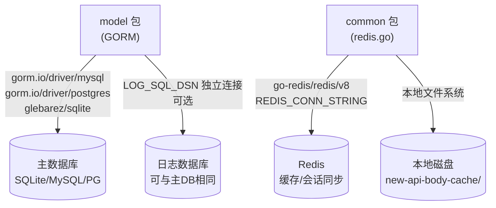
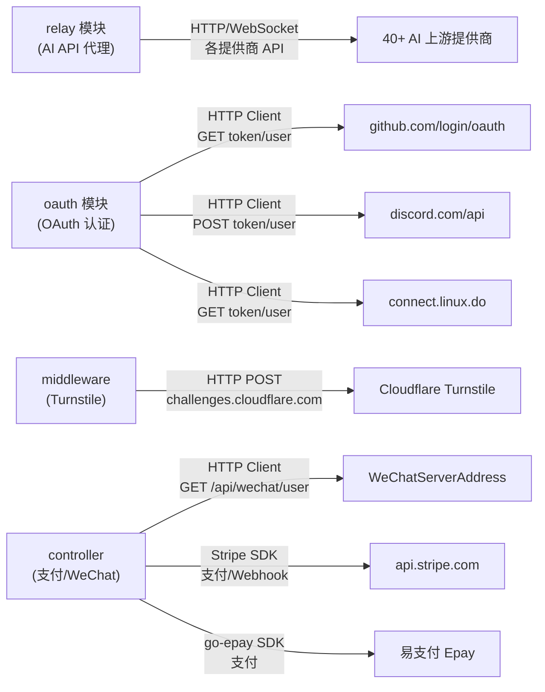

# new-api - 仓库依赖关系

> 基于代码中的依赖调用分析生成。

## 基本信息

- **分析版本**: `21cfc1ca`
- **生成时间**: 2026-03-02

## 整体依赖拓扑

```mermaid
graph TB
    subgraph "应用核心"
        APP[new-api 主进程]
    end

    subgraph "数据存储层"
        SQLite[(SQLite\n主/日志DB)]
        MySQL[(MySQL\n主/日志DB)]
        PostgreSQL[(PostgreSQL\n主/日志DB)]
        Redis[(Redis\n缓存)]
        Disk[(本地磁盘\n请求体/文件缓存)]
    end

    subgraph "第三方认证与支付"
        GitHub[GitHub OAuth API]
        Discord[Discord OAuth API]
        LinuxDO[Linux DO OAuth API]
        Telegram[Telegram Bot API]
        WeChat[WeChat Server\n第三方服务]
        Stripe[Stripe\n支付 API]
        Epay[易支付 Epay\n支付 API]
        Turnstile[Cloudflare Turnstile\n验证码 API]
        GoogleOAuth[Google OAuth2\nToken API]
    end

    subgraph "AI 上游提供商"
        OpenAI[OpenAI API]
        Anthropic[Anthropic Claude API]
        Gemini[Google Gemini API]
        AWSBedrock[AWS Bedrock\nRuntime SDK]
        VertexAI[Google Vertex AI API]
        Ali[阿里云 DashScope API]
        Baidu[百度文心 API]
        BaiduV2[百度文心 V2 API]
        Zhipu[智谱 AI API]
        Minimax[MiniMax API]
        Moonshot[月之暗面 API]
        Deepseek[DeepSeek API]
        XAI[xAI API]
        Cohere[Cohere API]
        Mistral[Mistral AI API]
        Cloudflare[Cloudflare AI API]
        Tencent[腾讯混元 API]
        Xunfei[科大讯飞 Spark API]
        Volcengine[火山引擎 API]
        Ollama[Ollama 本地 API]
        Others[其他 20+ 上游 AI 提供商]
    end

    subgraph "任务队列型上游"
        Suno[Suno 音乐 API]
        Kling[Kling 视频 API]
        Hailuo[Hailuo/MiniMax 视频 API]
        Sora[Sora 视频 API]
        Jimeng[即梦图像/视频 API]
        Vidu[Vidu 视频 API]
        DoubaoTask[豆包任务 API]
        GeminiTask[Gemini 任务 API]
        VertexTask[Vertex 任务 API]
    end

    subgraph "可选监控"
        Pyroscope[Grafana Pyroscope\n性能分析]
    end

    APP -->|GORM ORM| SQLite
    APP -->|GORM ORM| MySQL
    APP -->|GORM ORM| PostgreSQL
    APP -->|go-redis Client| Redis
    APP -->|本地文件 IO| Disk

    APP -->|HTTP Client| GitHub
    APP -->|HTTP Client| Discord
    APP -->|HTTP Client| LinuxDO
    APP -->|HTTP Client| Telegram
    APP -->|HTTP Client| WeChat
    APP -->|Stripe SDK| Stripe
    APP -->|go-epay SDK| Epay
    APP -->|HTTP POST| Turnstile
    APP -->|HTTP Client JWT| GoogleOAuth

    APP -->|HTTP Client| OpenAI
    APP -->|HTTP Client| Anthropic
    APP -->|HTTP Client| Gemini
    APP -->|AWS SDK v2| AWSBedrock
    APP -->|HTTP Client| VertexAI
    APP -->|HTTP Client| Ali
    APP -->|HTTP Client| Baidu
    APP -->|HTTP Client| BaiduV2
    APP -->|HTTP Client JWT| Zhipu
    APP -->|HTTP Client| Minimax
    APP -->|HTTP Client| Moonshot
    APP -->|HTTP Client| Deepseek
    APP -->|HTTP Client| XAI
    APP -->|HTTP Client| Cohere
    APP -->|HTTP Client| Mistral
    APP -->|HTTP Client| Cloudflare
    APP -->|HTTP Client| Tencent
    APP -->|HTTP Client| Xunfei
    APP -->|HTTP Client| Volcengine
    APP -->|HTTP Client| Ollama
    APP -->|HTTP Client| Others

    APP -->|HTTP Client| Suno
    APP -->|HTTP Client JWT| Kling
    APP -->|HTTP Client| Hailuo
    APP -->|HTTP Client| Sora
    APP -->|HTTP Client| Jimeng
    APP -->|HTTP Client| Vidu
    APP -->|HTTP Client| DoubaoTask
    APP -->|HTTP Client| GeminiTask
    APP -->|HTTP Client| VertexTask

    APP -.->|可选 Pyroscope SDK| Pyroscope
```

### 数据存储依赖

### 外部 HTTP 服务调用关系

## 依赖详细说明

### 数据存储依赖

| 存储服务 | 使用模块 | Client 类型 | 代码位置 | 用途 | 强度 |
|---------|---------|------------|---------|------|------|
| SQLite (glebarez) | model | GORM + glebarez/sqlite | `new-api/model/main.go:146` | 主数据库（默认） | 强（三选一） |
| MySQL | model | GORM + go-sql-driver/mysql | `new-api/model/main.go:165` | 主数据库（可选） | 强（三选一） |
| PostgreSQL | model | GORM + pgx/v5 | `new-api/model/main.go:132` | 主数据库（可选） | 强（三选一） |
| SQLite/MySQL/PG（日志） | model | GORM（独立连接） | `new-api/model/main.go:218` | 日志独立数据库（LOG_SQL_DSN） | 弱（默认与主DB共用） |
| Redis | common | go-redis/v8 | `new-api/common/redis.go:40` | 分布式缓存、Token/用户缓存、配置同步 | 弱（可选，未设置则禁用） |
| 本地磁盘 | common | os/io 标准库 | `new-api/common/disk_cache.go:30` | 请求体大文件磁盘缓存、文件数据缓存 | 弱（超内存阈值时启用） |

### 外部服务依赖

#### OAuth 认证服务

| 服务名称 | 使用模块 | 调用方式 | 代码位置 | 强度 |
|---------|---------|---------|---------|------|
| GitHub OAuth | oauth | HTTP Client GET `github.com/login/oauth/access_token`，GET `api.github.com/user` | `new-api/oauth/github.go:60` | 弱（可选） |
| Discord OAuth | oauth | HTTP Client POST `discord.com/api/oauth2/token`，GET `discord.com/api/users/@me` | `new-api/oauth/discord.go:56` | 弱（可选） |
| Linux DO OAuth | oauth | HTTP Client GET `connect.linux.do` token/user | `new-api/oauth/linuxdo.go:45` | 弱（可选） |
| Telegram Bot API | controller | HTTP GET Telegram Login widget 验证 | `new-api/controller/telegram.go` | 弱（可选） |
| WeChat Server | controller | HTTP Client GET `{WeChatServerAddress}/api/wechat/user?code=...` | `new-api/controller/wechat.go:28` | 弱（可选，依赖第三方 WeChat 服务） |
| OIDC Provider | oauth | HTTP Client GET `/.well-known/openid-configuration`，POST token | `new-api/oauth/oidc.go` | 弱（可选） |
| Generic OAuth | oauth | HTTP Client 通用 OAuth2 流程 | `new-api/oauth/generic.go` | 弱（可选） |

#### 支付服务

| 服务名称 | 使用模块 | 调用方式 | 代码位置 | 强度 |
|---------|---------|---------|---------|------|
| Stripe | controller | stripe-go/v81 SDK，Checkout Session、Webhook | `new-api/controller/topup_stripe.go:21` | 弱（可选） |
| 易支付 Epay | controller | go-epay SDK | `new-api/controller/topup.go:19` | 弱（可选） |

#### 安全验证服务

| 服务名称 | 使用模块 | 调用方式 | 代码位置 | 强度 |
|---------|---------|---------|---------|------|
| Cloudflare Turnstile | middleware | HTTP POST `challenges.cloudflare.com/turnstile/v0/siteverify` | `new-api/middleware/turnstile-check.go:35` | 弱（可选） |

#### Google 云服务

| 服务名称 | 使用模块 | 调用方式 | 代码位置 | 强度 |
|---------|---------|---------|---------|------|
| Google OAuth2 Token | relay/channel/vertex | HTTP POST `googleapis.com/oauth2/v4/token`（JWT Bearer） | `new-api/relay/channel/vertex/service_account.go:109` | 弱（Vertex AI 渠道启用时） |
| Google Vertex AI | relay/channel/vertex | HTTP Client `aiplatform.googleapis.com` | `new-api/relay/channel/vertex/adaptor.go:137` | 弱（渠道配置时） |

#### 可选监控服务

| 服务名称 | 使用模块 | 调用方式 | 代码位置 | 强度 |
|---------|---------|---------|---------|------|
| Grafana Pyroscope | common | grafana/pyroscope-go SDK，推送 profiling 数据 | `new-api/common/pyro.go:27` | 弱（PYROSCOPE_URL 配置时启用） |

#### 邮件服务

| 服务名称 | 使用模块 | 调用方式 | 代码位置 | 强度 |
|---------|---------|---------|---------|------|
| SMTP 邮件服务器 | common | net/smtp 标准库，支持 TLS/STARTTLS/LOGIN | `new-api/common/email.go:41` | 弱（可选，配置 SMTP 后启用） |

#### Cloudflare Worker（中间代理）

| 服务名称 | 使用模块 | 调用方式 | 代码位置 | 强度 |
|---------|---------|---------|---------|------|
| Cloudflare Worker | service | HTTP POST 到 WorkerUrl，代理文件/图片下载 | `new-api/service/download.go:49` | 弱（可选，EnableWorker 启用时） |

### AI 上游提供商依赖

#### 标准对话/模型上游

| 提供商 | 适配器包 | 调用方式 | 代码位置 | 强度 |
|-------|---------|---------|---------|------|
| OpenAI | relay/channel/openai | HTTP Client / WebSocket | `new-api/relay/channel/openai/adaptor.go` | 弱（渠道配置时） |
| Anthropic Claude | relay/channel/claude | HTTP Client | `new-api/relay/channel/claude/adaptor.go:44` | 弱（渠道配置时） |
| Google Gemini | relay/channel/gemini | HTTP Client | `new-api/relay/channel/gemini/relay-gemini.go` | 弱（渠道配置时） |
| AWS Bedrock | relay/channel/aws | aws-sdk-go-v2 bedrockruntime SDK | `new-api/relay/channel/aws/relay-aws.go:26` | 弱（渠道配置时） |
| Google Vertex AI | relay/channel/vertex | HTTP Client `aiplatform.googleapis.com` | `new-api/relay/channel/vertex/adaptor.go:137` | 弱（渠道配置时） |
| 阿里云 DashScope | relay/channel/ali | HTTP Client | `new-api/relay/channel/ali/adaptor.go:77` | 弱（渠道配置时） |
| 百度文心（V1） | relay/channel/baidu | HTTP Client | `new-api/relay/channel/baidu/adaptor.go:105` | 弱（渠道配置时） |
| 百度文心（V2） | relay/channel/baidu_v2 | HTTP Client | `new-api/relay/channel/baidu_v2/adaptor.go:49` | 弱（渠道配置时） |
| 智谱 AI | relay/channel/zhipu | HTTP Client（JWT 鉴权） | `new-api/relay/channel/zhipu/relay-zhipu.go:55` | 弱（渠道配置时） |
| MiniMax | relay/channel/minimax | HTTP Client | `new-api/relay/channel/minimax` | 弱（渠道配置时） |
| 月之暗面 Moonshot | relay/channel/moonshot | HTTP Client | `new-api/relay/channel/moonshot` | 弱（渠道配置时） |
| DeepSeek | relay/channel/deepseek | HTTP Client | `new-api/relay/channel/deepseek/adaptor.go:47` | 弱（渠道配置时） |
| xAI | relay/channel/xai | HTTP Client | `new-api/relay/channel/xai` | 弱（渠道配置时） |
| Cohere | relay/channel/cohere | HTTP Client | `new-api/relay/channel/cohere/adaptor.go:47` | 弱（渠道配置时） |
| Mistral | relay/channel/mistral | HTTP Client | `new-api/relay/channel/mistral` | 弱（渠道配置时） |
| Cloudflare AI | relay/channel/cloudflare | HTTP Client | `new-api/relay/channel/cloudflare/adaptor.go:40` | 弱（渠道配置时） |
| 腾讯混元 | relay/channel/tencent | HTTP Client | `new-api/relay/channel/tencent` | 弱（渠道配置时） |
| 科大讯飞 Spark | relay/channel/xunfei | HTTP Client | `new-api/relay/channel/xunfei` | 弱（渠道配置时） |
| 火山引擎 | relay/channel/volcengine | HTTP Client | `new-api/relay/channel/volcengine` | 弱（渠道配置时） |
| Ollama | relay/channel/ollama | HTTP Client（本地/自托管） | `new-api/relay/channel/ollama` | 弱（渠道配置时） |
| 其他 20+ 提供商 | relay/channel/* | HTTP Client | `new-api/relay/channel/` | 弱（渠道配置时） |

#### 异步任务型上游

| 提供商 | 适配器包 | 调用方式 | 代码位置 | 强度 |
|-------|---------|---------|---------|------|
| Suno 音乐 | relay/channel/task/suno | HTTP Client 提交+批量轮询 | `new-api/relay/channel/task/suno/adaptor.go:68` | 弱（渠道配置时） |
| Kling 视频 | relay/channel/task/kling | HTTP Client（JWT 鉴权） | `new-api/relay/channel/task/kling/adaptor.go:17` | 弱（渠道配置时） |
| Hailuo/MiniMax 视频 | relay/channel/task/hailuo | HTTP Client | `new-api/relay/channel/task/hailuo/adaptor.go:35` | 弱（渠道配置时） |
| Sora 视频 | relay/channel/task/sora | HTTP Client | `new-api/relay/channel/task/sora/adaptor.go:73` | 弱（渠道配置时） |
| 即梦图像/视频 | relay/channel/task/jimeng | HTTP Client | `new-api/relay/channel/task/jimeng/adaptor.go:89` | 弱（渠道配置时） |
| Vidu 视频 | relay/channel/task/vidu | HTTP Client | `new-api/relay/channel/task/vidu` | 弱（渠道配置时） |
| 豆包任务 | relay/channel/task/doubao | HTTP Client | `new-api/relay/channel/task/doubao` | 弱（渠道配置时） |
| Gemini 任务 | relay/channel/task/gemini | HTTP Client | `new-api/relay/channel/task/gemini/adaptor.go:38` | 弱（渠道配置时） |
| Vertex AI 任务 | relay/channel/task/vertex | HTTP Client | `new-api/relay/channel/task/vertex` | 弱（渠道配置时） |

### 关键第三方库依赖（代码级）

| 库名 | 使用模块 | 用途 | 代码位置 | 强度 |
|-----|---------|------|---------|------|
| gorm.io/gorm | model | ORM 数据访问层 | `new-api/model/main.go:17` | 强 |
| github.com/gin-gonic/gin | router/controller/middleware | HTTP 框架 | `new-api/main.go:31` | 强 |
| github.com/go-redis/redis/v8 | common | Redis 客户端 | `new-api/common/redis.go:12` | 弱（可选） |
| github.com/aws/aws-sdk-go-v2 | relay/channel/aws | AWS Bedrock 调用 | `new-api/relay/channel/aws/relay-aws.go:24` | 弱（AWS 渠道） |
| github.com/stripe/stripe-go/v81 | controller | Stripe 支付 | `new-api/controller/topup_stripe.go:20` | 弱（Stripe 支付） |
| github.com/Calcium-Ion/go-epay | controller | 易支付 Epay | `new-api/controller/topup.go:19` | 弱（Epay 支付） |
| github.com/go-webauthn/webauthn | controller/model | WebAuthn/Passkey 认证 | `new-api/controller/passkey.go:17` | 弱（Passkey 功能） |
| github.com/golang-jwt/jwt/v5 | relay/channel/zhipu,vertex,kling | JWT 令牌生成（API 鉴权） | `new-api/relay/channel/zhipu/relay-zhipu.go:21` | 弱（特定渠道） |
| github.com/pquerna/otp | common | TOTP 两步验证 | `new-api/common/totp.go:10` | 弱（2FA 功能） |
| github.com/tiktoken-go/tokenizer | service | OpenAI 兼容 Token 计数 | `new-api/service/tokenizer.go:7` | 强（计费核心） |
| github.com/anknown/ahocorasick | service | 敏感词多模式匹配 | `new-api/service/str.go:11` | 弱（敏感词过滤） |
| github.com/gorilla/websocket | relay/controller | WebSocket 代理（实时对话） | `new-api/controller/relay.go:30` | 弱（WSS 模型） |
| github.com/grafana/pyroscope-go | common | 持续性能 profiling | `new-api/common/pyro.go:6` | 弱（可选监控） |
| github.com/nicksnyder/go-i18n/v2 | i18n | 后端国际化 | `new-api/i18n/i18n.go:9` | 强（错误信息多语言） |
| github.com/shopspring/decimal | service/controller | 精确小数计费计算 | `new-api/service/quota.go:24` | 强（计费核心） |
| github.com/bytedance/gopkg | common/logger | goroutine 池 gopool | `new-api/common/gopool.go:8` | 强（并发控制） |
| github.com/samber/lo | service/controller | Go 泛型工具集 | `new-api/common/str.go:12` | 强（通用工具） |
| github.com/gin-contrib/sessions | controller/middleware | Cookie 会话管理 | `new-api/controller/user.go:23` | 强（会话管理） |
| github.com/joho/godotenv | main | .env 文件加载 | `new-api/main.go:32` | 强（配置加载） |
| github.com/samber/hot | model | 热重载缓存（订阅计划） | `new-api/model/subscription.go:13` | 弱（订阅功能） |
| github.com/gin-contrib/gzip | router | HTTP 响应 gzip 压缩 | `new-api/router/api-router.go:10` | 强（性能优化） |
| github.com/shirou/gopsutil | common | CPU/内存系统指标采集 | `new-api/common/system_monitor.go:7` | 弱（系统监控） |
| github.com/google/uuid | common | UUID 生成（Session/Crypto Key） | `new-api/common/constants.go:10` | 强 |

## 依赖统计

| 分类 | 数量 | 说明 |
|-----|------|------|
| 数据库（必选一种） | 3 | SQLite、MySQL、PostgreSQL |
| 缓存服务 | 1 | Redis（可选） |
| 本地磁盘存储 | 1 | 请求体/文件缓存 |
| AI 上游提供商 | 40+ | 通过 HTTP/SDK 调用 |
| 异步任务型 AI 提供商 | 9 | 视频/音乐生成任务 |
| OAuth 认证服务 | 7 | GitHub/Discord/LinuxDO/Telegram/WeChat/OIDC/Generic |
| 支付服务 | 2 | Stripe、易支付 Epay |
| 安全验证服务 | 1 | Cloudflare Turnstile |
| 监控服务 | 1 | Grafana Pyroscope（可选） |
| 邮件服务 | 1 | 自配置 SMTP（可选） |
| 关键第三方库 | 20+ | 见代码级依赖表 |

---

> 共分析 1 个单体服务，识别 60+ 个依赖关系（含 AI 上游提供商 40+，外部服务 10+，存储服务 3 类）。
