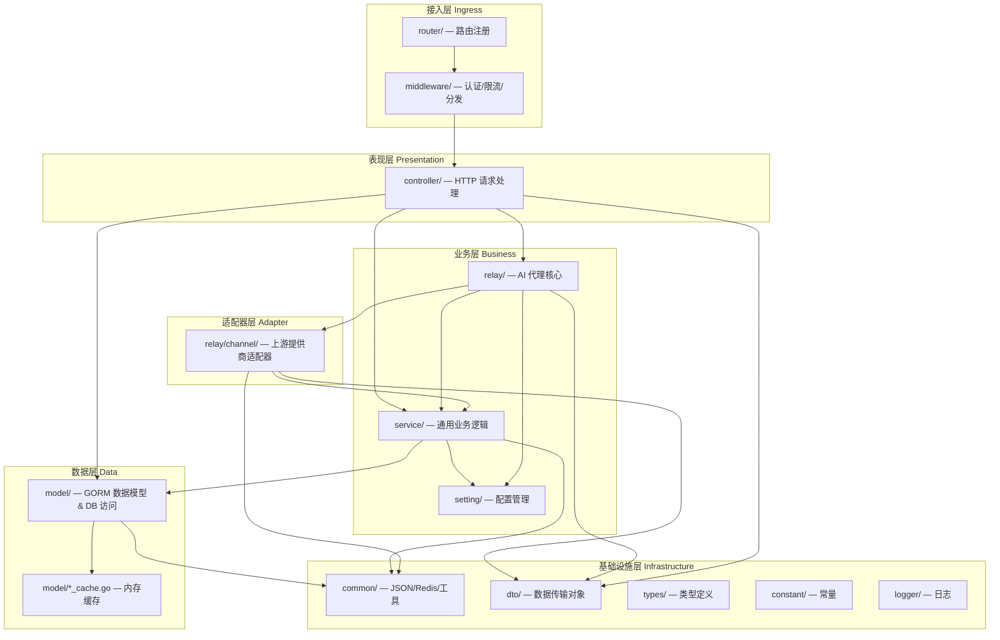
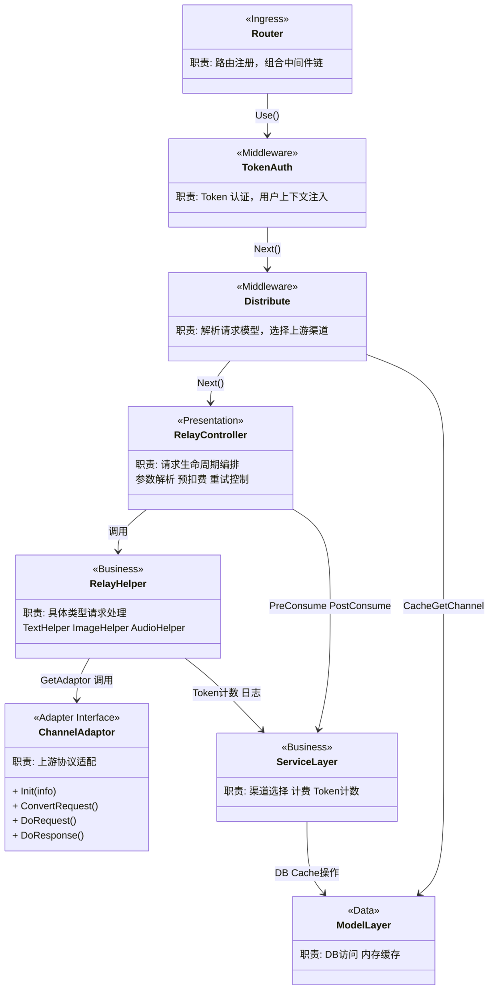

# 仓库架构

> 本文档聚焦于仓库的**分层架构、技术架构和逻辑架构**。

> **文档定位**：
> - 本文档关注"怎么组织"（分层设计、架构模式、类关系）
> - 模块列表和目录结构请参考 [仓库概览](./仓库概览.md)
> - 外部依赖关系请参考 [仓库依赖](./仓库依赖.md)

## 架构模式识别

### 项目类型

**架构类型**: 单体分层架构（Layered Monolith）

**识别依据**:
- 所有代码编译为单一二进制 (`new-api/main.go`)，通过环境变量区分主/从节点角色
- 目录按职责分层组织：`router/` → `middleware/` → `controller/` → `service/` + `relay/` → `model/`
- 前端 React SPA 以 `embed.FS` 的方式打包进二进制，随 Go 服务一同发布 (`new-api/main.go:37-41`)
- 没有服务间 RPC 或消息队列——组件通过 Go 函数调用直接通信

---

## 分层架构

### 分层设计



### 层级职责说明

| 层级 | 职责 | 主要目录 | 不应该做什么 |
|------|------|----------|------------|
| **接入层** | 路由注册、全局中间件挂载、会话管理 | `new-api/router/` | 不包含业务逻辑，不直接操作数据库 |
| **表现层** | 解析 HTTP 请求参数、调用下层、序列化响应 | `new-api/controller/` | 不包含业务规则，不直接操作数据库 |
| **业务层** | 业务规则、计费计算、渠道选择、Token 校验 | `new-api/service/`、`new-api/relay/`、`new-api/setting/` | 不关心 HTTP 细节（URL、Header 格式） |
| **适配器层** | 将统一请求格式转换为各上游 API 格式，发送请求并解析响应 | `new-api/relay/channel/` | 不包含全局业务逻辑，不直接操作 DB |
| **数据层** | 数据持久化、内存缓存、GORM 模型定义 | `new-api/model/` | 不包含 HTTP 逻辑，不包含渠道代理逻辑 |
| **基础设施层** | JSON 封装、Redis 客户端、类型与常量、日志 | `new-api/common/`、`new-api/dto/`、`new-api/types/`、`new-api/constant/`、`new-api/logger/` | 不依赖上层任何模块 |

### 层间调用规则

- 允许：上层调用下层（Router → Controller → Service/Relay → Model）
- 允许：所有层可以使用基础设施层（`common/`、`dto/`、`types/`、`constant/`）
- 禁止：下层调用上层（`model/` 不得 import `controller/`）
- 特殊说明：`service/` 和 `relay/` 存在互相引用。为了打破循环依赖，`main.go` 在启动时通过函数变量注入将 `relay.GetTaskAdaptor` 挂载到 `service.GetTaskAdaptorFunc`（`new-api/main.go:116-122`），避免了直接 import 循环

---

## 技术架构

### 技术选型

**核心技术栈**：

| 技术类别 | 选型 | 用途 | 使用方式 |
|---------|------|------|---------|
| HTTP 框架 | Gin (`github.com/gin-gonic/gin`) | Web 服务骨架 | `gin.New()` 在 `main.go` 初始化，通过 `router.SetRouter()` 挂载分组路由 |
| ORM | GORM v2 (`gorm.io/gorm`) | 数据访问 | `model/` 目录下定义 struct，使用 `DB.Find/Create/Updates` 等方法；不同数据库通过 `chooseDB()` 动态选择驱动 (`new-api/model/main.go:118`) |
| 数据库驱动 | SQLite (`glebarez/sqlite`)、MySQL (`gorm.io/driver/mysql`)、PostgreSQL (`gorm.io/driver/postgres`) | 持久化存储 | 运行时通过 `SQL_DSN` 环境变量前缀自动选择，支持三库同时编译 |
| Redis 客户端 | go-redis (`github.com/redis/go-redis/v9`) | 分布式缓存、限流 | `common/redis.go` 封装，提供 `common.RDB` 全局变量；限流在 `middleware/rate-limit.go` 使用 |
| 内存缓存 | 自实现 `model/*_cache.go` | 渠道、Token、用户缓存 | 启动时加载，通过 `SyncChannelCache(freq)` 周期同步 (`new-api/main.go:90`) |
| 配置管理 | 环境变量 + DB 选项表 | 系统配置 | `common/env.go` 读取 OS 环境变量；运行时可通过 `model/option.go` 的 `InitOptionMap`/`SyncOptions` 热更新配置 |
| 认证 | JWT-like Session（cookie）+ Bearer Token + WebAuthn | 用户/API 认证 | Session 通过 `gin-contrib/sessions`；API Token 通过 `middleware/auth.go:TokenAuth()` 解析并校验 DB |
| 国际化 | `nicksnyder/go-i18n/v2`（后端）+ `i18next`（前端） | 多语言支持 | 后端 `i18n/` 初始化，中间件 `middleware/i18n.go` 注入语言到 gin.Context |
| 异步任务 | `bytedance/gopkg/util/gopool` | goroutine 池 | 批量任务（MJ/Suno 轮询）通过 `gopool.Go()` 提交 |

### 设计模式应用

#### 适配器模式（核心模式）

每个上游 AI 提供商实现同一个 `channel.Adaptor` 接口（`new-api/relay/channel/adapter.go:15`），接口规定了请求转换、执行和响应处理的完整生命周期：

```go
// new-api/relay/channel/adapter.go:15
type Adaptor interface {
    Init(info *relaycommon.RelayInfo)
    GetRequestURL(info *relaycommon.RelayInfo) (string, error)
    SetupRequestHeader(c *gin.Context, req *http.Header, info *relaycommon.RelayInfo) error
    ConvertOpenAIRequest(c *gin.Context, info *relaycommon.RelayInfo, request *dto.GeneralOpenAIRequest) (any, error)
    DoRequest(c *gin.Context, info *relaycommon.RelayInfo, requestBody io.Reader) (any, error)
    DoResponse(c *gin.Context, resp *http.Response, info *relaycommon.RelayInfo) (usage any, err *types.NewAPIError)
    // ...
}
```

工厂函数 `relay.GetAdaptor(apiType int)` (`new-api/relay/relay_adaptor.go:53`) 根据渠道类型返回具体实现，调用方无需感知上游差异。

#### 中间件链模式

Gin 中间件通过 `router.Group().Use()` 链式组合，每个关注点独立封装：

```go
// new-api/router/relay-router.go:69-74
relayV1Router := router.Group("/v1")
relayV1Router.Use(middleware.RouteTag("relay"))
relayV1Router.Use(middleware.SystemPerformanceCheck())
relayV1Router.Use(middleware.TokenAuth())            // 认证
relayV1Router.Use(middleware.ModelRequestRateLimit()) // 限流
// 子路由再附加 Distribute()（渠道选择）
```

关键中间件链（Relay 路径）：`TokenAuth` → `Distribute` → `Controller.Relay`

- `TokenAuth`（`new-api/middleware/auth.go:248`）：解析 Bearer Token，设置用户/Token 上下文
- `Distribute`（`new-api/middleware/distributor.go:30`）：从请求中提取模型名，按权重/优先级选择可用渠道，将渠道信息写入 Context

#### 依赖注入（通过函数变量解循环）

`service` 包需要使用 `relay` 的 `TaskAdaptor`，但 `relay` 已经 import 了 `service`，会形成循环。解决方案是在 `service` 中声明函数类型变量，由 `main.go` 在启动时注入：

```go
// new-api/main.go:116-122
service.GetTaskAdaptorFunc = func(platform constant.TaskPlatform) service.TaskPollingAdaptor {
    a := relay.GetTaskAdaptor(platform)
    if a == nil {
        return nil
    }
    return a
}
```

#### 策略模式（渠道选择）

`service.CacheGetRandomSatisfiedChannel`（`new-api/service/channel_select.go:48`）封装了渠道选择策略：支持按 `group` 筛选、按 `priority` 排序、跨分组 Retry 等多种策略，以及亲和性优先（`service.GetPreferredChannelByAffinity`）。

#### Context 传递模式

所有请求上下文（用户 ID、Token 信息、渠道参数、请求起始时间等）通过 `gin.Context` 的 Key-Value 存储传递，使用 `constant/context_key.go` 中的常量作为 Key，由 `common.SetContextKey/GetContextKey` 封装访问，避免字符串硬编码。

---

## 逻辑架构

### 核心模块职责

| 模块 | 层级 | 核心职责 | 代码位置 |
|------|------|---------|---------|
| `router.SetRouter` | 接入层 | 注册所有 HTTP 路由分组（API/Relay/Dashboard/Video/Web） | `new-api/router/main.go:16` |
| `middleware.TokenAuth` | 接入层 | 解析 API Token，校验有效性、IP 限制、用户状态，写入用户上下文 | `new-api/middleware/auth.go:248` |
| `middleware.Distribute` | 接入层 | 从请求解析模型名，按 group+model 从内存缓存选择满足条件的渠道 | `new-api/middleware/distributor.go:30` |
| `controller.Relay` | 表现层 | 协调一次 AI 请求的完整生命周期：参数解析、敏感词检测、Token 计数、预扣费、重试循环 | `new-api/controller/relay.go:66` |
| `relay.TextHelper` | 业务层 | 处理 Chat Completions 请求：调用适配器转换格式、发送请求、解析响应 | `new-api/relay/compatible_handler.go:30` |
| `relay.GetAdaptor` | 业务层 | 按 API 类型返回具体 `Adaptor` 实现（工厂函数） | `new-api/relay/relay_adaptor.go:53` |
| `channel.Adaptor`（接口） | 适配器层 | 定义上游适配器契约：URL 生成、Header 设置、请求格式转换、HTTP 发送、响应解析 | `new-api/relay/channel/adapter.go:15` |
| `openai.Adaptor`（示例实现） | 适配器层 | OpenAI 及兼容协议的具体适配实现，也作为 OpenRouter/Xinference 的复用实现 | `new-api/relay/channel/openai/adaptor.go:36` |
| `service.CacheGetRandomSatisfiedChannel` | 业务层 | 渠道选择策略：支持优先级、权重、亲和性、跨分组重试 | `new-api/service/channel_select.go:48` |
| `service.PreConsumeBilling` | 业务层 | 预扣费：在请求发出前从用户配额/订阅扣减估算额度 | `new-api/service/quota.go` |
| `model.Channel` | 数据层 | 渠道数据模型，包含类型、Key、权重、分组、模型列表等字段 | `new-api/model/channel.go:21` |
| `model.Token` | 数据层 | API Token 数据模型，包含配额、IP 限制、模型限制等 | `new-api/model/token.go:14` |
| `model.User` | 数据层 | 用户数据模型，包含配额、分组、OAuth 绑定字段 | `new-api/model/user.go:23` |
| `model.Log` | 数据层 | 请求日志模型，记录每次调用的模型、Token 消耗、渠道、用户信息 | `new-api/model/log.go:19` |
| `model.InitChannelCache` | 数据层 | 启动时将 group→model→[]channelId 映射加载到内存，支持 O(1) 渠道查找 | `new-api/model/channel_cache.go:21` |
| `setting/ratio_setting` | 业务层 | 维护模型定价比例、分组比例、音频比例等配置，支持热更新 | `new-api/setting/ratio_setting/` |
| `common/json.go` | 基础设施层 | 统一 JSON 序列化/反序列化入口，屏蔽底层实现 | `new-api/common/json.go` |

### 模块协作关系



### 数据流向

**典型 AI 请求（Chat Completions）的完整数据流**：

```
客户端 HTTP 请求
  |
  v
[TokenAuth 中间件]
  解析 Authorization Header -> model.ValidateUserToken() -> 写入 Context（用户ID、配额等）
  |
  v
[Distribute 中间件]
  解析请求 Body 中的 model 字段 -> service.CacheGetRandomSatisfiedChannel()
  -> 写入 Context（渠道ID、渠道Key、BaseURL等）
  |
  v
[controller.Relay]
  1. helper.GetAndValidateRequest()   — 解析并校验请求格式（OpenAI/Claude/Gemini）
  2. relaycommon.GenRelayInfo()       — 从 Context 构建 RelayInfo
  3. service.EstimateRequestToken()   — 估算输入 Token 数
  4. helper.ModelPriceHelper()        — 计算预扣费金额
  5. service.PreConsumeBilling()      — 预扣费（写 DB）
  |
  v（进入重试循环）
[relay.TextHelper / ImageHelper / AudioHelper / ...]
  1. relay.GetAdaptor(apiType)        — 获取适配器
  2. adaptor.Init(info)               — 初始化适配器状态
  3. adaptor.ConvertOpenAIRequest()   — 请求格式转换（如 OpenAI -> Claude）
  4. adaptor.DoRequest()              — 构建并发送 HTTP 请求到上游
  5. adaptor.DoResponse()             — 解析上游响应（流式/非流式），透传给客户端
  |
  v
[post-consume]
  service.PostConsumeQuota() — 根据实际 Token 用量结算差额，写入 Log 表
  |
  v
客户端收到响应
```

**出错/重试路径**：

```
adaptor.DoResponse() 返回错误
  -> processChannelError()                         — 判断是否需要禁用渠道、上报错误
  -> service.CacheGetRandomSatisfiedChannel(retry++) — 换渠道重试
  -> 若超出 RetryTimes 上限
       -> Billing.Refund() 退还预扣费
       -> 返回错误给客户端
```

---

## 架构评估

### 架构优势

**分层清晰，职责明确**：
- 各层依赖方向单一，`router/middleware/controller/service/model` 的调用链易于追踪
- `relay/channel/` 的适配器模式使新增提供商只需实现 `Adaptor` 接口，不影响核心代码（`new-api/relay/relay_adaptor.go:53`）

**可扩展的渠道管理**：
- 已支持 35+ 上游提供商，通过统一适配器接口插拔式新增
- 渠道按 group/model 维度缓存，支持优先级、权重、亲和性等多种选择策略

**多数据库兼容**：
- 通过 `chooseDB()` 运行时选择驱动，并在 `model/main.go` 中统一处理 PostgreSQL/MySQL/SQLite 的语法差异（`new-api/model/main.go:28-59`）

**热更新配置**：
- 系统选项通过 `model.SyncOptions(freq)` 周期同步，无需重启即可生效

**计费闭环**：
- 预扣费 → 实际消费结算 → 退款的完整 Billing 生命周期由 `BillingSettler` 接口封装，保证请求失败时配额不丢失

### 潜在改进点

`middleware/distributor.go` 承担了过多职责：
- 发现位置：`new-api/middleware/distributor.go:30`
- 问题：`Distribute()` 同时处理模型名解析、权限检查、渠道亲和性查找、渠道选择，函数体超 200 行，逻辑路径复杂
- 建议：可将"请求模型名提取"与"渠道选择"拆分为独立函数或子中间件，提升单一职责

`controller/relay.go` 与 `relay/` 包存在层级穿透：
- 发现位置：`new-api/controller/relay.go:33`
- 问题：`relayHandler()` 直接在 controller 层调用 `relay.TextHelper/ImageHelper` 等，而这些 Helper 内部又调用 `service/` 层，导致 controller 层实质上直接感知了 relay 的内部结构
- 建议：可在 `relay/` 包暴露统一的 `relay.Handle(c, info)` 入口，将格式分发逻辑收拢到 relay 层内部

`service/` 与 `relay/` 的循环依赖通过函数变量规避：
- 发现位置：`new-api/main.go:116`
- 问题：`service.GetTaskAdaptorFunc` 是一个运行时注入的全局变量，测试时需要手动设置，增加了测试复杂度
- 建议：可通过引入独立的接口包（如 `ports/`）彻底解耦，但考虑到项目规模当前方案是可接受的权衡

---

> 相关文档：
> - 模块列表和技术栈详见: [仓库概览](./仓库概览.md)
> - 外部依赖和中间件详见: [仓库依赖](./仓库依赖.md)
> - 数据结构设计详见: [数据结构](./技术知识库/数据结构.md)
> - 代码编写规范详见: [代码编写指南](./技术知识库/代码编写指南.md)
