# 数据结构文档

> 本文档从代码仓库中提取，描述项目的数据结构设计。

## 数据存储系统概览

### 数据库

| 数据库类型 | 用途 | 版本要求 | 配置位置 |
|-----------|------|---------|---------|
| SQLite | 默认开发/单机部署，主数据库 | 任意 | 环境变量 `SQL_DSN` 未设置时自动启用 |
| MySQL | 生产部署主数据库 | >= 5.7.8 | 环境变量 `SQL_DSN`（mysql:// 开头） |
| PostgreSQL | 生产部署主数据库 | >= 9.6 | 环境变量 `SQL_DSN`（postgres:// 开头） |
| MySQL/PostgreSQL/SQLite（日志库） | 独立日志数据库（可选） | 同主库要求 | 环境变量 `LOG_SQL_DSN` |

> 三种数据库同时支持，通过 `SQL_DSN` 环境变量前缀自动选择。代码逻辑见 `new-api/model/main.go`。

### 中间件

| 中间件类型 | 用途 | 版本要求 | 配置位置 |
|-----------|------|---------|---------|
| Redis | 用户/令牌缓存、速率限制、通知限流 | >= 6.0 | 环境变量 `REDIS_CONN_STRING` |

> 项目无消息队列（Kafka/Pulsar）依赖。Redis 为可选组件，未配置时自动降级为内存缓存。

---

## 数据表结构

### users（用户表）

**业务说明**: 存储所有注册用户的基础信息、配额、OAuth 绑定标识、邀请关系等。

**表结构**:

| 字段名 | 类型 | 必填 | 默认值 | 索引 | 说明 |
|-------|------|------|-------|------|------|
| id | int | 是 | 自增 | PK | 用户 ID |
| username | varchar(20) | 是 | - | 唯一索引、普通索引 | 用户名，最长 20 字符 |
| password | varchar | 是 | - | - | bcrypt 哈希密码 |
| display_name | varchar(20) | 否 | - | 普通索引 | 显示名称 |
| role | int | 是 | 1 | - | 角色：1=普通用户，10=管理员，100=超级管理员 |
| status | int | 是 | 1 | - | 状态：1=启用，2=禁用 |
| email | varchar(50) | 否 | - | 普通索引 | 邮箱 |
| github_id | varchar | 否 | - | 普通索引 | GitHub OAuth ID |
| discord_id | varchar | 否 | - | 普通索引 | Discord OAuth ID |
| oidc_id | varchar | 否 | - | 普通索引 | OIDC OAuth ID |
| wechat_id | varchar | 否 | - | 普通索引 | 微信 ID |
| telegram_id | varchar | 否 | - | 普通索引 | Telegram ID |
| linux_do_id | varchar | 否 | - | 普通索引 | LinuxDO OAuth ID |
| access_token | char(32) | 否 | NULL | 唯一索引 | 系统管理 Token |
| quota | int | 是 | 0 | - | 当前可用配额 |
| used_quota | int | 是 | 0 | - | 已使用配额 |
| request_count | int | 是 | 0 | - | 请求总次数 |
| group | varchar(64) | 是 | 'default' | - | 用户分组 |
| aff_code | varchar(32) | 否 | - | 唯一索引 | 邀请码 |
| aff_count | int | 是 | 0 | - | 成功邀请数 |
| aff_quota | int | 是 | 0 | - | 邀请剩余奖励配额 |
| aff_history | int | 是 | 0 | - | 邀请历史总奖励配额 |
| inviter_id | int | 否 | - | 普通索引 | 邀请人 ID |
| stripe_customer | varchar(64) | 否 | - | 普通索引 | Stripe 客户 ID |
| setting | text | 否 | - | - | 用户设置 JSON（通知、语言等） |
| remark | varchar(255) | 否 | - | - | 管理员备注 |
| deleted_at | timestamp | 否 | NULL | 普通索引 | 软删除时间 |

**来源**: `new-api/model/user.go`

---

### tokens（API 令牌表）

**业务说明**: 存储用户创建的 API Key，支持配额限制、IP 限制、模型限制等精细控制。

**表结构**:

| 字段名 | 类型 | 必填 | 默认值 | 索引 | 说明 |
|-------|------|------|-------|------|------|
| id | int | 是 | 自增 | PK | 令牌 ID |
| user_id | int | 是 | - | 普通索引 | 归属用户 ID |
| key | char(48) | 是 | - | 唯一索引 | API Key 值 |
| status | int | 是 | 1 | - | 状态：1=启用，2=禁用，3=过期 |
| name | varchar | 是 | - | 普通索引 | 令牌名称 |
| created_time | bigint | 是 | - | - | 创建时间戳 |
| accessed_time | bigint | 否 | - | - | 最后访问时间戳 |
| expired_time | bigint | 是 | -1 | - | 过期时间戳，-1 表示永不过期 |
| remain_quota | int | 是 | 0 | - | 剩余配额 |
| unlimited_quota | bool | 是 | false | - | 是否无限配额 |
| model_limits_enabled | bool | 是 | false | - | 是否启用模型限制 |
| model_limits | varchar(1024) | 是 | '' | - | 允许的模型列表（换行分隔） |
| allow_ips | varchar | 否 | '' | - | 允许的 IP 列表（换行分隔） |
| used_quota | int | 是 | 0 | - | 已使用配额 |
| group | varchar | 是 | '' | - | 令牌分组 |
| cross_group_retry | bool | 是 | false | - | 是否启用跨分组重试（仅 auto 分组） |
| deleted_at | timestamp | 否 | NULL | 普通索引 | 软删除时间 |

**来源**: `new-api/model/token.go`

---

### channels（渠道表）

**业务说明**: 存储上游 AI 服务提供商的接入配置，支持多 Key 模式、模型映射、权重分配等。

**表结构**:

| 字段名 | 类型 | 必填 | 默认值 | 索引 | 说明 |
|-------|------|------|-------|------|------|
| id | int | 是 | 自增 | PK | 渠道 ID |
| type | int | 是 | 0 | - | 渠道类型（枚举，如 1=OpenAI，3=Azure 等） |
| key | text | 是 | - | - | API Key（可多行，支持 JSON 数组） |
| openai_organization | varchar | 否 | NULL | - | OpenAI 组织 ID |
| test_model | varchar | 否 | NULL | - | 测试用模型名 |
| status | int | 是 | 1 | - | 状态：1=启用，2=禁用 |
| name | varchar | 是 | - | 普通索引 | 渠道名称 |
| weight | uint | 否 | 0 | - | 权重（负载均衡） |
| created_time | bigint | 是 | - | - | 创建时间戳 |
| test_time | bigint | 否 | - | - | 上次测试时间戳 |
| response_time | int | 否 | - | - | 响应时间（毫秒） |
| base_url | varchar | 否 | '' | - | 自定义 Base URL |
| other | varchar | 否 | - | - | 其他配置信息 |
| balance | float64 | 否 | - | - | 账户余额（USD） |
| balance_updated_time | bigint | 否 | - | - | 余额更新时间戳 |
| models | text | 是 | - | - | 支持的模型列表（逗号分隔） |
| group | varchar(64) | 是 | 'default' | - | 渠道所属分组 |
| used_quota | bigint | 是 | 0 | - | 已使用配额 |
| model_mapping | text | 否 | NULL | - | 模型映射 JSON |
| status_code_mapping | varchar(1024) | 否 | '' | - | 状态码映射 JSON |
| priority | bigint | 否 | 0 | - | 优先级 |
| auto_ban | int | 否 | 1 | - | 是否自动禁用（1=是） |
| other_info | varchar | 否 | - | - | 额外信息 |
| tag | varchar | 否 | NULL | 普通索引 | 渠道标签 |
| setting | text | 否 | NULL | - | 渠道额外设置 JSON |
| param_override | text | 否 | NULL | - | 请求参数覆盖 JSON |
| header_override | text | 否 | NULL | - | 请求头覆盖 JSON |
| remark | varchar(255) | 否 | NULL | - | 备注 |
| channel_info | json | 否 | - | - | 多 Key 模式等扩展信息 |
| settings | varchar | 否 | - | - | 其他设置（Azure 版本等） |

**来源**: `new-api/model/channel.go`

---

### abilities（渠道能力表）

**业务说明**: 记录每个渠道支持哪些模型（group+model+channel_id 三列联合主键），是调度系统的核心路由表。

**表结构**:

| 字段名 | 类型 | 必填 | 默认值 | 索引 | 说明 |
|-------|------|------|-------|------|------|
| group | varchar(64) | 是 | - | PK（联合） | 分组名 |
| model | varchar(255) | 是 | - | PK（联合） | 模型名 |
| channel_id | int | 是 | - | PK（联合）、普通索引 | 渠道 ID |
| enabled | bool | 是 | - | - | 是否启用 |
| priority | bigint | 否 | 0 | 普通索引 | 优先级 |
| weight | uint | 是 | 0 | 普通索引 | 权重 |
| tag | varchar | 否 | NULL | 普通索引 | 标签 |

**来源**: `new-api/model/ability.go`

---

### logs（操作日志表）

**业务说明**: 记录所有用户的 API 调用日志、充值记录、管理操作记录、系统事件等。支持单独日志数据库（`LOG_SQL_DSN`）。

**表结构**:

| 字段名 | 类型 | 必填 | 默认值 | 索引 | 说明 |
|-------|------|------|-------|------|------|
| id | int | 是 | 自增 | PK、复合索引 | 日志 ID |
| user_id | int | 是 | - | 普通索引、复合索引 | 用户 ID |
| created_at | bigint | 是 | - | 复合索引、type 复合索引 | 创建时间戳 |
| type | int | 是 | - | 复合索引 | 日志类型（0=未知/1=充值/2=消费/3=管理/4=系统/5=错误/6=退款） |
| content | text | 是 | - | - | 日志内容 |
| username | varchar | 否 | '' | 普通索引、username-model 复合索引 | 用户名 |
| token_name | varchar | 否 | '' | 普通索引 | 令牌名称 |
| model_name | varchar | 否 | '' | 普通索引、username-model 复合索引 | 模型名称 |
| quota | int | 是 | 0 | - | 消耗配额 |
| prompt_tokens | int | 是 | 0 | - | 提示 Token 数 |
| completion_tokens | int | 是 | 0 | - | 完成 Token 数 |
| use_time | int | 是 | 0 | - | 请求耗时（秒） |
| is_stream | bool | 是 | false | - | 是否流式请求 |
| channel | int | 否 | - | 普通索引 | 渠道 ID |
| channel_name | varchar | - | - | （只读虚拟列） | 渠道名称（前端展示） |
| token_id | int | 是 | 0 | 普通索引 | 令牌 ID |
| group | varchar | 否 | - | 普通索引 | 分组 |
| ip | varchar | 否 | '' | 普通索引 | 请求 IP |
| request_id | varchar(64) | 否 | '' | 普通索引 | 请求唯一 ID |
| other | text | 否 | - | - | 扩展信息 JSON（含 admin_info、reject_reason 等） |

**来源**: `new-api/model/log.go`

---

### options（系统配置表）

**业务说明**: 键值对形式存储系统全局配置，如邮件设置、OAuth 密钥、各种功能开关等。

**表结构**:

| 字段名 | 类型 | 必填 | 默认值 | 索引 | 说明 |
|-------|------|------|-------|------|------|
| key | varchar | 是 | - | PK | 配置键名 |
| value | text | 是 | - | - | 配置值（字符串） |

**来源**: `new-api/model/option.go`

---

### redemptions（兑换码表）

**业务说明**: 存储一次性使用的配额兑换码，支持过期时间控制。

**表结构**:

| 字段名 | 类型 | 必填 | 默认值 | 索引 | 说明 |
|-------|------|------|-------|------|------|
| id | int | 是 | 自增 | PK | 兑换码 ID |
| user_id | int | 是 | - | - | 创建者用户 ID |
| key | char(32) | 是 | - | 唯一索引 | 兑换码 Key |
| status | int | 是 | 1 | - | 状态：1=可用，2=已禁用，3=已使用 |
| name | varchar | 是 | - | 普通索引 | 兑换码名称/备注 |
| quota | int | 是 | 100 | - | 兑换配额 |
| created_time | bigint | 是 | - | - | 创建时间戳 |
| redeemed_time | bigint | 否 | - | - | 兑换时间戳 |
| used_user_id | int | 否 | - | - | 使用者用户 ID |
| expired_time | bigint | 是 | 0 | - | 过期时间戳，0=不过期 |
| deleted_at | timestamp | 否 | NULL | 普通索引 | 软删除时间 |

**来源**: `new-api/model/redemption.go`

---

### top_ups（充值记录表）

**业务说明**: 记录用户的在线充值订单（Stripe、易支付、Creem 等），用于充值状态追踪与幂等处理。

**表结构**:

| 字段名 | 类型 | 必填 | 默认值 | 索引 | 说明 |
|-------|------|------|-------|------|------|
| id | int | 是 | 自增 | PK | 记录 ID |
| user_id | int | 是 | - | 普通索引 | 用户 ID |
| amount | int64 | 是 | - | - | 充值额度数量 |
| money | float64 | 是 | - | - | 实付金额（USD） |
| trade_no | varchar(255) | 是 | - | 唯一索引、普通索引 | 支付平台单号 |
| payment_method | varchar(50) | 否 | - | - | 支付方式（stripe/creem 等） |
| create_time | bigint | 是 | - | - | 创建时间戳 |
| complete_time | bigint | 否 | - | - | 完成时间戳 |
| status | varchar | 是 | - | - | 状态（pending/success/expired） |

**来源**: `new-api/model/topup.go`

---

### midjourney（Midjourney 任务表）

**业务说明**: 存储 Midjourney 图像生成任务记录（遗留表，较新任务统一使用 tasks 表）。

**表结构**:

| 字段名 | 类型 | 必填 | 默认值 | 索引 | 说明 |
|-------|------|------|-------|------|------|
| id | int | 是 | 自增 | PK | 任务 ID |
| code | int | 否 | - | - | HTTP 状态码 |
| user_id | int | 是 | - | 普通索引 | 用户 ID |
| action | varchar(40) | 是 | - | 普通索引 | 操作类型（IMAGINE/UPSCALE 等） |
| mj_id | varchar | 否 | - | 普通索引 | Midjourney 平台任务 ID |
| prompt | text | 否 | - | - | 提示词（中文） |
| prompt_en | text | 否 | - | - | 提示词（英文） |
| description | text | 否 | - | - | 任务描述 |
| state | text | 否 | - | - | 任务状态信息 |
| submit_time | bigint | 是 | - | 普通索引 | 提交时间戳 |
| start_time | bigint | 否 | - | 普通索引 | 开始时间戳 |
| finish_time | bigint | 否 | - | 普通索引 | 完成时间戳 |
| image_url | text | 否 | - | - | 生成图片 URL |
| video_url | text | 否 | - | - | 视频 URL |
| video_urls | text | 否 | - | - | 多视频 URL |
| status | varchar(20) | 是 | - | 普通索引 | 任务状态 |
| progress | varchar(30) | 否 | - | 普通索引 | 进度（百分比字符串） |
| fail_reason | text | 否 | - | - | 失败原因 |
| channel_id | int | 否 | - | - | 渠道 ID |
| quota | int | 否 | - | - | 消耗配额 |
| buttons | text | 否 | - | - | 可用操作按钮 JSON |
| properties | text | 否 | - | - | 扩展属性 |

**来源**: `new-api/model/midjourney.go`

---

### tasks（通用异步任务表）

**业务说明**: 统一存储所有异步生成任务（视频生成、音频生成、图像生成等），跨平台（Suno、Kling、Vidu、Luma、Runway 等）。

**表结构**:

| 字段名 | 类型 | 必填 | 默认值 | 索引 | 说明 |
|-------|------|------|-------|------|------|
| id | int64 | 是 | 自增 | PK | 任务内部 ID |
| created_at | bigint | 是 | - | 普通索引 | 创建时间戳 |
| updated_at | bigint | 是 | - | - | 更新时间戳 |
| task_id | varchar(191) | 否 | - | 普通索引 | 对外暴露的任务 ID（task_xxxx 格式） |
| platform | varchar(30) | 是 | - | 普通索引 | 平台标识（suno/kling/vidu 等） |
| user_id | int | 是 | - | 普通索引 | 用户 ID |
| group | varchar(50) | 否 | - | - | 分组（用于计费修正） |
| channel_id | int | 否 | - | 普通索引 | 渠道 ID |
| quota | int | 否 | - | - | 消耗配额 |
| action | varchar(40) | 是 | - | 普通索引 | 任务类型（generate/描述等） |
| status | varchar(20) | 是 | - | 普通索引 | 任务状态（NOT_START/SUBMITTED/QUEUED/IN_PROGRESS/FAILURE/SUCCESS） |
| fail_reason | text | 否 | - | - | 失败原因 |
| submit_time | bigint | 否 | - | 普通索引 | 提交时间戳 |
| start_time | bigint | 否 | - | 普通索引 | 开始时间戳 |
| finish_time | bigint | 否 | - | 普通索引 | 完成时间戳 |
| progress | varchar(20) | 否 | - | 普通索引 | 进度 |
| properties | json | 否 | - | - | 任务属性（输入文本、模型名等） |
| private_data | json | 否 | - | - | 私有数据（Key、上游 ID、计费上下文，不对外暴露） |
| data | json | 否 | - | - | 任务结果数据（对外暴露） |

**来源**: `new-api/model/task.go`

---

### quota_data（配额统计数据表）

**业务说明**: 按小时粒度聚合的配额使用统计，用于数据看板图表展示（每小时批量写入）。

**表结构**:

| 字段名 | 类型 | 必填 | 默认值 | 索引 | 说明 |
|-------|------|------|-------|------|------|
| id | int | 是 | 自增 | PK | 记录 ID |
| user_id | int | 是 | - | 普通索引 | 用户 ID |
| username | varchar(64) | 否 | '' | 复合索引（model+username） | 用户名 |
| model_name | varchar(64) | 否 | '' | 复合索引（model+username） | 模型名称 |
| created_at | bigint | 是 | - | 普通索引 | 时间戳（精确到小时） |
| token_used | int | 是 | 0 | - | Token 使用量 |
| count | int | 是 | 0 | - | 请求次数 |
| quota | int | 是 | 0 | - | 消耗配额 |

**来源**: `new-api/model/usedata.go`

---

### models（模型元数据表）

**业务说明**: 存储平台注册的模型信息，包括描述、图标、标签、厂商关联等，支持软删除和名称匹配规则。

**表结构**:

| 字段名 | 类型 | 必填 | 默认值 | 索引 | 说明 |
|-------|------|------|-------|------|------|
| id | int | 是 | 自增 | PK | 模型 ID |
| model_name | varchar(128) | 是 | - | 唯一复合索引（与 deleted_at） | 模型名称 |
| description | text | 否 | - | - | 模型描述 |
| icon | varchar(128) | 否 | - | - | 图标名（@lobehub/icons） |
| tags | varchar(255) | 否 | - | - | 标签（逗号分隔） |
| vendor_id | int | 否 | - | 普通索引 | 厂商 ID |
| endpoints | text | 否 | - | - | 端点信息 JSON |
| status | int | 是 | 1 | - | 状态（1=启用） |
| sync_official | int | 是 | 1 | - | 是否同步官方信息 |
| name_rule | int | 是 | 0 | - | 名称匹配规则（0=精确/1=前缀/2=包含/3=后缀） |
| created_time | bigint | 是 | - | - | 创建时间戳 |
| updated_time | bigint | 是 | - | - | 更新时间戳 |
| deleted_at | timestamp | 否 | NULL | 软删除索引 | 软删除时间 |

**来源**: `new-api/model/model_meta.go`

---

### vendors（厂商表）

**业务说明**: 存储 AI 服务提供商（厂商）信息，供模型关联引用。

**表结构**:

| 字段名 | 类型 | 必填 | 默认值 | 索引 | 说明 |
|-------|------|------|-------|------|------|
| id | int | 是 | 自增 | PK | 厂商 ID |
| name | varchar(128) | 是 | - | 唯一复合索引（与 deleted_at） | 厂商名称 |
| description | text | 否 | - | - | 厂商描述 |
| icon | varchar(128) | 否 | - | - | 图标名（@lobehub/icons） |
| status | int | 是 | 1 | - | 状态（1=启用） |
| created_time | bigint | 是 | - | - | 创建时间戳 |
| updated_time | bigint | 是 | - | - | 更新时间戳 |
| deleted_at | timestamp | 否 | NULL | 软删除索引 | 软删除时间 |

**来源**: `new-api/model/vendor_meta.go`

---

### prefill_groups（预填充组表）

**业务说明**: 存储可复用的"组"信息（模型组、标签组、端点组等），用于渠道配置快速选择。

**表结构**:

| 字段名 | 类型 | 必填 | 默认值 | 索引 | 说明 |
|-------|------|------|-------|------|------|
| id | int | 是 | 自增 | PK | 记录 ID |
| name | varchar(64) | 是 | - | 条件唯一索引（deleted_at IS NULL） | 组名称 |
| type | varchar(32) | 是 | - | 普通索引 | 组类型（model/tag/endpoint 等） |
| items | json | 否 | - | - | 组成员列表 JSON 数组 |
| description | varchar(255) | 否 | - | - | 描述 |
| created_time | bigint | 是 | - | - | 创建时间戳 |
| updated_time | bigint | 是 | - | - | 更新时间戳 |
| deleted_at | timestamp | 否 | NULL | 软删除索引 | 软删除时间 |

**来源**: `new-api/model/prefill_group.go`

---

### setups（初始化记录表）

**业务说明**: 记录系统是否已完成初始化，单行记录，防止重复初始化。

**表结构**:

| 字段名 | 类型 | 必填 | 默认值 | 索引 | 说明 |
|-------|------|------|-------|------|------|
| id | uint | 是 | 自增 | PK | 记录 ID |
| version | varchar(50) | 是 | - | - | 初始化时的版本号 |
| initialized_at | bigint | 是 | - | - | 初始化时间戳 |

**来源**: `new-api/model/setup.go`

---

### passkey_credentials（Passkey 凭证表）

**业务说明**: 存储用户注册的 WebAuthn/Passkey 凭证，支持无密码登录，每用户限一个凭证。

**表结构**:

| 字段名 | 类型 | 必填 | 默认值 | 索引 | 说明 |
|-------|------|------|-------|------|------|
| id | int | 是 | 自增 | PK | 记录 ID |
| user_id | int | 是 | - | 唯一索引 | 用户 ID（每用户仅一条） |
| credential_id | varchar(512) | 是 | - | 唯一索引 | 凭证 ID（Base64 编码） |
| public_key | text | 是 | - | - | 公钥（Base64 编码） |
| attestation_type | varchar(255) | 否 | - | - | 证明类型 |
| aaguid | varchar(512) | 否 | - | - | 认证器 AAGUID（Base64） |
| sign_count | uint32 | 是 | 0 | - | 签名计数器（防克隆） |
| clone_warning | bool | 是 | false | - | 是否触发克隆警告 |
| user_present | bool | 是 | false | - | 用户在场标记 |
| user_verified | bool | 是 | false | - | 用户验证标记 |
| backup_eligible | bool | 是 | false | - | 是否可备份 |
| backup_state | bool | 是 | false | - | 备份状态 |
| transports | text | 否 | - | - | 传输方式 JSON 数组（usb/nfc/ble 等） |
| attachment | varchar(32) | 否 | - | - | 认证器附加方式（platform/cross-platform） |
| last_used_at | timestamp | 否 | NULL | - | 最后使用时间 |
| created_at | timestamp | 是 | - | - | 创建时间 |
| updated_at | timestamp | 是 | - | - | 更新时间 |
| deleted_at | timestamp | 否 | NULL | 普通索引 | 软删除时间 |

**来源**: `new-api/model/passkey.go`

---

### two_fas（2FA 设置表）

**业务说明**: 存储用户的 TOTP 双因素认证配置，包含锁定机制防止暴力破解。

**表结构**:

| 字段名 | 类型 | 必填 | 默认值 | 索引 | 说明 |
|-------|------|------|-------|------|------|
| id | int | 是 | 自增 | PK | 记录 ID |
| user_id | int | 是 | - | 唯一索引、普通索引 | 用户 ID（每用户仅一条） |
| secret | varchar(255) | 是 | - | - | TOTP 密钥（不对外返回） |
| is_enabled | bool | 是 | false | - | 是否已启用 2FA |
| failed_attempts | int | 是 | 0 | - | 连续失败次数 |
| locked_until | timestamp | 否 | NULL | - | 锁定到期时间 |
| last_used_at | timestamp | 否 | NULL | - | 最后使用时间 |
| created_at | timestamp | 是 | - | - | 创建时间 |
| updated_at | timestamp | 是 | - | - | 更新时间 |
| deleted_at | timestamp | 否 | NULL | 软删除索引 | 软删除时间 |

**来源**: `new-api/model/twofa.go`

---

### two_fa_backup_codes（2FA 备用码表）

**业务说明**: 存储用户生成的 2FA 备用码（哈希存储），用于在无法使用 TOTP 时恢复访问。

**表结构**:

| 字段名 | 类型 | 必填 | 默认值 | 索引 | 说明 |
|-------|------|------|-------|------|------|
| id | int | 是 | 自增 | PK | 记录 ID |
| user_id | int | 是 | - | 普通索引 | 用户 ID |
| code_hash | varchar(255) | 是 | - | - | 备用码哈希值 |
| is_used | bool | 是 | false | - | 是否已使用 |
| used_at | timestamp | 否 | NULL | - | 使用时间 |
| created_at | timestamp | 是 | - | - | 创建时间 |
| deleted_at | timestamp | 否 | NULL | 软删除索引 | 软删除时间 |

**来源**: `new-api/model/twofa.go`

---

### checkins（签到记录表）

**业务说明**: 存储用户每日签到记录，按日期+用户 ID 唯一约束防并发重复签到，奖励随机配额。

**表结构**:

| 字段名 | 类型 | 必填 | 默认值 | 索引 | 说明 |
|-------|------|------|-------|------|------|
| id | int | 是 | 自增 | PK | 记录 ID |
| user_id | int | 是 | - | 唯一复合索引（与 checkin_date） | 用户 ID |
| checkin_date | varchar(10) | 是 | - | 唯一复合索引（与 user_id） | 签到日期（YYYY-MM-DD） |
| quota_awarded | int | 是 | - | - | 奖励配额 |
| created_at | bigint | 是 | - | - | 创建时间戳 |

**来源**: `new-api/model/checkin.go`

---

### subscription_plans（订阅套餐表）

**业务说明**: 存储订阅套餐定义，包含价格、时长、配额总量、重置周期、升级分组等，支持 Stripe 和 Creem 支付。SQLite 下单独处理建表（不支持 decimal 类型）。

**表结构**:

| 字段名 | 类型 | 必填 | 默认值 | 索引 | 说明 |
|-------|------|------|-------|------|------|
| id | int | 是 | 自增 | PK | 套餐 ID |
| title | varchar(128) | 是 | - | - | 套餐标题 |
| subtitle | varchar(255) | 否 | '' | - | 副标题 |
| price_amount | decimal(10,6) | 是 | 0 | - | 显示价格 |
| currency | varchar(8) | 是 | 'USD' | - | 货币类型 |
| duration_unit | varchar(16) | 是 | 'month' | - | 时长单位（year/month/day/hour/custom） |
| duration_value | int | 是 | 1 | - | 时长数量 |
| custom_seconds | bigint | 是 | 0 | - | 自定义时长（秒，custom 模式用） |
| enabled | bool | 是 | true | - | 是否启用 |
| sort_order | int | 是 | 0 | - | 排序权重 |
| stripe_price_id | varchar(128) | 否 | '' | - | Stripe 价格 ID |
| creem_product_id | varchar(128) | 否 | '' | - | Creem 产品 ID |
| max_purchase_per_user | int | 是 | 0 | - | 每用户最大购买次数（0=不限） |
| upgrade_group | varchar(64) | 否 | '' | - | 购买后升级到的用户分组 |
| total_amount | bigint | 是 | 0 | - | 套餐总配额（0=不限） |
| quota_reset_period | varchar(16) | 否 | 'never' | - | 配额重置周期（never/daily/weekly/monthly/custom） |
| quota_reset_custom_seconds | bigint | 是 | 0 | - | 自定义重置周期（秒） |
| created_at | bigint | 是 | - | - | 创建时间戳 |
| updated_at | bigint | 是 | - | - | 更新时间戳 |

**来源**: `new-api/model/subscription.go`

---

### subscription_orders（订阅订单表）

**业务说明**: 存储订阅购买订单，记录从待支付到成功/过期的状态流转，幂等处理支付回调。

**表结构**:

| 字段名 | 类型 | 必填 | 默认值 | 索引 | 说明 |
|-------|------|------|-------|------|------|
| id | int | 是 | 自增 | PK | 订单 ID |
| user_id | int | 是 | - | 普通索引 | 用户 ID |
| plan_id | int | 是 | - | 普通索引 | 套餐 ID |
| money | float64 | 是 | - | - | 实付金额 |
| trade_no | varchar(255) | 是 | - | 唯一索引、普通索引 | 支付平台单号 |
| payment_method | varchar(50) | 否 | - | - | 支付方式 |
| status | varchar | 是 | - | - | 状态（pending/success/expired） |
| create_time | bigint | 是 | - | - | 创建时间戳 |
| complete_time | bigint | 否 | - | - | 完成时间戳 |
| provider_payload | text | 否 | - | - | 支付平台回调原始数据 |

**来源**: `new-api/model/subscription.go`

---

### user_subscriptions（用户订阅实例表）

**业务说明**: 存储用户实际持有的订阅记录（套餐快照），追踪配额使用量、重置时间、到期时间，支持分组升级回退。

**表结构**:

| 字段名 | 类型 | 必填 | 默认值 | 索引 | 说明 |
|-------|------|------|-------|------|------|
| id | int | 是 | 自增 | PK | 实例 ID |
| user_id | int | 是 | - | 普通索引、活跃复合索引 | 用户 ID |
| plan_id | int | 是 | - | 普通索引 | 套餐 ID |
| amount_total | bigint | 是 | 0 | - | 套餐总配额 |
| amount_used | bigint | 是 | 0 | - | 已使用配额 |
| start_time | bigint | 是 | - | - | 生效开始时间戳 |
| end_time | bigint | 是 | - | 普通索引、活跃复合索引 | 到期时间戳 |
| status | varchar(32) | 是 | - | 普通索引、活跃复合索引 | 状态（active/expired/cancelled） |
| source | varchar(32) | 是 | 'order' | - | 来源（order/admin） |
| last_reset_time | bigint | 是 | 0 | - | 最后重置时间戳 |
| next_reset_time | bigint | 是 | 0 | 普通索引 | 下次重置时间戳 |
| upgrade_group | varchar(64) | 否 | '' | - | 升级到的分组 |
| prev_user_group | varchar(64) | 否 | '' | - | 升级前的原始分组（用于到期回退） |
| created_at | bigint | 是 | - | - | 创建时间戳 |
| updated_at | bigint | 是 | - | - | 更新时间戳 |

**来源**: `new-api/model/subscription.go`

---

### subscription_pre_consume_records（订阅预消费幂等记录表）

**业务说明**: 存储订阅配额预消费的幂等记录，防止并发重复扣费，支持退款回滚。

**表结构**:

| 字段名 | 类型 | 必填 | 默认值 | 索引 | 说明 |
|-------|------|------|-------|------|------|
| id | int | 是 | 自增 | PK | 记录 ID |
| request_id | varchar(64) | 是 | - | 唯一索引 | 请求唯一 ID（幂等键） |
| user_id | int | 是 | - | 普通索引 | 用户 ID |
| user_subscription_id | int | 是 | - | 普通索引 | 订阅实例 ID |
| pre_consumed | bigint | 是 | 0 | - | 预消费配额量 |
| status | varchar(32) | 是 | - | 普通索引 | 状态（consumed/refunded） |
| created_at | bigint | 是 | - | - | 创建时间戳 |
| updated_at | bigint | 是 | - | 普通索引 | 更新时间戳（用于定期清理） |

**来源**: `new-api/model/subscription.go`

---

### custom_oauth_providers（自定义 OAuth 提供商表）

**业务说明**: 存储管理员配置的自定义 OAuth/OIDC 提供商，支持 OIDC 发现、字段映射、访问策略控制。

**表结构**:

| 字段名 | 类型 | 必填 | 默认值 | 索引 | 说明 |
|-------|------|------|-------|------|------|
| id | int | 是 | 自增 | PK | 提供商 ID |
| name | varchar(64) | 是 | - | - | 显示名称 |
| slug | varchar(64) | 是 | - | 唯一索引 | URL 标识符（小写字母+数字+连字符） |
| icon | varchar(128) | 否 | '' | - | 图标名 |
| enabled | bool | 是 | false | - | 是否启用 |
| client_id | varchar(256) | 是 | - | - | OAuth Client ID |
| client_secret | varchar(512) | 是 | - | - | OAuth Client Secret（不对外返回） |
| authorization_endpoint | varchar(512) | 是 | - | - | 授权端点 URL |
| token_endpoint | varchar(512) | 是 | - | - | Token 交换端点 URL |
| user_info_endpoint | varchar(512) | 是 | - | - | 用户信息端点 URL |
| scopes | varchar(256) | 否 | 'openid profile email' | - | OAuth 授权范围 |
| user_id_field | varchar(128) | 否 | 'sub' | - | 用户 ID 字段路径（支持 JSONPath） |
| username_field | varchar(128) | 否 | 'preferred_username' | - | 用户名字段路径 |
| display_name_field | varchar(128) | 否 | 'name' | - | 显示名称字段路径 |
| email_field | varchar(128) | 否 | 'email' | - | 邮箱字段路径 |
| well_known | varchar(512) | 否 | - | - | OIDC 发现端点（可选） |
| auth_style | int | 是 | 0 | - | 认证方式（0=自动/1=参数/2=Basic Auth） |
| access_policy | text | 否 | - | - | 访问控制策略 JSON |
| access_denied_message | varchar(512) | 否 | - | - | 访问拒绝提示消息模板 |
| created_at | timestamp | 是 | - | - | 创建时间 |
| updated_at | timestamp | 是 | - | - | 更新时间 |

**来源**: `new-api/model/custom_oauth_provider.go`

---

### user_oauth_bindings（用户 OAuth 绑定表）

**业务说明**: 存储用户与自定义 OAuth 提供商的绑定关系，每个用户每个提供商仅限一条绑定。

**表结构**:

| 字段名 | 类型 | 必填 | 默认值 | 索引 | 说明 |
|-------|------|------|-------|------|------|
| id | int | 是 | 自增 | PK | 记录 ID |
| user_id | int | 是 | - | 唯一复合索引（与 provider_id） | 用户 ID |
| provider_id | int | 是 | - | 唯一复合索引（与 user_id）、唯一复合索引（与 provider_user_id） | 提供商 ID |
| provider_user_id | varchar(256) | 是 | - | 唯一复合索引（与 provider_id） | OAuth 提供商侧的用户 ID |
| created_at | timestamp | 是 | - | - | 创建时间 |

**来源**: `new-api/model/user_oauth_binding.go`

---

## 数据关系图

```mermaid
erDiagram
    users ||--o{ tokens : "创建"
    users ||--o{ logs : "产生"
    users ||--o{ top_ups : "充值"
    users ||--o{ redemptions : "使用(used_user_id)"
    users ||--o{ midjourney : "提交"
    users ||--o{ tasks : "提交"
    users ||--o{ quota_data : "统计"
    users ||--o{ checkins : "签到"
    users ||--o| passkey_credentials : "注册"
    users ||--o| two_fas : "启用"
    users ||--o{ two_fa_backup_codes : "生成"
    users ||--o{ user_oauth_bindings : "绑定"
    users ||--o{ subscription_orders : "购买"
    users ||--o{ user_subscriptions : "持有"

    channels ||--o{ abilities : "支持"
    channels ||--o{ logs : "路由"
    channels ||--o{ midjourney : "处理"
    channels ||--o{ tasks : "处理"

    tokens ||--o{ logs : "调用"

    models }o--o| vendors : "归属"

    subscription_plans ||--o{ subscription_orders : "下单"
    subscription_plans ||--o{ user_subscriptions : "实例化"

    subscription_orders ||--o| top_ups : "同步(trade_no)"

    user_subscriptions ||--o{ subscription_pre_consume_records : "预消费"

    custom_oauth_providers ||--o{ user_oauth_bindings : "绑定"

    users {
        int id PK
        varchar username
        int quota
        varchar group
        int status
    }

    tokens {
        int id PK
        int user_id FK
        char key
        int remain_quota
    }

    channels {
        int id PK
        int type
        text key
        varchar models
        varchar group
    }

    abilities {
        varchar group PK
        varchar model PK
        int channel_id PK
        bool enabled
    }

    logs {
        int id PK
        int user_id FK
        int token_id FK
        int channel FK
        bigint created_at
        int type
    }

    top_ups {
        int id PK
        int user_id FK
        varchar trade_no
        varchar status
    }

    subscription_plans {
        int id PK
        varchar title
        bigint total_amount
        varchar duration_unit
    }

    subscription_orders {
        int id PK
        int user_id FK
        int plan_id FK
        varchar trade_no
        varchar status
    }

    user_subscriptions {
        int id PK
        int user_id FK
        int plan_id FK
        bigint amount_total
        bigint amount_used
        varchar status
    }

    subscription_pre_consume_records {
        int id PK
        varchar request_id
        int user_subscription_id FK
        bigint pre_consumed
        varchar status
    }

    custom_oauth_providers {
        int id PK
        varchar slug
        bool enabled
    }

    user_oauth_bindings {
        int id PK
        int user_id FK
        int provider_id FK
        varchar provider_user_id
    }
```



**关系说明**：
- `users` → `tokens`：一对多，用户可创建多个 API 令牌
- `users` → `logs`：一对多，用户产生多条操作日志
- `users` → `top_ups`：一对多，用户可多次充值
- `users` → `passkey_credentials`：一对一（每用户限 1 个 Passkey）
- `users` → `two_fas`：一对一（每用户限 1 条 2FA 配置）
- `users` → `user_subscriptions`：一对多，用户可持有多个订阅实例
- `channels` → `abilities`：一对多，一个渠道支持多个（group, model）组合
- `subscription_plans` → `user_subscriptions`：一对多，一个套餐可实例化多个订阅
- `subscription_orders` → `top_ups`：通过 `trade_no` 同步（订阅完成后写入充值记录）
- `user_subscriptions` → `subscription_pre_consume_records`：一对多，预消费幂等记录
- `custom_oauth_providers` → `user_oauth_bindings`：一对多，一个提供商可绑定多个用户

---

## 索引策略

| 表名 | 索引名 | 索引类型 | 字段 | 用途 |
|------|--------|---------|------|------|
| users | PK | 主键 | id | 主键查找 |
| users | unique | 唯一 | username | 用户名唯一性 |
| users | unique | 唯一 | access_token | 系统 Token 唯一性 |
| users | unique | 唯一 | aff_code | 邀请码唯一性 |
| users | idx | 普通 | email | 邮箱查找 |
| users | idx | 软删除 | deleted_at | 软删除过滤 |
| tokens | unique | 唯一 | key | API Key 唯一性 |
| tokens | idx | 普通 | user_id | 按用户查令牌 |
| tokens | idx | 软删除 | deleted_at | 软删除过滤 |
| channels | idx | 普通 | name | 渠道名搜索 |
| channels | idx | 普通 | tag | 按标签过滤 |
| abilities | PK（联合） | 主键 | group + model + channel_id | 唯一标识 |
| abilities | idx | 普通 | channel_id | 按渠道查能力 |
| abilities | idx | 普通 | priority | 优先级排序 |
| abilities | idx | 普通 | weight | 权重排序 |
| logs | idx_created_at_id | 复合 | created_at + id | 时间范围分页 |
| logs | idx_user_id_id | 复合 | user_id + id | 按用户分页 |
| logs | idx_created_at_type | 复合 | created_at + type | 按类型时间过滤 |
| logs | idx_logs_request_id | 普通 | request_id | 请求 ID 去重 |
| logs | index_username_model_name | 复合 | username + model_name | 用户模型统计 |
| top_ups | unique | 唯一 | trade_no | 支付单号幂等 |
| redemptions | unique | 唯一 | key | 兑换码唯一性 |
| tasks | idx | 普通 | task_id | 任务 ID 查找 |
| tasks | idx | 普通 | platform | 按平台过滤 |
| tasks | idx | 普通 | user_id | 按用户查任务 |
| tasks | idx | 普通 | status | 按状态过滤 |
| quota_data | idx | 复合 | model_name + username | 模型用户统计 |
| quota_data | idx_qdt_created_at | 普通 | created_at | 时间范围查询 |
| models | uk_model_name_delete_at | 唯一复合 | model_name + deleted_at | 软删除唯一约束 |
| checkins | idx_user_checkin_date | 唯一复合 | user_id + checkin_date | 防重复签到 |
| user_subscriptions | idx | 普通 | next_reset_time | 定时重置任务扫描 |
| user_subscriptions | idx_user_sub_active | 复合 | user_id + status + end_time | 活跃订阅快速查询 |
| subscription_pre_consume_records | unique | 唯一 | request_id | 幂等键 |
| passkey_credentials | unique | 唯一 | user_id | 每用户限一个 |
| passkey_credentials | unique | 唯一 | credential_id | 凭证 ID 唯一 |
| custom_oauth_providers | unique | 唯一 | slug | URL 标识唯一 |
| user_oauth_bindings | ux_user_provider | 唯一复合 | user_id + provider_id | 每用户每提供商限一条 |
| user_oauth_bindings | ux_provider_userid | 唯一复合 | provider_id + provider_user_id | 同一 OAuth 账号不重复绑定 |

**索引设计原则**（从实际代码中总结）：
- **联合主键替代自增主键**：abilities 表使用 (group, model, channel_id) 联合主键，避免冗余 ID 字段
- **软删除字段加入唯一索引**：models、vendors、prefill_groups 等表在唯一索引中包含 deleted_at，允许同名记录在软删除后重新创建
- **时间戳与 ID 复合索引**：logs 表使用 (created_at, id) 复合索引支持高效分页
- **业务唯一性约束**：trade_no、API Key、aff_code 等业务唯一字段均加唯一索引防重复
- **预消费幂等**：subscription_pre_consume_records 以 request_id 为唯一索引保证幂等性

---

## 数据库命名规范

### 实际使用的规范

**表名**: snake_case（如 `top_ups`、`quota_data`、`passkey_credentials`）

**字段名**: snake_case（如 `user_id`、`created_at`、`model_name`）

**外键**: `{关联表单数}_id`（如 `user_id`、`channel_id`、`plan_id`）

**时间戳**: 混合使用两种风格：
- `created_at` / `updated_at`（time.Time 类型，用于 Passkey、TwoFA、CustomOAuthProvider 等）
- `created_time` / `updated_time`（int64 Unix 时间戳，用于 Token、Channel、Model 等）
- `create_time` / `complete_time`（int64，用于 TopUp、SubscriptionOrder）

**软删除**: 使用 GORM 的 `gorm.DeletedAt`（`deleted_at` 字段），支持 `DB.Unscoped()` 硬删除

**状态字段**: 多数表用 int（1=启用/2=禁用），Log 类型用 int 常量枚举，Task 状态用 string 常量

**配额字段**: 统一命名为 `quota`（令牌层）、`remain_quota`（令牌剩余）、`used_quota`（已用），`amount_total`/`amount_used`（订阅层）

---

## 数据库变更记录

> 项目使用 GORM AutoMigrate 管理数据库变更，无单独的迁移文件目录。变更历史通过 Git 提交记录追踪。

| 变更时间 | 版本/迁移方式 | 变更类型 | 变更内容 | 影响范围 |
|---------|--------------|---------|---------|---------|
| 随版本发布 | AutoMigrate（`model/main.go`） | 新增表 | 新增 passkey_credentials | 用户认证 |
| 随版本发布 | AutoMigrate | 新增表 | 新增 two_fas、two_fa_backup_codes | 用户安全 |
| 随版本发布 | AutoMigrate | 新增表 | 新增 checkins（签到功能） | 用户激励 |
| 随版本发布 | AutoMigrate | 新增表 | 新增 subscription_plans、subscription_orders、user_subscriptions、subscription_pre_consume_records | 订阅系统 |
| 随版本发布 | AutoMigrate | 新增表 | 新增 custom_oauth_providers、user_oauth_bindings | OAuth 扩展 |
| 随版本发布 | AutoMigrate | 新增表 | 新增 models、vendors（模型管理） | 模型元数据 |
| 随版本发布 | AutoMigrate | 新增表 | 新增 prefill_groups（预填充组） | 渠道配置 |
| 随版本发布 | AutoMigrate | 新增表 | 新增 tasks（通用异步任务，取代 midjourney） | 任务系统 |
| 随版本发布 | `migrateSubscriptionPlanPriceAmount()` | 修改列 | subscription_plans.price_amount 从 float/double 改为 decimal(10,6) | 订阅套餐 |
| 随版本发布 | SQLite 特殊处理 | 建表 | SQLite 不支持 decimal，subscription_plans 单独建表 | 数据库兼容 |

**说明**: 通过 `git log --all -- model/` 可查看完整的 model 层变更历史。所有迁移由 `migrateDB()` 函数中的 `DB.AutoMigrate(...)` 顺序执行，代码位置：`new-api/model/main.go`。

---

## Redis 数据结构

### 用途说明

Redis 在项目中作为可选缓存层，主要用途：
1. **用户信息缓存**：缓存用户基础信息（配额、状态、分组等），减少数据库查询
2. **API 令牌缓存**：缓存令牌信息，加速认证流程中的令牌查找
3. **速率限制**：记录用户请求频次，实现模型调用速率限制
4. **通知限流**：限制用户每小时通知发送次数
5. **订阅套餐缓存**：HybridCache（Redis + 内存 LRU）缓存订阅套餐信息

### 键设计

| 键名模式 | 数据类型 | 用途 | TTL | 代码位置 |
|---------|---------|------|-----|---------|
| `user:{userId}` | Hash | 用户基础信息缓存（id/group/email/quota/status/username/setting） | `SYNC_FREQUENCY` 秒（默认 60s） | `new-api/model/user_cache.go` |
| `token:{hmac(key)}` | Hash | API 令牌信息缓存（RemainQuota/Status 等字段） | `SYNC_FREQUENCY` 秒 | `new-api/model/token_cache.go` |
| `rateLimit:MRRLS:{userId}` | List | 用户成功请求时间戳列表（滑动窗口限流） | `ModelRequestRateLimitDurationMinutes` 分钟 | `new-api/middleware/model-rate-limit.go` |
| `rateLimit:{userId}` | 令牌桶 | 用户总请求令牌桶限流 | 动态 | `new-api/middleware/model-rate-limit.go` |
| `notify_limit:{userId}:{type}:{YYYYMMDDHH}` | String | 通知发送次数限流（按小时计） | `NotificationLimitDurationMinute` 分钟 | `new-api/service/notify-limit.go` |
| `new-api:subscription_plan:v1:{planId}` | String/JSON | 订阅套餐缓存（HybridCache） | 300s（可配置） | `new-api/model/subscription.go` |
| `new-api:subscription_plan_info:v1:sub:{subId}` | String/JSON | 订阅实例-套餐信息缓存（HybridCache） | 120s（可配置） | `new-api/model/subscription.go` |

**Redis Hash 结构说明**：

`user:{userId}` Hash 字段：
```
Id       → int（用户 ID）
Group    → string（用户分组）
Email    → string（邮箱）
Quota    → int（当前配额）
Status   → int（状态）
Username → string（用户名）
Setting  → string（设置 JSON）
```

`token:{hmac(key)}` Hash 字段（与 Token 结构体字段同名）：
```
Id                 → int
UserId             → int
Status             → int
Name               → string
CreatedTime        → int64
AccessedTime       → int64
ExpiredTime        → int64
RemainQuota        → int
UnlimitedQuota     → bool
ModelLimitsEnabled → bool
ModelLimits        → string
AllowIps           → string
UsedQuota          → int
Group              → string
CrossGroupRetry    → bool
```

> Token Key 使用 HMAC 哈希后作为 Redis Key，防止原始 API Key 泄露到缓存层。

---

## 消息队列数据结构

本项目**不使用**消息队列（Kafka、Pulsar、RabbitMQ 等）。所有异步任务通过以下方式处理：
- 数据库轮询（tasks 表，定时任务扫描）
- Go goroutine 异步处理（`bytedance/gopkg/util/gopool`）

---

## 如何添加新表

### 步骤

1. **创建 Model 文件**：在 `new-api/model/` 目录下创建 `{业务名}.go`，定义 GORM 结构体
2. **注册到 AutoMigrate**：在 `new-api/model/main.go` 的 `migrateDB()` 函数中添加 `&YourModel{}`
3. **同步注册 migrateDBFast()**：同样在 `migrateDBFast()` 的 migrations 列表中添加
4. **跨数据库兼容**：注意以下规范：
   - 使用 `common.UsingPostgreSQL` / `common.UsingSQLite` 进行分支处理
   - 不使用 `JSONB`，改用 `TEXT` 或 `json` 类型
   - 保留字列（group/key）使用 `commonGroupCol` / `commonKeyCol` 变量
   - Boolean 值使用 `commonTrueVal` / `commonFalseVal`
5. **实现 CRUD 方法**：在同文件中实现 Insert/Update/Delete/Get 方法，使用 `DB.*` GORM 操作
6. **JSON 序列化**：使用 `common.Marshal()` / `common.Unmarshal()`，不得直接调用 `encoding/json`

**参考现有代码**: `new-api/model/checkin.go`（含 SQLite 兼容事务处理示例）、`new-api/model/subscription.go`（含缓存、软删除、跨数据库示例）

---

> 共分析 **22 个数据库表**，**1 个中间件（Redis）** 数据结构，**0 个消息队列**。
